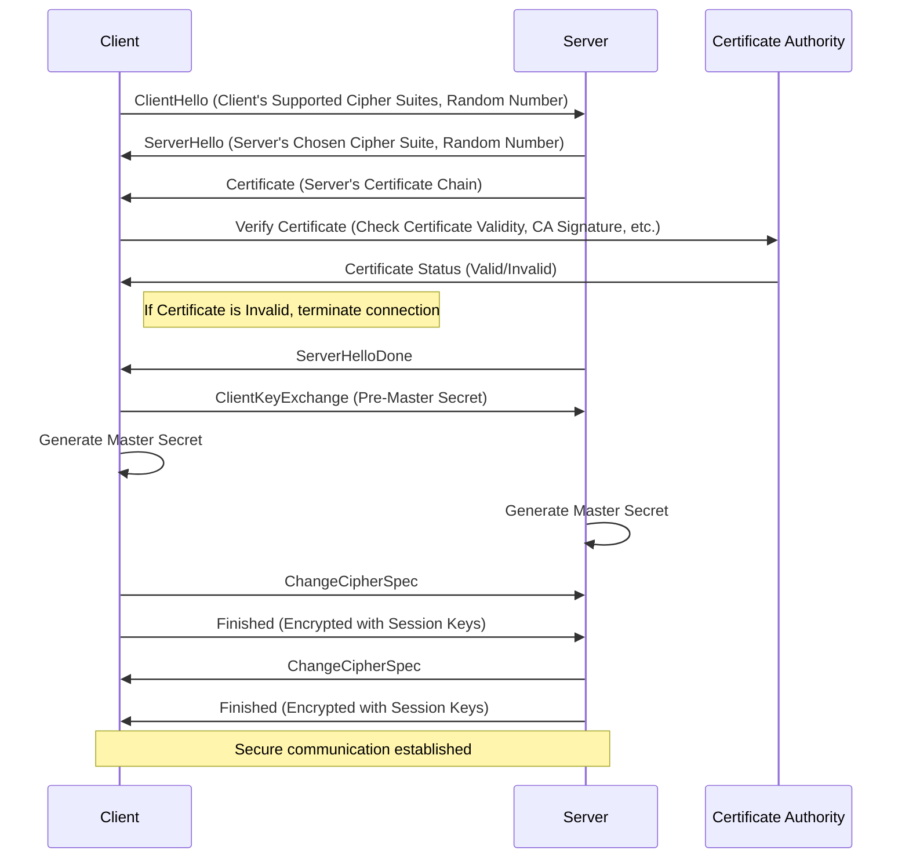

下面是完整的TLS（传输层安全）握手过程的描述，特别是围绕证书验证的部分。我将以Mermaid流程图的形式展示这一过程。

### 流程解释

1. **ClientHello**: 客户端发送一个ClientHello消息，其中包括支持的加密套件列表和一个随机数。

2. **ServerHello**: 服务器响应一个ServerHello消息，选择一个加密套件，并发送一个随机数。

3. **Certificate**: 服务器发送其证书链给客户端。证书链包括服务器证书和中间CA证书，最后连接到一个受信任的根CA。

4. **证书验证**: 
   - 客户端验证证书的有效性，包括证书的签名、有效期等。它会使用内置或从网络获取的受信任CA列表来验证证书。
   - 证书验证成功后，客户端继续握手流程；如果验证失败，握手终止。

5. **ServerHelloDone**: 服务器通知客户端其握手消息已完成。

6. **ClientKeyExchange**: 客户端发送ClientKeyExchange消息，其中包括一个使用服务器公钥加密的预主密钥。

7. **生成主密钥**: 
   - 客户端和服务器都使用共享的预主密钥和之前交换的随机数生成主密钥（Master Secret）。

8. **ChangeCipherSpec**: 客户端发送ChangeCipherSpec消息，通知服务器后续消息将使用协商的加密套件和主密钥加密。

9. **Finished**: 客户端发送Finished消息，这是用新协商的密钥加密的，确保前面的握手消息未被篡改。

10. **服务器的ChangeCipherSpec和Finished消息**: 服务器也会发送相应的ChangeCipherSpec和Finished消息。

11. **建立安全通信**: 双方都验证成功后，建立了一个安全的加密通道，可以进行安全的数据传输。

这个过程确保了通信双方能够安全地交换信息，并且只有验证通过的参与者能够成功建立连接。

