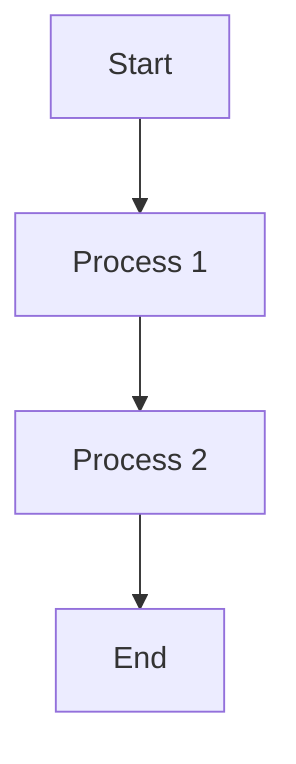
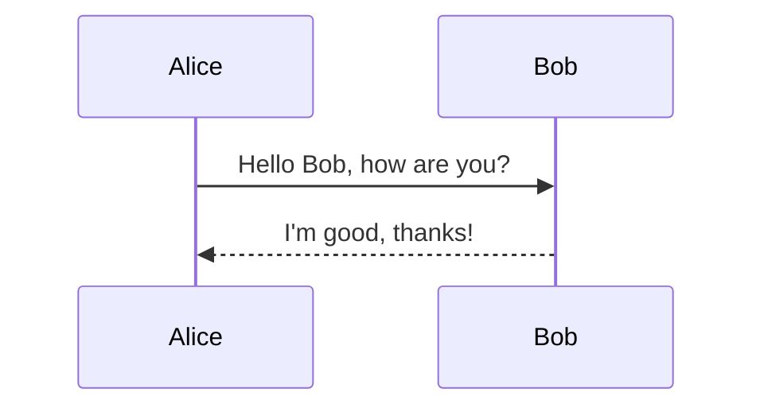
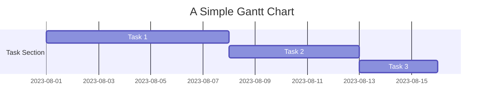
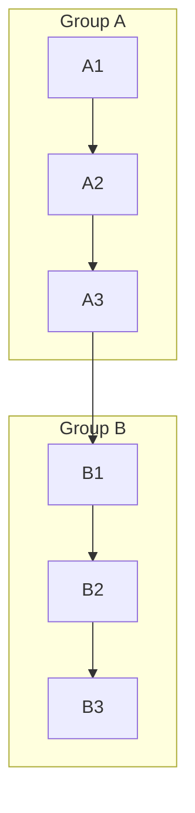
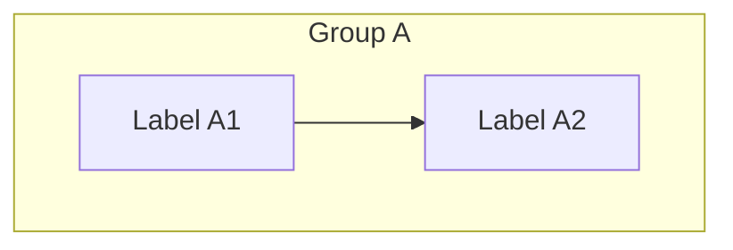
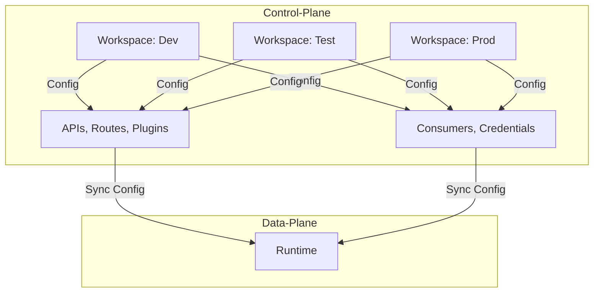

这是带有删除线的文本 ~~删除~~。


当然可以！Mermaid是一种用于绘制流程图、时序图、甘特图等的Markdown扩展。下面是一个详细的Mermaid语法示例，以及关于subgraph的用法和注意事项。

### Mermaid语法示例：

#### 流程图示例：




#### 时序图示例：




#### 甘特图示例：




### subgraph的用法和注意事项：

在Mermaid中，`subgraph`允许您创建一个子图，用于将相关元素分组并以更清晰的方式呈现图表。





关于`subgraph`内的标签问题，您正确地指出了`[]`不能再使用`()`引用，这是因为Mermaid使用`[]`和`()`进行标签解析，因此在`subgraph`中的标签，您应该避免使用`()`。例如：





希望这个示例和解释对您有帮助！如果您需要更多关于Mermaid的指导或其他信息，请随时提问。


当然可以！以下是关于Kong的CP和Workspace之间关系的Mermaid示意图：



在上述Mermaid示意图中，Control Plane（CP）中有三个工作区（Dev、Test、Prod），每个工作区包含不同的配置（如APIs、Routes、Plugins、Consumers等）。CP负责管理不同工作区的配置状态，并通过同步配置到Data Plane（Runtime）来实现配置的生效。

希望这个Mermaid示意图能够更清楚地展示CP和Workspace之间的关系。如果您有任何进一步的问题，请随时提问。

如果 Markdown 表格中有多行共用一个单元格区域,可以使用 :-- 表示这几行属于同一个单元格。

例如:
| 表头1 | 表头2 |
|:--:|:--:|  
|第一行|第一行|  
|:--|  
|第二行|第二行|
|第三行|第三行|


显示效果:

| 表头1 | 表头2 |  
|:--:|:--:|
|第一行|第一行|
|:--|  
|第二行|第二行|  
|第三行|第三行|

可以看到 "第二行" 和 "第三行" 位于同一个单元格区域中。

这时如果要在这几行中加入多行内容,仍然可以使用 \ 进行换行。例如:

| 表头1 | 表头2 |
|:--:|:--:|  
|第一行|第一行|  
|:--|  
|第二行\   
第三行|第二行\  
       第三行|
|第四行|第四行| 


显示效果:  

| 表头1 | 表头2 |  
|:--:|:--:|
|第一行|第一行|  
|:--|      
|第二行\     
第三行|第二行\  
       第三行|  
|第四行|第四行|

第三行和第四行公用一个单元格,通过 \ 进行换行输入多行内容。

所以,通过 :-- 语法可以实现 Markdown 表格中多行共用一个单元格的效果,并且仍然可以在该单元格中使用 \ 换行符输入多行内容。

这里是 Markdown 帮助文档的中文版:

# Markdown 语法帮助 

## 标题

# 一级标题 
## 二级标题 
### 三级标题 
#### 四级标题
##### 五级标题 
###### 六级标题

## 字体 

斜体文字   

**加粗文字**   

***斜体加粗文字***

## 分割线

***   

* * *

## 列表

### 无序列表

* 第一项 
* 第二项
* 第三项

### 有序列表

1. 第一项 
2. 第二项  
3. 第三项

## 图片


## 链接

[Markdown 语法](https://www.runoob.com/markdown/md-tutorial.html)

## 引用

这是一个引用的内容  


## 行内代码

代码  

## 代码块

代码块


## 表格

|  表头   | 表头  |
|  ----  | ----  |
| 单元格  | 单元格 |
| 单元格  | 单元格 |

## 高级技巧

### 删除线

~~删除线~~

### 注脚

你的工资已经到账[^1] 

[^1]: 您有一笔转账款项已成功完成

### 缩写

Markdown -> MD

### 下划线

H<sub>2</sub>O

## 待办事项 

- [x] 已完成事项 
- [ ] 未完成事项1 
- [ ] 未完成事项2

```
这里是 Markdown 帮助文档的中文版:

# Markdown 语法帮助 

## 标题

# 一级标题 
## 二级标题 
### 三级标题 
#### 四级标题
##### 五级标题 
###### 六级标题

## 字体 

斜体文字   

**加粗文字**   

***斜体加粗文字***

## 分割线

***   

* * *

## 列表

### 无序列表

* 第一项 
* 第二项
* 第三项

### 有序列表

1. 第一项 
2. 第二项  
3. 第三项

## 图片


## 链接

[Markdown 语法](https://www.runoob.com/markdown/md-tutorial.html)

## 引用

这是一个引用的内容  


## 行内代码

代码  

## 代码块

代码块


## 表格

|  表头   | 表头  |
|  ----  | ----  |
| 单元格  | 单元格 |
| 单元格  | 单元格 |

## 高级技巧

### 删除线

~~删除线~~

### 注脚

你的工资已经到账[^1] 

[^1]: 您有一笔转账款项已成功完成

### 缩写

Markdown -> MD

### 下划线

H<sub>2</sub>O

## 待办事项 

- [x] 已完成事项 
- [ ] 未完成事项1 
- [ ] 未完成事项2
```
