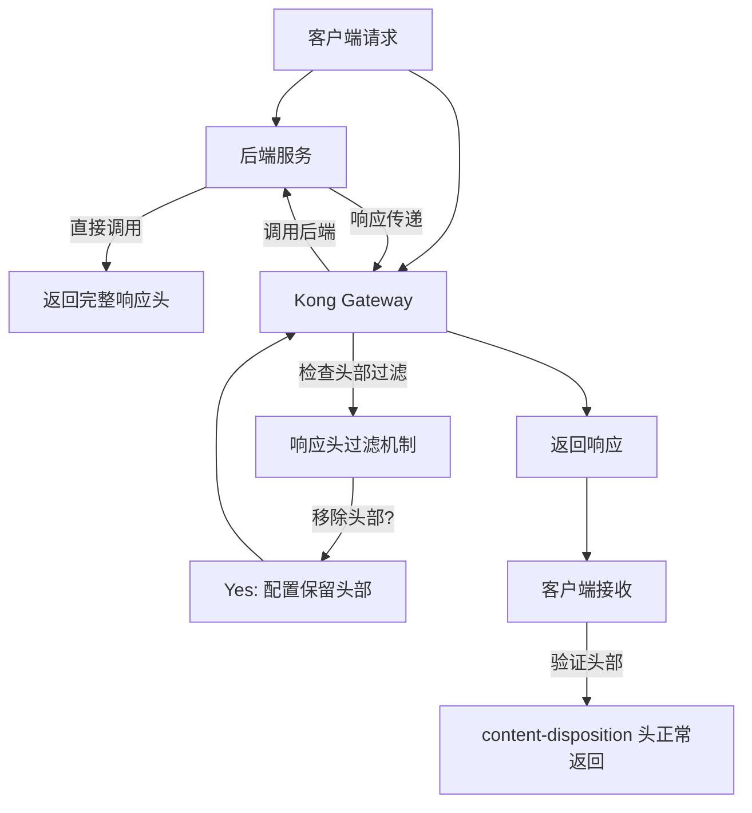
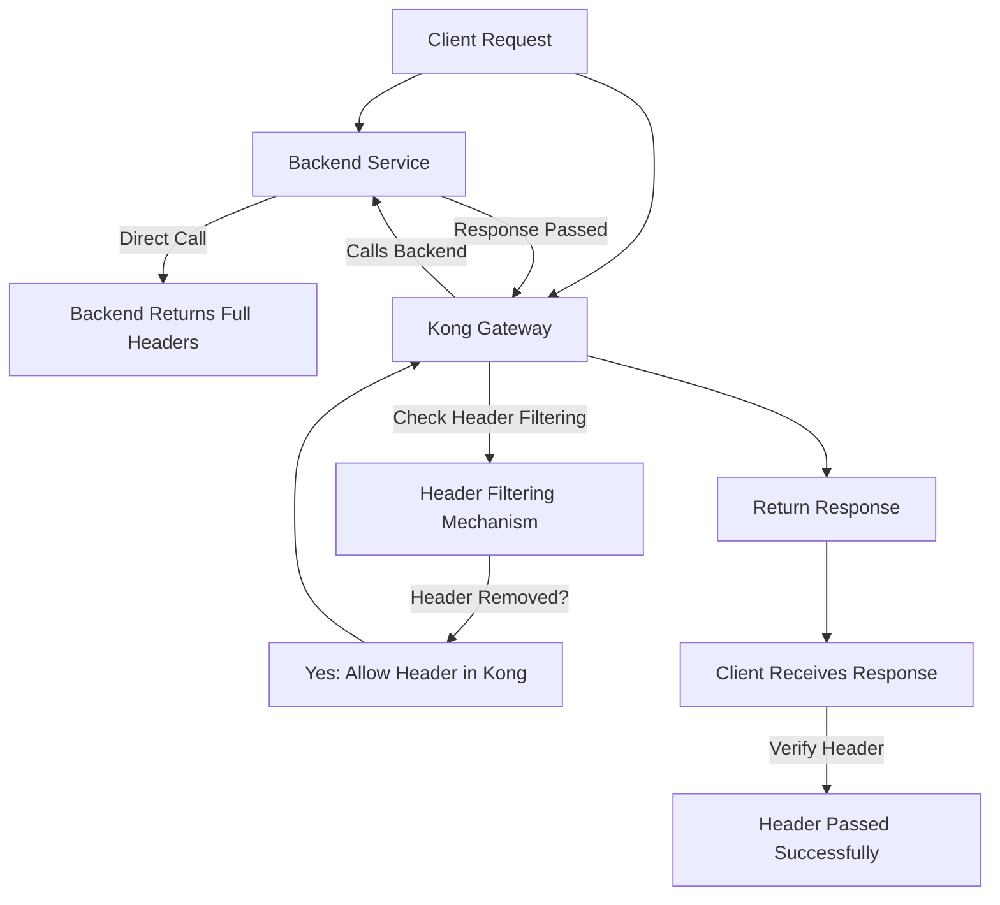
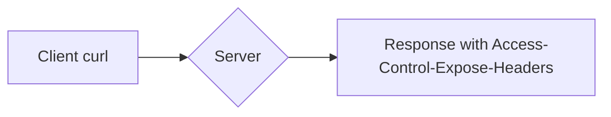
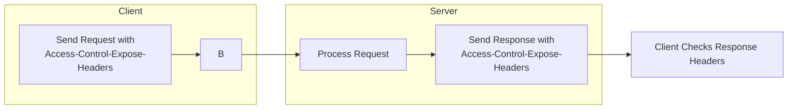

We might need to take the following steps:
1. Verify the backend service via curl. Directly call the API of the backend service and check the response header.
2. Verify the response header via Kong. Call the API of the Kong Gateway and check if the content-disposition exists.  


# calude 
针对这个问题，我们需要从多个层面进行排查：

1. Kong Gateway 配置检查

Kong可能会默认过滤某些响应头。可以尝试以下配置：

```yaml
# Kong Gateway 配置
plugins:
  - name: response-transformer
    config:
      add:
        headers: 
          - "Content-Disposition"
      remove: {}
```

2. Kong Debug 排查步骤

```bash
# 抓取具体请求响应头
kubectl logs <kong-pod-name> | grep -i "content-disposition"

# 使用 Kong Admin API 检查插件配置
curl http://localhost:8001/routes/<your-route-id>/plugins
```

3. 代码层面优化

```java
@GetMapping("/files/incoming/csv/download/{fileInfoId}")
public ResponseEntity<Resource> downloadIncomingFile(@RequestParam("fileInfoId") Long fileInfoId) throws NoFileExistException {
    BSMFileInfo fileInfo = fileSearchService.getIncomingFileById(fileInfoId);
    InputStreamResource resource = fileSearchService.downloadIncomingFile(fileInfo);
    
    // 明确指定 Content-Disposition 头
    return ResponseEntity.ok()
        .header(HttpHeaders.CONTENT_DISPOSITION, 
            "attachment; filename=\"" + URLEncoder.encode(fileInfo.getFileName(), StandardCharsets.UTF_8) + "\"")
        .contentType(MediaType.parseMediaType(FileProcessorConstants.CSV_MEDIA_TYPE))
        .body(resource);
}
```

4. Nginx L4/L7 配置检查

```nginx
# 确保响应头透传
proxy_pass_header Content-Disposition;
proxy_hide_header Content-Disposition; # 如果需要重新设置
```

5. 前端请求处理调整

```javascript
.then(async (response) => {
    // 更健壮的头部获取方式
    const contentDisposition = response.headers['content-disposition'] 
        || response.headers['Content-Disposition'];
    
    const fileName = contentDisposition 
        ? contentDisposition.split('filename=')[1].replace(/"/g, '')
        : 'download.csv';

    const blob = new Blob([response.data], { 
        type: 'text/plain;charset=utf-8' 
    });
    
    downloadFile(blob, fileName, null);
})
```

排查建议：
1. 确认 Kong Gateway 版本和插件兼容性
2. 检查所有网关层（Nginx L7/L4、Kong）的配置
3. 使用 Wireshark 或 curl 抓包分析完整请求响应
4. 检查 CORS 和安全策略是否影响头部传递

定位问题的关键步骤：
- 在 Spring 后端添加日志记录响应头
- 在 Kong Gateway 日志中跟踪头部变化
- 使用 curl 或 Postman 直接测试 API 响应

如果问题仍然存在，建议：
1. 提供完整的 Kong 插件配置
2. 检查网关的响应头转换插件
3. 确认是否有任何安全策略阻止特定响应头


# Chatgpt
针对 **`content-disposition` 头丢失** 的问题，Kong Gateway 作为 API 网关时，可能会过滤、丢弃或修改某些响应头，导致下游应用的响应头未能成功返回到客户端。

---

## **排查步骤**

### 1. **检查 Kong 配置**
Kong Gateway 默认会过滤掉某些敏感的响应头。如果 `content-disposition` 头不在允许的列表中，可能会被丢弃。

- 检查是否存在响应头过滤器插件（如 `response-transformer` 插件）。
- 确保 `content-disposition` 头没有被不当移除。

在 Kong 配置中，可以设置允许传递的响应头。  
确保 `Kong` 的插件或配置没有排除 `content-disposition`：

```yaml
plugins:
  - name: response-transformer
    config:
      add:
        headers:
          - "content-disposition: ${value}"
```

---

### 2. **确认 Kong 是否拦截响应头**
使用以下步骤确认 Kong 是否拦截了响应头：

1. **捕获后端响应**
   在后端服务中，打印日志以确认 `content-disposition` 确实存在：
   ```java
   logger.info("Response Headers: {}", response.getHeaders());
   ```

2. **通过 `curl` 验证后端服务**
   直接调用后端服务的 API，检查响应头：
   ```bash
   curl -I -X GET http://<backend-service-url>/files/incoming/csv/download/12345
   ```

   **预期响应示例**：
   ```http
   HTTP/1.1 200 OK
   Content-Type: text/csv
   Content-Disposition: attachment; filename="test.csv"
   ```

3. **通过 Kong 验证响应头**
   调用 Kong Gateway 的 API，检查是否存在 `content-disposition`：
   ```bash
   curl -I -X GET http://<kong-gateway-url>/files/incoming/csv/download/12345
   ```

   如果在此步骤发现 `content-disposition` 头缺失，则问题出在 Kong 配置。

---

### 3. **设置 `Kong` 配置：保留响应头**
可以通过 `Kong` 的配置明确允许传递 `content-disposition`：

- 修改 Kong 的 **`kong.conf`** 配置文件或动态插件：
   ```yaml
   headers:
     - Content-Disposition
     - Content-Type
   ```

   **注意**：需要重启 Kong 使配置生效。

- 如果使用 `response-transformer` 插件，请确保配置未移除 `content-disposition` 头。

---

### 4. **Kong 插件响应头排查**
检查 Kong 上是否启用了以下插件，这些插件可能影响响应头：

| 插件名                  | 可能影响的内容                        |
|-------------------------|-------------------------------------|
| `response-transformer`  | 增加、修改或删除响应头               |
| `request-transformer`   | 修改传入请求头                      |
| `cors`                  | 处理跨域资源共享，可能过滤响应头      |
| `proxy-cache`           | 缓存的响应中可能丢失头部            |

---

## **解决方法**

### 方案 1: 添加 `content-disposition` 到允许列表
在 Kong 中添加 `content-disposition` 到允许通过的响应头中：

使用 **`response-transformer`** 插件：

```bash
curl -X POST http://<admin-url>/plugins \
    --data "name=response-transformer" \
    --data "config.add.headers[1]=Content-Disposition: attachment; filename=test.csv"
```

### 方案 2: 禁用 Kong 的响应头过滤
如果响应头过滤导致丢失，设置 Kong 禁用过滤机制，允许传递所有响应头：

在 Kong 配置中，添加：

```yaml
headers:
  - "*"
```

---

## **最终验证**
在完成上述配置后，重新通过 Kong Gateway 调用 API，确保响应头包含 `content-disposition`：

```bash
curl -I -X GET http://<kong-gateway-url>/files/incoming/csv/download/12345
```

预期输出示例：

```http
HTTP/1.1 200 OK
Content-Type: text/csv
Content-Disposition: attachment; filename="test.csv"
```

---

## **Mermaid 流程图**

以下是整体排查和解决流程：



---

## **总结**
通过以下步骤可以解决 `content-disposition` 丢失的问题：

1. 确认后端服务的响应头正常。
2. 使用 `curl` 验证 Kong 网关的响应。
3. 配置 `response-transformer` 插件，允许传递 `content-disposition`。
4. 检查和修复 Kong 插件的响应头过滤配置。
5. 验证修复结果。

如问题依旧，请提供 Kong 网关的详细配置文件和插件列表，以便进一步诊断。


When the **`content-disposition`** header is missing after passing through **Kong Gateway**, it is usually because Kong filters, modifies, or drops certain response headers by default.

---

## **Steps to Troubleshoot**

### 1. **Check Kong Configuration**
Kong Gateway may filter out certain headers by default. If `content-disposition` is not allowed, it might get dropped.

- Verify if a response header filtering plugin, such as `response-transformer`, is in place.
- Ensure `content-disposition` is not being unintentionally removed.

In Kong’s configuration, explicitly allow the header to pass through:

```yaml
plugins:
  - name: response-transformer
    config:
      add:
        headers:
          - "content-disposition: ${value}"
```

---

### 2. **Confirm the Backend Service Sends the Header**
1. **Log the Response Headers in Backend**
   Ensure that the backend sends the `content-disposition` header as expected:
   ```java
   logger.info("Response Headers: {}", response.getHeaders());
   ```

2. **Test the Backend Service Directly**
   Use `curl` to call the backend API directly:
   ```bash
   curl -I -X GET http://<backend-service-url>/files/incoming/csv/download/12345
   ```

   **Expected Response Example**:
   ```http
   HTTP/1.1 200 OK
   Content-Type: text/csv
   Content-Disposition: attachment; filename="test.csv"
   ```

3. **Test the Kong Gateway**
   Call the Kong Gateway endpoint and check for `content-disposition`:
   ```bash
   curl -I -X GET http://<kong-gateway-url>/files/incoming/csv/download/12345
   ```

   If the header is missing here but exists in the backend response, the issue lies with Kong.

---

### 3. **Configure Kong to Retain the Header**
To ensure the `content-disposition` header is preserved, explicitly allow it in Kong’s configuration:

- Modify **`kong.conf`** or use a plugin configuration:

   ```yaml
   headers:
     - Content-Disposition
     - Content-Type
   ```

   **Note**: Restart Kong for the configuration to take effect.

- If using the `response-transformer` plugin, make sure `content-disposition` is not being removed.

---

### 4. **Verify Plugins Affecting Headers**
Check if any plugins might be modifying or removing headers:

| **Plugin Name**          | **Impact**                          |
|--------------------------|-------------------------------------|
| `response-transformer`   | Adds, modifies, or removes headers  |
| `request-transformer`    | Modifies incoming request headers   |
| `cors`                   | Handles CORS; may filter headers    |
| `proxy-cache`            | Cached responses may lose headers   |

---

## **Solutions**

### **Solution 1: Allow `content-disposition` Using `response-transformer`**
Enable the `response-transformer` plugin to explicitly add the header:

```bash
curl -X POST http://<admin-url>/plugins \
    --data "name=response-transformer" \
    --data "config.add.headers[1]=Content-Disposition: attachment; filename=test.csv"
```

---

### **Solution 2: Disable Header Filtering**
To allow all headers to pass through Kong, set the configuration:

```yaml
headers:
  - "*"
```

---

## **Final Verification**
After applying the fixes, revalidate the response:

1. **Call Kong Gateway**:
   ```bash
   curl -I -X GET http://<kong-gateway-url>/files/incoming/csv/download/12345
   ```

2. **Expected Response**:
   ```http
   HTTP/1.1 200 OK
   Content-Type: text/csv
   Content-Disposition: attachment; filename="test.csv"
   ```

---

## **Mermaid Diagram**

The following diagram illustrates the troubleshooting and resolution process:



---

## **Summary**
To resolve the issue of `content-disposition` being dropped:

1. Confirm the backend service sends the header correctly.
2. Validate Kong Gateway’s response with `curl`.
3. Allow `content-disposition` explicitly in Kong’s configuration or the `response-transformer` plugin.
4. Verify no plugins are removing or modifying the header.
5. Test and ensure the header is now retained.

If the issue persists, provide the Kong Gateway configuration and plugin details for further investigation.


`Content-Disposition` HTTP 响应头。

**`Content-Disposition` 的作用**

`Content-Disposition` 是一个 HTTP 响应头，它指示用户代理（通常是浏览器）如何处理服务器返回的内容。简单来说，它告诉浏览器：

*   **是应该把内容当成页面内容直接展示，还是应该把它当成文件下载。**
*   **如果应该下载，应该使用什么样的文件名。**

**`Content-Disposition` 的语法**

`Content-Disposition` 头的基本语法如下：

```
Content-Disposition: <type>; <parameters>
```

*   **`<type>`**: 指定内容的处置类型，常用的有两种：
    *   `inline`: (默认值) 表示内容应该直接在浏览器中显示，例如 HTML 页面、图片、PDF 文件等。
    *   `attachment`: 表示内容应该被下载，而不是直接显示。
*   **`<parameters>`**:  用于提供额外的参数，最常用的一个参数是 `filename`:
    *   `filename="<文件名>"`: 指定下载的文件名。如果文件名包含特殊字符或非 ASCII 字符，应该进行 URL 编码。
    *   `filename*="<编码>;<文件名>"`：用于文件名中包含非 ASCII 字符，采用RFC 5987规范进行编码，例如 `filename*=UTF-8''%E6%96%87%E4%BB%B6%E5%90%8D.txt` 。

**`Content-Disposition` 的常见使用场景**

1.  **文件下载**： 这是 `Content-Disposition` 最常见的用途。
    *   服务器设置 `Content-Disposition: attachment; filename="my_document.pdf"` 告诉浏览器应该下载 `my_document.pdf` 文件，而不是在浏览器中打开。
2.  **图片显示（内联）**：
    *   对于直接在页面中显示的图片，通常不需要设置 `Content-Disposition`，或者使用默认的 `Content-Disposition: inline`。
3.  **强制下载**：
    *   即使浏览器通常能够直接显示的文件类型（如文本文件），服务器可以通过设置 `Content-Disposition: attachment` 强制浏览器将其下载。
4.  **动态文件名**：
    *   服务器可以根据请求动态生成文件名，并通过 `Content-Disposition` 头传递给浏览器，例如 `Content-Disposition: attachment; filename="report-" + new Date().getTime() + ".csv"`。
5.  **支持特殊字符的文件名**：
    *   当文件名包含非 ASCII 字符时，使用 `filename*` 参数，并按照 RFC 5987 规范进行编码， 例如： `Content-Disposition: attachment; filename="中文文件名.txt"; filename*=UTF-8''%E4%B8%AD%E6%96%87%E6%96%87%E4%BB%B6%E5%90%8D.txt`

**`Content-Disposition` 的例子**

*   **下载名为 `document.pdf` 的 PDF 文件:**

    ```
    Content-Disposition: attachment; filename="document.pdf"
    ```

*   **下载名为 `report_20231027.csv` 的 CSV 文件:**

    ```
    Content-Disposition: attachment; filename="report_20231027.csv"
    ```

*   **下载名为 `my file with spaces.txt` 的文本文件:**

    ```
    Content-Disposition: attachment; filename="my file with spaces.txt"
    ```

*   **下载名为 `我的文件.txt` 的文本文件，使用非ASCII字符:**
    ```
    Content-Disposition: attachment; filename="我的文件.txt"; filename*=UTF-8''%E6%88%91%E7%9A%84%E6%96%87%E4%BB%B6.txt
    ```

*  **强制下载名为 `data.json` 的 JSON 文件：**
    ```
    Content-Disposition: attachment; filename="data.json"
    Content-Type: application/json
    ```
*  **内联显示图像:**
    ```
    Content-Disposition: inline
    Content-Type: image/jpeg
    ```

**`Content-Disposition` 的注意事项**

1.  **`filename` 参数的安全性**：
    *   要避免文件名中的路径遍历攻击，不要直接使用用户输入的文件名，应确保文件名仅包含允许的字符。
2.  **文件名编码**：
    *   当文件名包含特殊字符或非 ASCII 字符时，必须进行 URL 编码，或者使用 `filename*` 参数。
3.  **与 `Content-Type` 响应头配合使用**：
    *   `Content-Disposition` 通常需要与 `Content-Type` 响应头配合使用。`Content-Type` 告诉浏览器返回内容的 MIME 类型 (例如 `text/csv`, `application/pdf`, `image/jpeg`)。
4.  **浏览器兼容性**：
    *   大多数现代浏览器都支持 `Content-Disposition`，但在处理复杂文件名和编码时，可能存在一些细微的差异。测试在不同的浏览器上确保兼容性。
5.  **代理和网关**：
    *   如你所见，代理服务器（例如 Kong）可能会修改或删除 `Content-Disposition` 头。需要仔细检查配置。

**总结**

`Content-Disposition` 是一个非常重要的 HTTP 响应头，它使服务器能够控制浏览器如何处理返回的内容。正确使用 `Content-Disposition` 可以确保文件被正确下载，并且文件名也能够正确显示。


# how to debug this problem gemini2
好的，这是一个典型的 Kong 网关处理响应头的问题。问题在于，Kong 默认情况下可能会出于安全或性能考虑，过滤或修改一些 HTTP 响应头，包括 `Content-Disposition`。

下面是排查和解决这个问题的详细步骤：

**1. 确定问题是否真的出在 Kong 网关：**

* **直接访问后端服务：** 绕过 Kong 网关，直接调用你的 GKE 部署中的 API，看是否能收到 `Content-Disposition` 响应头。如果直接访问可以，说明问题确实在 Kong 网关。
    *  你可以使用 `kubectl port-forward` 将 GKE Pod 端口转发到本地，然后通过 `curl` 或类似的工具直接请求后端服务。

* **检查 Kong 的 access logs：** 看看 Kong 的日志中是否有关于请求和响应的详细信息，特别是关于响应头的部分。这可以帮助你了解 Kong 是否真的收到了后端发送的 `Content-Disposition` 头，以及它如何处理的。

**2. 确认问题出在 Kong 后，开始排查 Kong 配置：**

* **Kong 插件：**
    * **`header-transformation` 插件：** Kong 有 `header-transformation` 插件，可以添加、修改或删除请求和响应头。检查 Kong 中是否启用了此插件，以及是否配置了规则来删除 `Content-Disposition` 头。
    * **`request-transformer` 插件：** 类似于 `header-transformation`，但功能更强大，也可能导致响应头被修改或删除。检查是否有此插件，并查看配置。
    * **其他插件：** 检查是否有任何其他 Kong 插件可能影响响应头。有些插件为了安全或其他目的，可能修改或删除特定响应头。
    * **禁用插件测试：** 如果怀疑某个插件导致问题，尝试禁用它并重新测试，看看是否能解决问题。
* **Kong 全局配置：**
    *  检查 Kong 的全局配置，例如 `proxy_pass` 或其他相关设置，看看是否配置了任何头过滤或修改规则。

* **Kong 服务/路由配置：**
    *  检查与你的 API 相关的 Kong 服务和路由的配置，看看是否有配置影响响应头的设置。

**3. Kong 配置调整（解决问题）：**

* **`header-transformation` 插件配置：** 如果使用了 `header-transformation` 插件，确保该插件的配置不会删除或修改 `Content-Disposition` 头。
    * 如果需要，可以添加一个规则来显式传递 `Content-Disposition` 头：
      ```yaml
      config:
        add:
          response:
            - header: Content-Disposition
              value: "preserve"  # 或者直接复制后端返回的头
      ```
* **禁用不必要的插件：** 禁用任何你确定不影响业务逻辑但可能导致响应头丢失的插件。
* **Kong 的 `nginx_proxy_header` 或 `proxy_pass_headers` 配置：**  
    *  Kong 默认情况下可能会忽略后端响应头。尝试在 Kong 配置中开启 `nginx_proxy_header` 或 `proxy_pass_headers`，以便传递所有后端响应头。 具体方式取决于 Kong 的版本和部署方式。
    *  在 `kong.conf` 或 `kong.yml` (如果使用声明式配置) 中添加以下内容，可能需要重启 Kong 服务生效：
       ```
        nginx_proxy_header = on
        proxy_pass_headers = on
       ```
       或者
       ```
       proxy_pass_headers: true
       nginx_proxy_header: true
       ```
* **Kong 路由配置 (如果可以配置)：** 
  * 有些 Kong 版本允许在路由级别配置是否传递后端头。 检查 Kong 路由配置文档，看看是否有相关的配置项。

**4. 监控和日志：**

* **启用 Kong 日志：** 配置 Kong 详细的日志记录，以便更好地跟踪请求和响应的流程。
* **监控 Kong：** 设置监控系统，以便及时发现问题并排查。
* **错误日志：** 检查 Kong 的错误日志，看看是否有任何错误信息与响应头处理相关。

**代码片段分析：**

你的后端代码片段看起来没有问题，正确设置了 `Content-Disposition` 响应头。问题应该出在 Kong 网关对响应头的处理上。

**一些额外建议：**

* **使用 `Content-Disposition: attachment; filename="your_filename"`：** 确保 `Content-Disposition` 值的格式是正确的，即 `attachment; filename="your_filename"`. `attachment` 表示以附件形式下载， `filename` 指定下载的文件名。
* **文件名编码：** 如果文件名包含特殊字符，可能需要进行编码处理，例如使用 `encodeURIComponent()`。
* **Content-Type：** 确保响应的 `Content-Type` 与文件类型相匹配。
* **CORS:** 如果涉及到跨域请求，确保你的服务器配置了正确的CORS头，这可能影响某些浏览器的行为。
* **升级 Kong 版本:** 如果你使用的 Kong 版本比较老旧，尝试升级到较新的版本，新版本可能会修复一些已知的问题。

**排查步骤总结：**

1.  **确认问题范围:**  直接访问后端，确认是 Kong 导致的问题。
2.  **检查 Kong 插件:**  排查 `header-transformation` 和 `request-transformer` 插件。
3.  **检查 Kong 全局配置:** 检查 `nginx_proxy_header` 和 `proxy_pass_headers`。
4.  **检查 Kong 服务/路由配置:** 查看服务和路由是否配置了响应头相关规则。
5.  **调整 Kong 配置:**  修改插件配置或 Kong 全局配置以保留 `Content-Disposition` 头。
6.  **监控和日志:**  启用详细的日志记录，监控 Kong。

**请提供以下信息以便更精准的定位问题：**

*   **Kong 版本**
*   **Kong 插件列表 (特别是 `header-transformation`, `request-transformer`)**
*   **Kong 的 `nginx_proxy_header` 或 `proxy_pass_headers` 配置**
*   **Kong 的服务和路由配置 (相关的)**
*   **Kong 的日志输出**

希望这些步骤能够帮助你解决问题!  根据你的具体情况，你可能需要多次尝试不同的配置，逐步缩小问题的范围。 祝你顺利！


# Opencat gemini2

即Content-Disposition响应头在通过 Kong 网关后丢失的问题，这里我将从排查思路、Kong 配置以及可能的解决方案等方面进行详细分析，并提供相应的 Markdown 和 Mermaid 格式输出。

问题分析

	1.	问题现象：
	•	后端服务 (如您提供的 Java 代码片段) 明确设置了 Content-Disposition 响应头。
	•	客户端在直接请求后端服务时可以获取到该响应头。
	•	当请求经过 Kong 网关后，客户端无法获取到 Content-Disposition 响应头。
	2.	可能原因：
	•	Kong 插件干扰：某些 Kong 插件可能会修改或移除响应头。例如，某些插件可能会出于安全考虑或头标准化而修改响应头。
	•	Kong 配置问题：Kong 的默认配置或特定配置可能导致响应头被过滤或丢失。例如，Kong 可能设置了特定的代理头白名单，而 Content-Disposition 不在其列。
	•	上游服务响应头处理：虽然后端服务设置了响应头，但 Kong 可能对上游服务的响应头有特殊处理逻辑。
	•	CORS 问题：如果客户端是跨域请求，浏览器可能会出于安全策略的考虑而限制某些响应头的访问，但这通常会导致浏览器报错。
	•	HTTP/2：如果涉及到HTTP/2， 需要检查Kong和上游服务是否对Header大小有限制。

排查步骤

	1.	检查 Kong 日志：
	•	查看 Kong 的错误日志和访问日志，查找是否有任何关于头信息处理的异常或警告。
	•	使用 Kong 的 debug 级别日志，获取更详细的请求和响应头信息。
	2.	使用 Kong curl 命令：
	•	使用 curl 命令直接向 Kong 发起请求，并检查返回的响应头，这可以帮助判断问题是否在客户端。
curl -i -X GET http://<kong-address>/files/incoming/csv/download/123
	3.	对比直接请求与 Kong 代理请求：
	•	使用 curl 或其他工具，直接向后端服务发起请求，并对比与通过 Kong 代理后的响应头信息。
# 直接请求
curl -i -X GET http://<backend-address>/files/incoming/csv/download/123

# 通过 Kong 代理请求
curl -i -X GET http://<kong-address>/files/incoming/csv/download/123
4.	禁用 Kong 插件：
	•	逐个禁用可能影响响应头的 Kong 插件（如请求/响应转换插件、安全插件），并测试问题是否解决，以排除插件的干扰。
	5.	检查 Kong 配置：
	•	检查 Kong 的 nginx.conf 文件，查看是否有任何头信息过滤或修改的配置。
	•	检查 Kong 的 Service 和 Route 配置，确保没有配置任何会导致响应头被过滤的选项。
	6.	检查上游服务响应头处理：
	•	检查上游服务响应头，确认 content-disposition 是否已经被修改或者丢失。
	7.	检查 HTTP/2 设置
	•	确保Kong和上游服务均支持HTTP/2, 并检查其header大小设置， 如果存在设置请增大。

解决思路

	1.	配置 Kong 的 nginx.conf 文件
	•	在 nginx.conf 文件中添加以下配置，允许传递 Content-Disposition 响应头：
proxy_pass_header Content-Disposition;
	•	注意：修改 nginx.conf 后，需要重启 Kong 服务。

	1.	在 Kong 的 Service 配置中设置 proxy_set_header
	•	通过 Kong 的 Admin API 或配置文件，在 Service 配置中添加 proxy_set_header，强制设置 Content-Disposition 响应头。
{
  "name": "my-service",
  "host": "backend-service-host",
  "port": 8080,
  "protocol": "http",
  "path": "/files/incoming/csv/download",
   "proxy_set_header": {
        "Content-Disposition": "$upstream_http_content_disposition"
   }
}
需要注意的是，这里的 $upstream_http_content_disposition 变量会从后端服务的响应头中获取 Content-Disposition，并传递给客户端。

	1.	在 Kong 的 Route 配置中添加 headers 插件
	•	可以使用 Kong 的 headers 插件来添加或修改响应头。
	•	在 Route 配置中添加 headers 插件，设置 Content-Disposition 响应头。
{
   "name": "my-route",
    "paths": ["/files/incoming/csv/download"],
    "service": { "id": "<service-id>"},
    "plugins": [
        {
         "name": "headers",
         "config": {
            "remove": ["Content-Disposition"],
            "add": ["Content-Disposition:$upstream_http_content_disposition"]
             }
         }
      ]
}
	2.	排除 CORS 问题
	•	如果涉及到跨域问题，请配置 Kong 或后端服务的 CORS，允许客户端获取 Content-Disposition 响应头。
	3.	确保 Kong 和后端服务之间的 HTTP/2 配置兼容
	•	检查Kong和后端服务是否都支持HTTP/2, 如果不支持， 建议禁用。 另外可以尝试增大 header 大小限制
流程图 (Mermaid)
```Mermaid
graph LR
    A[客户端发起请求] --> B(Kong 网关);
    B --> C{检查 Kong 配置和插件};
    C -- 插件干扰 --> D[禁用或调整插件];
    C -- 配置问题 --> E[修改 Kong 配置];
    B --> F{检查上游服务响应头};
    F -- 响应头正常 --> G[问题定位];
    F -- 响应头丢失或修改 --> H[检查上游服务问题];
    G --> I{验证问题解决};
    I -- 是 --> J[完成];
    I -- 否 --> K[重新排查];
    H --> K;
    D --> I;
    E --> I;
    K --> C;
```
总结

通过以上步骤，您应该能够定位到 Content-Disposition 响应头丢失的原因，并根据具体情况选择合适的解决方案。请务必在生产环境中谨慎操作，并在修改配置后进行充分测试。如果问题依然存在，请提供更详细的日志和配置信息，以便进一步分析。


# curl Example
分解一下这个命令：

	•	curl:  这是命令行工具，用于传输数据，支持多种协议，包括 HTTP。
	•	"https://url": 这是目标 URL，curl 将向这个地址发送请求。  你需要将其替换为你实际的 URL。
	•	-H 'Access-Control-Expose-Headers: Content-Disposition':  这个选项是 curl 的一个参数，用于添加自定义的 HTTP 请求头。 -H  代表 Header。  在这个例子中，它添加了一个名为 Access-Control-Expose-Headers 的请求头，其值为 Content-Disposition。

Access-Control-Expose-Headers 头的作用

Access-Control-Expose-Headers  主要用于跨域资源共享 (CORS) 场景。通常情况下，浏览器出于安全考虑，只允许 JavaScript 访问有限的几个响应头，例如 Cache-Control、Content-Language、Content-Type、Expires、Last-Modified 和 Pragma。

如果你希望 JavaScript 代码能够访问其他的响应头，例如 Content-Disposition (通常用于指定下载文件名)，就需要服务器在响应中包含 Access-Control-Expose-Headers 头，并将其值设置为允许访问的响应头名称。

示例场景

假设你有一个服务器，当用户下载文件时，会在响应中包含 Content-Disposition 头，用于指定
```
HTTP/1.1 200 OK
Content-Disposition: attachment; filename="myfile.txt"
Content-Type: text/plain
...
```
如果没有 Access-Control-Expose-Headers 头，浏览器会阻止 JavaScript 访问 Content-Disposition 头。因此，你需要在服务器的响应中添加如下头

这样，JavaScript 代码就可以通过 XMLHttpRequest 或 fetch API 获取 Content-Disposition 头的值，并提取下载文件名。

你的 curl 命令的作用

你使用的 curl 命令模拟了浏览器发送请求，并添加了 Access-Control-Expose-Headers: Content-Disposition 请求头。这个命令本身并不会触发 CORS 机制，因为它不是浏览器发出的请求。  你使用这个命令的目的可能是为了测试服务器是否正确配置了 CORS 响应头。

总结

curl "https://url" -H 'Access-Control-Expose-Headers: Content-Disposition'  向指定 URL 发送了一个 HTTP 请求，并添加了 Access-Control-Expose-


你的 curl 命令只是 发送 了 Access-Control-Expose-Headers 请求头，这并不代表服务器就一定会响应并允许访问 Content-Disposition。

你的 curl 命令是在测试服务器的 CORS 配置。 服务器是否支持 Content-Disposition 取决于服务器的响应，而不是你的请求中的  Access-Control-Expose-Headers。

为了验证服务器是否正确配置，你需要检查服务器的 响应头 是否包含 Access-Control-Expose-Headers: Content-Disposition (或包含 Content-Disposition 在内的多个允许的头)。

你可以使用 curl -v  (verbose mode) 来查看完整的请求和响应信息，或者使用浏览器的开发者工具 (Network tab) 来检查响应头。

示例：

假设你使用 curl -v "https://url" -H 'Access-Control-Expose-Headers: 

Access-Control-Expose-Headers: Content-Disposition, X-Custom-Header

这表明服务器允许 JavaScript 访问 Content-Disposition 和 X-Custom-Header 这两个响应头。

如果服务器响应头中 没有  Access-Control-Expose-Headers  或其中不包含 Content-Disposition，那么 JavaScript 就无法访问 Content-Disposition 头，即使你的请求中包含了 Access-Control-Expose-Headers: Content-Disposition。

总结

	•	客户端发送 Access-Control-Expose-Headers 请求头是为了 请求 服务器允许访问某些响应头。
	•	服务器是否允许访问，取决于服务器的 响应头 中是否包含 Access-Control-Expose-Headers 以及其值。




