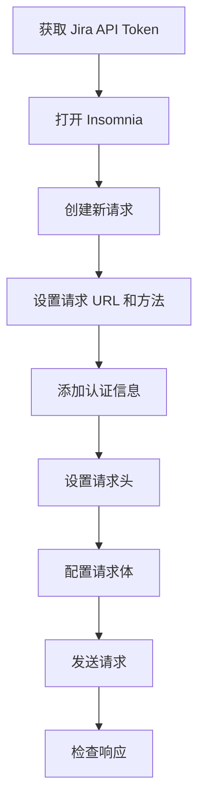

要使用 Insomnia 工具通过 Jira API 更新工单状态，你需要获取 Jira 的 API Token，并在 Insomnia 中配置请求头以包含该 Token。以下是详细的操作步骤：

### 1. 获取 Jira API Token

1. **登录到 Jira**:
   - 打开你的 Jira 实例，并使用你的账号登录。

2. **生成 API Token**:
   - 访问 [Atlassian API tokens page](https://id.atlassian.com/manage-profile/security/api-tokens)。
   - 点击 “Create API token”。
   - 输入一个标识这个 Token 的标签（如 “Insomnia”）。
   - 点击 “Create”，然后点击 “Copy to clipboard” 复制生成的 Token。

### 2. 在 Insomnia 中配置请求

1. **打开 Insomnia**:
   - 启动 Insomnia 应用。

2. **创建一个新请求**:
   - 点击左上角的 “Create” 按钮，选择 “Request”。
   - 输入请求名称（如 “Update Jira Ticket”）和选择请求的文件夹（如 “Jira Requests”）。

3. **设置请求 URL 和方法**:
   - 在请求的配置页面，设置请求方法为 `PUT`（或根据你具体的 Jira API 操作选择合适的方法，如 `POST`、`GET`、`DELETE`）。
   - 输入 Jira API 的 URL（如 `https://your-jira-instance.atlassian.net/rest/api/3/issue/{issueIdOrKey}`），替换 `your-jira-instance` 和 `{issueIdOrKey}` 为你的具体 Jira 实例和工单ID。

4. **添加认证信息**:
   - 在请求的配置页面，点击右侧的 “Auth” 标签。
   - 选择 “Basic” 认证类型。
   - 在 “Username” 字段输入你的 Jira 用户邮箱。
   - 在 “Password” 字段输入你在第一步中获取的 API Token。

5. **设置请求头**:
   - 在请求的配置页面，点击右侧的 “Headers” 标签。
   - 添加一个新的 Header，名称为 `Content-Type`，值为 `application/json`。

6. **配置请求体**:
   - 在请求的配置页面，点击右侧的 “Body” 标签。
   - 选择 “JSON” 作为请求体格式。
   - 输入你要发送的 JSON 数据，例如：

    ```json
    {
      "fields": {
        "status": {
          "name": "Done"
        }
      }
    }
    ```

### 3. 发送请求并验证

1. **发送请求**:
   - 点击 “Send” 按钮，发送配置好的请求。

2. **检查响应**:
   - 查看响应状态和返回的数据，确保请求成功。如果状态码为 200 或 204，表示请求成功。

### 示例图示



### 例子

假设你要更新的 Jira 工单 ID 是 `TEST-123`，状态更新为 “Done”，你的配置会是：

- **URL**: `https://your-jira-instance.atlassian.net/rest/api/3/issue/TEST-123`
- **Method**: `PUT`
- **Headers**:
  - `Content-Type: application/json`
- **Auth**: Basic Auth
  - **Username**: your-email@example.com
  - **Password**: your-generated-api-token
- **Body**:
  ```json
  {
    "fields": {
      "status": {
        "name": "Done"
      }
    }
  }
  ```

完成上述步骤后，你应该能够通过 Insomnia 成功更新 Jira 工单的状态。如果遇到任何问题，请确保 URL、认证信息、以及 JSON 请求体格式都是正确的。
