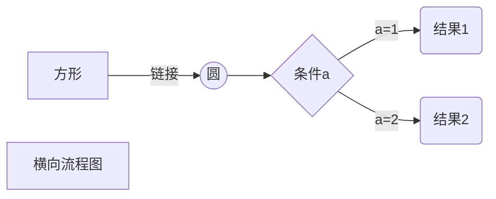
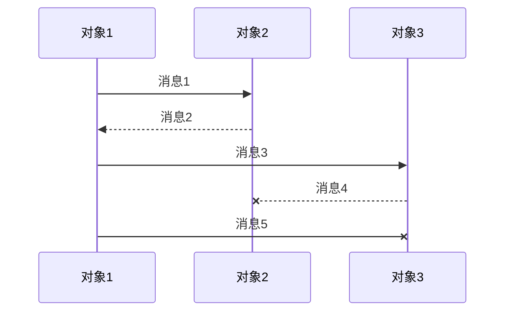
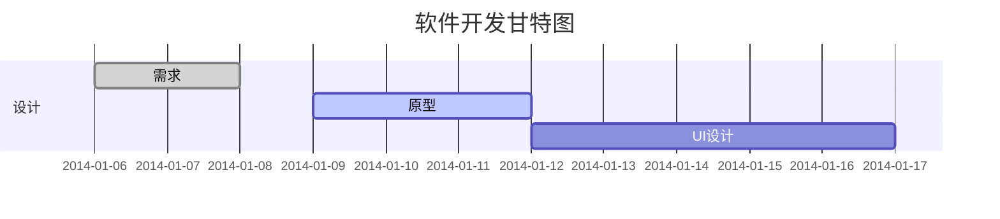
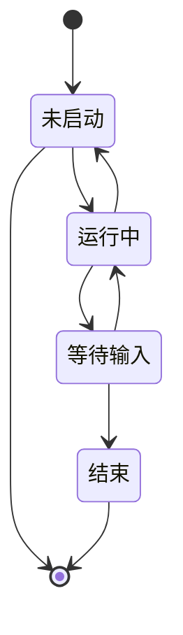
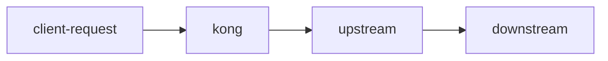
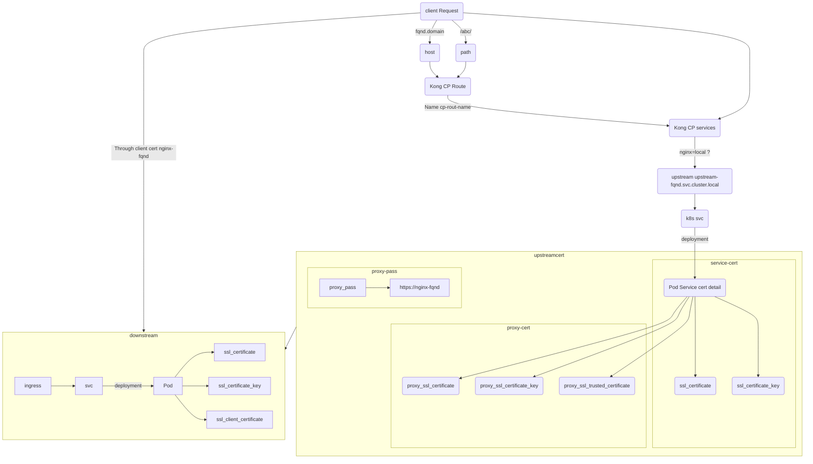
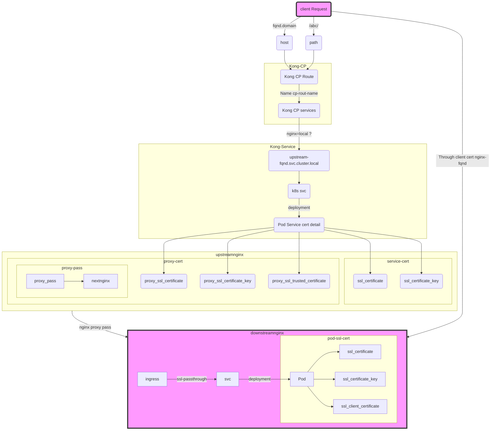

Mermaid 是一种文本渲染引擎,可以从简单的文本描述生成图表,序列图,甘特图,状态图,等等。它非常适合用在 Markdown 文档中。
这里给出一些 Mermaid 的用法示例:

mermaid flowchart 类似的语法中[]符号中间包含的时候不能包括()
例如
subgraph Kong
CP[Control Plane (CP)]
DP[Data Plane (DP)]
end
上面就是错误的写法

另外就是类似下面这种，后面的字符串中不能包含空格，必须是一个整体
Workspace3 --> |Contains| Configurations3

https://mermaid.live/
https://support.typora.io/Draw-Diagrams-With-Markdown/

## 流程图

## 序列图

## 甘特图

## 状态图

Mermaid 还支持类图、用户旅程图等等。希望这个示例能给你提供一个 Mermaid 入门的参考。更详细的语法可以参考 Mermaid 官方文档

# flow Kong mtls
simple flow






network
```mermaid
graph LR
  A[Namespace A] --> B[Namespace B]
  A --> B [label="allow" style="dashed"]
  B --> A [label="allow" style="dashed"]
  A --> * [label="deny" style="dashed"]
  B --> * [label="deny" style="dashed"]
  A --> .1[DNS]
  B --> .2[DNS]
```
