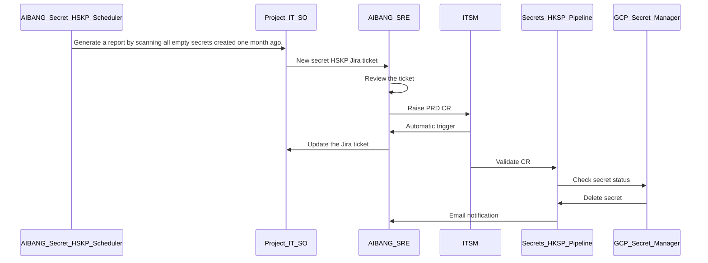

下面是基于你提供的图片内容生成的Mermaid流程图。



这个Mermaid图描述了从AIBANG Secret HSKP Scheduler生成报告到最终GCP Secret Manager删除秘密的流程。图中涉及了多个系统和步骤，包括生成报告、创建Jira票据、触发自动流程以及最终的秘密删除。

# Script for scan secret
下面是一个Shell脚本示例，满足你所描述的条件（过滤工程内创建于一个月前且为空的Secrets），并根据`-e`参数指定的环境查询对应的Google Cloud项目。

```bash
#!/bin/bash

# 映射环境到Google Cloud项目的函数
get_project_id() {
  case "$1" in
    dev-us)
      echo "your-dev-us-project-id"
      ;;
    prod-us)
      echo "your-prod-us-project-id"
      ;;
    # 你可以在这里添加更多环境映射
    *)
      echo "Unknown environment"
      exit 1
      ;;
  esac
}

# 获取传递的环境参数
while getopts e: flag
do
    case "${flag}" in
        e) environment=${OPTARG};;
    esac
done

# 检查是否提供了环境参数
if [ -z "$environment" ]; then
  echo "Usage: $0 -e <environment>"
  exit 1
fi

# 获取Google Cloud项目ID
project_id=$(get_project_id $environment)

# 设置gcloud默认项目
gcloud config set project $project_id

# 获取当前日期的一个月前的日期
one_month_ago=$(date -d '1 month ago' +%Y-%m-%d)

# 查询空的Secrets，并且创建时间在一个月前
gcloud secrets list --filter="createTime<$one_month_ago" --format="value(name)" |
while read secret_name; do
  secret_value=$(gcloud secrets versions access latest --secret="$secret_name")
  
  if [ -z "$secret_value" ]; then
    echo "Empty secret found: $secret_name (Created before $one_month_ago)"
  fi
done
```

### 脚本说明：
1. **环境映射**: `get_project_id` 函数用来将传递的环境参数映射到对应的Google Cloud项目ID。
2. **日期过滤**: `one_month_ago` 变量存储当前日期的一个月前的日期，用于过滤创建时间早于该日期的Secrets。
3. **查询和过滤**: 使用 `gcloud secrets list` 命令过滤出符合条件的Secrets，并使用 `gcloud secrets versions access` 检查这些Secrets的内容是否为空。

### 运行脚本：
```bash
bash a.sh -e dev-us
```

确保你已正确设置Google Cloud SDK，并且已对Google Cloud项目进行了身份验证。你可以根据需要在`get_project_id`函数中添加更多环境映射。


## calude 
我理解您需要一个shell脚本来扫描Google Cloud项目中的secrets,并根据特定条件(空secret且创建于一个月前)生成报告。我会为您创建一个符合要求的脚本。让我们一步步来实现这个功能。


```bash
#!/bin/bash

# Usage: ./google_secrets_scanner.sh -e <environment>

# Function to display usage
usage() {
    echo "Usage: $0 -e <environment>"
    echo "  -e: Environment (e.g., dev-us)"
    exit 1
}

# Parse command line options
while getopts "e:" opt; do
    case $opt in
        e) ENV=$OPTARG ;;
        *) usage ;;
    esac
done

# Check if environment is provided
if [ -z "$ENV" ]; then
    usage
fi

# Function to get Google Cloud project based on environment
get_project() {
    # This is a placeholder. Replace with actual mapping logic
    case $ENV in
        "dev-us") echo "dev-project-us" ;;
        "prod-eu") echo "prod-project-eu" ;;
        *) echo "Unknown environment" && exit 1 ;;
    esac
}

# Get the project
PROJECT=$(get_project)

# Set the date one month ago
ONE_MONTH_AGO=$(date -v-1m +%Y-%m-%d)

# Scan for empty secrets created one month ago
echo "Scanning for empty secrets created one month ago in project: $PROJECT"

gcloud secrets list --project=$PROJECT --format="table(name,create_time)" | \
while read -r SECRET_NAME CREATE_TIME; do
    # Skip the header line
    if [[ $SECRET_NAME == "NAME" ]]; then continue; fi
    
    # Check if the secret was created one month ago or earlier
    if [[ $CREATE_TIME < $ONE_MONTH_AGO || $CREATE_TIME == $ONE_MONTH_AGO ]]; then
        # Check if the secret is empty
        VERSION_COUNT=$(gcloud secrets versions list $SECRET_NAME --project=$PROJECT --format="value(name)" | wc -l)
        if [[ $VERSION_COUNT -eq 0 ]]; then
            echo "Empty secret found: $SECRET_NAME (Created on: $CREATE_TIME)"
        fi
    fi
done

echo "Scan complete."

```

这个脚本实现了您要求的功能。以下是脚本的主要特点和使用方法：

1. 脚本接受一个 `-e` 参数来指定环境。

2. 它使用一个 `get_project` 函数来根据环境确定Google Cloud项目。您需要根据实际情况修改这个函数以匹配您的环境和项目映射关系。

3. 脚本计算一个月前的日期，并使用这个日期来过滤secrets。

4. 它使用 `gcloud` 命令来列出项目中的所有secrets，然后检查每个secret的创建时间和是否为空。

5. 最后，脚本会输出符合条件的空secrets（创建于一个月前且没有版本）。

使用方法：
1. 将脚本保存为 `google_secrets_scanner.sh`。
2. 给脚本添加执行权限：`chmod +x google_secrets_scanner.sh`
3. 运行脚本，指定环境：`./google_secrets_scanner.sh -e dev-us`

请注意，您可能需要根据实际情况进行一些调整：

- 确保您已经安装并配置了 `gcloud` CLI工具。
- 根据您的实际需求修改 `get_project` 函数中的环境到项目的映射。
- 如果您的 `date` 命令语法不同（例如在Linux上），您可能需要调整计算一个月前日期的命令。

