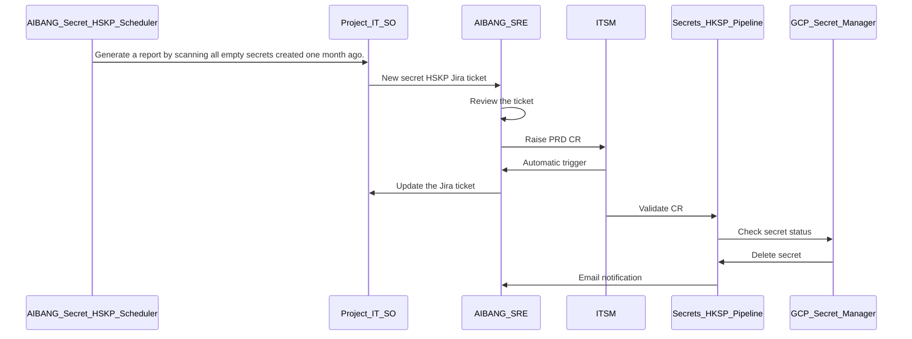

下面是基于你提供的图片内容生成的Mermaid流程图。

```mermaid
sequenceDiagram
    participant AIBANG_Secret_HSKP_Scheduler
    participant Project_IT_SO
    participant AIBANG_SRE
    participant ITSM
    participant Secrets_HKSP_Pipeline
    participant GCP_Secret_Manager

    AIBANG_Secret_HSKP_Scheduler->>Project_IT_SO: Generate a report by scanning all empty secrets created one month ago.
    Project_IT_SO->>AIBANG_SRE: New secret HSKP Jira ticket
    AIBANG_SRE->>AIBANG_SRE: Review the ticket
    AIBANG_SRE->>ITSM: Raise PRD CR
    ITSM->>AIBANG_SRE: Automatic trigger
    AIBANG_SRE->>Project_IT_SO: Update the Jira ticket
    ITSM->>Secrets_HKSP_Pipeline: Validate CR
    Secrets_HKSP_Pipeline->>GCP_Secret_Manager: Check secret status
    GCP_Secret_Manager->>Secrets_HKSP_Pipeline: Delete secret
    Secrets_HKSP_Pipeline->>AIBANG_SRE: Email notification
```

这个Mermaid图描述了从AIBANG Secret HSKP Scheduler生成报告到最终GCP Secret Manager删除秘密的流程。图中涉及了多个系统和步骤，包括生成报告、创建Jira票据、触发自动流程以及最终的秘密删除。
