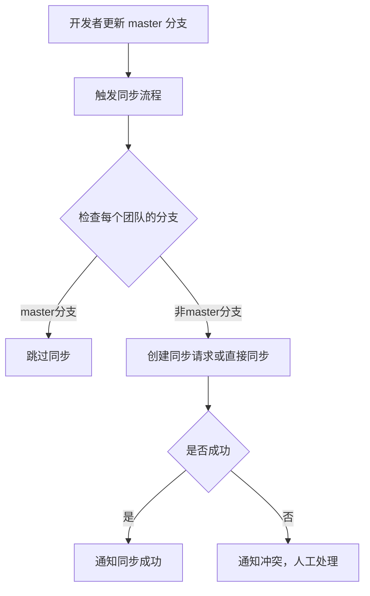

在这种环境下，如果各个团队都从共享库（shared library）创建不同的 pipeline，且可能使用了不同的分支，那么确保每次对 master 分支的修改能够覆盖到所有子分支，需要以下几个步骤：1. 分支状态检查：
定期检查所有团队使用的库分支情况，以确保一致性。可以使用脚本自动检索各个 pipeline 中的 shared library 分支信息。示例如下：

# 检查各团队 pipeline 配置中的 shared library 分支信息

```bash
for team_dir in /path/to/teams/*; do
    echo "Checking branch for team pipeline in: $team_dir"
    branch=$(grep "branch" "$team_dir/pipeline_config.yml" | awk '{print $2}')
    echo "Team $(basename $team_dir) uses branch: $branch"
done

```

    2. 自动化同步 master 修改到各个子分支：

为了确保 master 分支的更新能够快速同步到其他分支，可以通过以下几种方式实现自动化：
• Git hooks: 配置 post-commit 或 post-merge 钩子，使得每次在 master 分支提交或合并代码后，自动创建 pull request，或者自动将 master 的更改推送到其他活跃分支。
• CI/CD Pipeline 同步任务: 在 CI/CD pipeline 中添加一个任务，定期检查 master 分支的更改并合并到所有其他分支。
示例脚本如下，用于将 master 分支的更改合并到特定子分支：

# 自动化将 master 分支的更改推送到其他子分支

```bash
branches_to_update=("dev" "staging" "feature1")

for branch in "${branches_to_update[@]}"; do
    git checkout $branch
    git merge master
    if [ $? -eq 0 ]; then
        echo "Merged master into $branch successfully."
        git push origin $branch
    else
        echo "Conflict detected while merging into $branch. Please resolve manually."
    fi
done
```

    3. 统一管理 Pipeline 配置：
    • 集中化配置管理: 将 shared library 的配置集中在一个配置文件中，每个团队的 pipeline 从这个集中配置文件读取 shared library 分支的信息。这种方式可以确保所有团队使用相同的分支，也便于快速切换。
    4. 定期审计报告：

利用自动化脚本生成审计报告，列出每个团队当前使用的库分支，以便定期检查。5. 触发提醒：
如果检测到团队 pipeline 使用的 shared library 分支与 master 不一致，可以触发提醒。例如，发送邮件或在 Slack 上通知相关团队。

方案流程图

以下是一个简单的流程图，描述如何在共享库的 master 分支有更新时，通过脚本或 pipeline 自动同步到所有子分支的流程：



额外说明

上述方法可确保 master 分支的更新尽可能快速、准确地覆盖到其他子分支。如果需要更灵活的管理方式，可以考虑在 shared library 的代码库中实现 GitOps 或者配置管理工具来简化多分支的管理流程。

