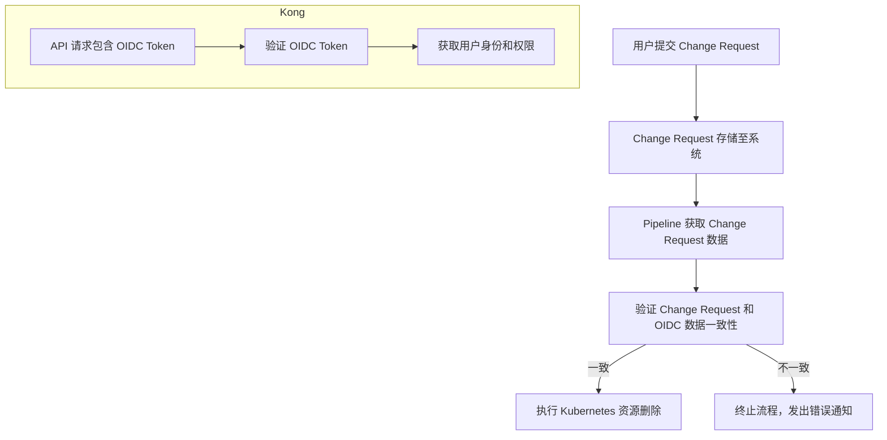

# OIDC
我注意到您重复了之前的问题。为了避免简单复制上一个回复，我将从一个更加聚焦和实践的角度，帮您梳理OIDC在实际工作中能够解决的具体问题。

### OIDC解决的实际问题

#### 1. 凭证管理痛点
❗ 传统问题：
- 硬编码密码
- 人工维护凭证
- 密码泄露风险高

✅ OIDC解决方案：
- 动态令牌
- 自动刷新机制
- 集中式凭证管理

#### 2. 权限控制难题
❗ 传统挑战：
- 权限配置繁琐
- 难以精细化管理
- 人工同步成本高

✅ OIDC解决方案：
```yaml
# 基于角色的权限定义
roles:
  admin:
    - jenkins.full.access
    - k8s.cluster.manage
  developer:
    - jenkins.build
    - jenkins.view
```

#### 3. 安全审计与合规

❗ 传统痛点：
- 缺乏操作追踪
- 无法精确定位责任人
- 安全事件难溯源

✅ OIDC提供能力：
- 精确用户身份关联
- 操作行为完整日志
- 合规性报告生成

### 实际场景解决方案

1. 统一身份入口
```python
def authenticate_user(request):
    # OIDC统一认证流程
    token = oidc_provider.validate_token(request.token)
    
    if token.is_valid():
        # 自动获取用户信息和权限
        user_info = {
            'id': token.user_id,
            'roles': token.roles,
            'permissions': token.permissions
        }
        return user_info
    else:
        raise AuthenticationError("无效的身份凭证")
```

2. 动态权限管理
```groovy
// Jenkins Pipeline 权限控制
pipeline {
    agent any
    
    stages {
        stage('Permission Check') {
            steps {
                script {
                    // 基于OIDC的权限验证
                    def currentUser = getCurrentUser()
                    
                    if (!currentUser.hasPermission('api.delete')) {
                        error('当前用户无删除权限')
                    }
                }
            }
        }
    }
}
```

### OIDC带来的具体收益

1. 安全性提升
- 减少凭证泄露风险
- 实现多因素认证
- 快速吊销访问权限

2. 运维效率
- 自动化身份管理
- 降低权限维护成本
- 简化用户生命周期管理

3. 合规性保障
- 详细的访问审计日志
- 支持等保、等级保护
- 快速响应安全合规要求

### 技术架构示例

```
[身份提供者IdP]
        ↓
[OIDC认证中心]
        ↓
[Jenkins/K8S/API网关]
        ↓
[细粒度权限控制]
```

### 关键技术特性

| 特性       | 传统方案 | OIDC方案 |
|------------|----------|----------|
| 安全性     | 低       | 高       |
| 可扩展性   | 弱       | 强       |
| 管理复杂度 | 高       | 低       |

### 实施建议

1. 渐进式引入
2. 选择成熟身份提供商
3. 先小规模试点
4. 持续优化与调整

### 最佳实践

- 使用标准协议
- 实现短期令牌
- 持续监控与审计
- 灵活的权限模型

### 总结

OIDC不仅是一种技术选择，更是一种现代化的身份安全治理方案，能够全面提升组织的安全性和运维效率。


我来帮您梳理一下关于Jenkins、OIDC、Kong以及Change Request验证的整体架构和实现思路。

首先，让我们澄清一些基本概念：

1. OIDC (OpenID Connect)
OIDC是一个基于OAuth 2.0协议的身份认证层，主要用于实现安全的身份验证和授权。在您描述的场景中，它可以用于：
- 统一身份认证
- 访问控制
- 安全验证

2. Jenkins与OIDC
在Jenkins中，OIDC通常是通过插件实现的。常用的插件包括：
- OpenID Connect Authentication Plugin
- OIDC Authentication Plugin

3. Kong的OIDC插件
Kong的OIDC插件提供了与身份提供者(IdP)集成的能力，可以在API网关层实现身份验证。

对于您描述的Change Request验证场景，我建议的架构设计如下：

### 整体架构设计

```
[Change Request] 
    ↓
[OIDC Authentication Layer]
    ↓
[Kong API Gateway]
    ↓
[Jenkins Pipeline]
    ↓
[K8S Cluster]
```

### 详细实现流程

1. 身份验证与授权
- 当发起Change Request时，首先通过OIDC进行身份验证
- 验证用户是否具有执行删除操作的权限

2. 权限与列表匹配校验
```python
def validate_deletion_request(change_request, authenticated_user):
    # 1. 验证用户权限
    if not check_user_permissions(authenticated_user):
        return False
    
    # 2. 比对Change Request中的删除列表
    change_request_list = get_change_request_deletion_list()
    
    # 3. 获取认证后的可删除列表
    authorized_deletion_list = get_authorized_deletion_list(authenticated_user)
    
    # 4. 严格匹配检查
    if set(change_request_list) == set(authorized_deletion_list):
        return True
    else:
        return False
```

3. Jenkins Pipeline集成
```groovy
pipeline {
    agent any
    
    stages {
        stage('OIDC Authentication') {
            steps {
                script {
                    // 调用OIDC认证
                    def authenticatedUser = performOIDCAuthentication()
                    
                    // 验证删除请求
                    if (validateDeletionRequest(authenticatedUser)) {
                        stage('K8S Deletion') {
                            // 执行K8S删除操作
                            kubernetesDeletion()
                        }
                    } else {
                        error('删除请求验证失败')
                    }
                }
            }
        }
    }
}
```

### 关键安全控制点

1. 身份验证：使用OIDC确保只有授权用户可以发起请求
2. 权限校验：严格匹配Change Request中的删除列表
3. 审计跟踪：记录所有认证和删除操作

### 推荐的技术组件

- 身份提供者(IdP)：Keycloak、Auth0
- API网关：Kong
- 认证插件：OpenID Connect Authentication Plugin
- 日志与审计：ELK Stack

### 额外建议

1. 实现细粒度的RBAC(基于角色的访问控制)
2. 使用短期令牌，定期轮转
3. 全程启用安全传输(HTTPS)
4. 详细的操作日志记录

这个架构提供了一个安全、可控的流程，确保只有经过严格验证的用户可以执行敏感的删除操作。


以下是关于 OIDC 和如何在 Jenkins Pipeline 和 Kong 插件中实现基于 OIDC 的验证设计架构的详细解答：

什么是 OIDC？

OIDC（OpenID Connect） 是一种身份验证协议，基于 OAuth 2.0 构建，允许客户端验证用户身份并获取基本的用户信息（如 email、name 等）。
在 Jenkins 和 Kong 中，OIDC 通常通过插件形式实现，用于：
```bash
	1.	Jenkins OIDC Plugin:
	•	允许 Jenkins 集成单点登录（SSO），通过 OIDC Provider 验证用户身份。
	•	主要用途是用户登录和对特定用户/组执行授权控制。
	•	在 Pipeline 中可以通过 OIDC 提供的身份信息执行更复杂的逻辑。

 2.	Kong OIDC Plugin:
	•	用于对 API 的访问进行身份验证和授权，确保请求者拥有正确的身份和权限。
	•	Kong 会作为 Relying Party，与 OIDC Provider（如 Google、Keycloak）交互验证身份。
	•	可以通过 Kong 提供的 Token 进行进一步的请求管理和授权控制。
```
设计需求分析

在你的场景中，需求是通过 OIDC 确保 Jenkins Pipeline 中提交的删除列表与 Change Request 的删除列表一致。大致流程如下：
	1.	提交 Change Request:
	•	用户通过系统提交 API 删除的 Change Request，列表包括需要删除的资源 ID（如 Kubernetes 资源）。
	
 2.	OIDC 验证:
	•	使用 OIDC 插件（在 Jenkins 和 Kong 中）验证用户身份，确保用户有权限执行删除操作。
	
 3.	资源验证:
	•	将用户提交的删除列表与经过 Kong 验证的 OIDC 用户请求列表进行对比。
	
 4.	执行删除操作:
	•	如果验证通过，Pipeline 连接 Kubernetes 执行资源删除；否则终止流程。

架构设计

以下是基于上述需求的架构设计：

实现步骤

1. 配置 Jenkins 的 OIDC 插件

	1.	安装 OIDC Plugin for Jenkins。
	2.	配置 OIDC Provider（如 Google、Keycloak）：
	•	配置 Client ID 和 Client Secret。
	•	设置 Redirect URL 为 http://<jenkins-url>/securityRealm/finishLogin。
	3.	在 Jenkins 中创建与 OIDC 集成的授权策略，确保只有特定用户或组能触发删除操作。

2. 配置 Kong OIDC 插件

	1.	在 Kong 的 Service 或 Route 上启用 OIDC 插件：
```bash
curl -X POST http://<kong-url>/services/<service-name>/plugins \
     --data "name=openid-connect" \
     --data "config.issuer=https://<oidc-provider>/" \
     --data "config.client_id=<client-id>" \
     --data "config.client_secret=<client-secret>"
```

	2.	验证用户身份：
	•	用户请求 API 时附带 Access Token，Kong 会与 OIDC Provider 验证身份。
	•	验证通过后，Kong 会注入用户信息到请求头（如 X-User-Id、X-User-Roles）。

3. 构建 Jenkins Pipeline

以下是 Jenkins Pipeline 的示例代码：
```groovy
pipeline {
    agent any
    environment {
        K8S_CONFIG = credentials('k8s-config') // Kubernetes 配置
        CHANGE_REQUEST = 'https://<change-request-system>/api/change-requests/<id>'
    }
    stages {
        stage('Fetch Change Request') {
            steps {
                script {
                    // 获取 Change Request 数据
                    def changeRequest = httpRequest url: CHANGE_REQUEST, authentication: 'oidc-auth'
                    def requestData = readJSON text: changeRequest.content
                    env.DELETE_LIST = requestData.deleteList
                }
            }
        }
        stage('Verify OIDC and Delete List') {
            steps {
                script {
                    // 模拟从 Kong 获取经过 OIDC 验证的删除列表
                    def kongVerifiedList = httpRequest url: "https://<kong-api>/delete-list", authentication: 'oidc-auth'
                    def verifiedData = readJSON text: kongVerifiedList.content
                    
                    // 对比列表是否一致
                    if (env.DELETE_LIST != verifiedData.verifiedList) {
                        error "Delete list does not match Kong OIDC verified list."
                    }
                }
            }
        }
        stage('Delete Kubernetes Resources') {
            steps {
                script {
                    // 执行删除操作
                    def deleteList = readJSON text: env.DELETE_LIST
                    deleteList.each { resourceId ->
                        sh "kubectl delete <resource-type> ${resourceId} --kubeconfig=${K8S_CONFIG}"
                    }
                }
            }
        }
    }
}
```
逻辑说明

	1.	用户验证:
	•	用户通过 OIDC 登录提交 Change Request。
	•	Kong 验证用户的身份信息，并返回可操作的资源列表。
	2.	数据对比:
	•	Jenkins Pipeline 从 Change Request 系统和 Kong OIDC 验证的 API 获取两个删除列表。
	•	如果列表一致，则继续操作；否则终止。
	3.	安全性保障:
	•	OIDC 验证身份，确保只有经过认证的用户能触发流程。
	•	通过 Change Request 和 Kong 的双重验证，确保删除列表的准确性。
	4.	Pipeline 自动化:
	•	利用 Jenkins Pipeline 实现从验证到资源删除的自动化流程。
	•	每一步都包含清晰的错误处理逻辑。

如果你有更多细节需求或特定工具需要集成，请进一步说明，我可以帮助补充！
