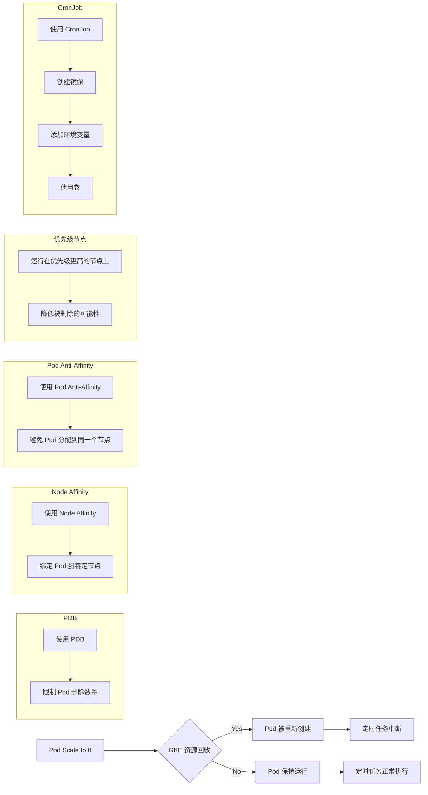

```yaml
apiVersion: batch/v1
kind: CronJob
metadata:
  name: sink-job
  namespace: aibang-core
spec:
  schedule: "0 0 * * *"  # 每天午夜运行
  jobTemplate:
    spec:
      template:
        spec:
          containers:
          - name: sink-job
            image: your-image-registry/sink-job:latest
            command: ["python", "abc.py"]
            resources:
              requests:
                cpu: "100m"
                memory: "128Mi"
              limits:
                cpu: "500m"
                memory: "512Mi"
          restartPolicy: OnFailure

```

这个 CronJob 配置的说明：

1. `schedule: "0 0 * * *"`: 这设置任务每天午夜运行。您可以根据需要调整这个 cron 表达式。

2. `jobTemplate`: 这定义了每次运行时创建的 Job 的模板。

3. `containers`:
   - `image`: 请替换为您的实际镜像地址。
   - `command`: 设置为运行您的 Python 脚本。

4. `resources`:
   - 设置了资源请求和限制，您应根据实际需求调整这些值。

5. `restartPolicy: OnFailure`: 这意味着如果任务失败，它将被重新启动。

使用 CronJob 的优势：

1. 定时执行：CronJob 专门设计用于按计划运行任务，非常适合您的用例。

2. 资源效率：当任务不运行时，不会占用集群资源。

3. 自动清理：Kubernetes 会自动清理已完成的 Job，减少管理负担。

4. 失败处理：可以配置重试策略和历史记录限制。

5. 灵活调度：可以轻松调整运行频率，而无需修改应用程序代码。

实施建议：

1. 镜像管理：确保您的 Docker 镜像包含所有必要的依赖和脚本。

2. 配置管理：考虑使用 ConfigMaps 或 Secrets 来管理配置，而不是硬编码在镜像中。

3. 日志管理：确保将重要的日志输出到 stdout/stderr，以便 Kubernetes 可以收集它们。

4. 监控：设置适当的监控和告警，以便在任务失败时得到通知。

5. 时区考虑：注意 CronJob 默认使用 UTC 时间。如果需要，可以调整 schedule 或设置容器的时区。

6. 并发策略：如果需要，可以通过设置 `spec.concurrencyPolicy` 来控制是否允许并发执行。

通过使用 CronJob，您可以更有效地管理这个定期任务，同时减少因资源重分配而导致的意外中断。这种方法应该能很好地解决您之前遇到的问题。


### 3. 评估使用CronJob的可行性

考虑到你的任务性质，使用Kubernetes的CronJob可能会更合适。CronJob允许你按照计划定期执行 `abc.py` 脚本，而不需要Pod持续运行，这样可以减少资源消耗，并避免Pod因调度问题而被重新创建。

#### 实现CronJob
你可以按以下步骤将 `abc.py` 脚本转换为CronJob：

1. **创建Docker镜像**：将 `abc.py` 脚本及其依赖项打包成一个Docker镜像。

2. **定义CronJob**：
    ```yaml
    apiVersion: batch/v1
    kind: CronJob
    metadata:
      name: sink-job-cron
    spec:
      schedule: "0 0 * * *"  # 调整计划，每24小时运行一次
      jobTemplate:
        spec:
          template:
            spec:
              containers:
              - name: sink-job
                image: your-docker-image
                command: ["python", "abc.py"]
              restartPolicy: OnFailure
    ```
3. **处理依赖项**：确保所有必要的依赖项和脚本都包含在Docker镜像中，以便CronJob可以独立运行。

### 总结

- **Pod重新创建的原因**：可能由于 `gke.io/optimize-utilization-scheduler` 的资源优化调度引起。
- **缓解措施**：可以使用Pod优先级、反亲和性、节点亲和性或专用节点池来减少调度干预。
- **CronJob的适用性**：建议将任务转换为CronJob，这样可以减少资源消耗，并避免持续运行的Pod受到调度影响。

这种方法有助于确保你的关键任务能够可靠运行，而不会因为GKE的资源调度而频繁中断。


在Kubernetes的CronJob中，`command` 参数定义了在Pod启动时要执行的命令。CronJob创建的每个Pod都会运行一次你指定的命令，并且该命令会在容器中执行。

### command参数的功能
在你的CronJob配置中：
```yaml
command: ["python", "abc.py"]
```
这个 `command` 的作用是告诉Kubernetes在Pod启动后，进入容器并执行 `python abc.py` 命令。

### 处理依赖的Python脚本
如果 `abc.py` 脚本在运行时依赖于同一目录下的其他Python脚本，如 `backup.py` 和 `def.py`，那么这些脚本需要和 `abc.py` 一起打包进Docker镜像中。当CronJob运行时，容器内的工作目录应该已经包含所有必要的脚本，因此这些依赖脚本可以正常被调用。

例如，假设 `abc.py` 中有如下代码：
```python
import backup
import def
```
或者通过 `subprocess` 调用其他脚本：
```python
import subprocess
subprocess.run(["python", "backup.py"])
```
只要 `backup.py` 和 `def.py` 在同一目录下，且已经包含在Docker镜像中，这样的调用就不会有任何问题。

### 完整的CronJob工作流程
1. **创建Docker镜像**：确保 `abc.py`、`backup.py`、`def.py` 等脚本都存在于同一个目录下，并且都被打包到同一个Docker镜像中。

2. **指定工作目录**：默认情况下，`command` 会在容器的工作目录（通常是 `/` 或 `/app`，具体取决于Dockerfile）中执行。如果你的脚本需要在特定目录中运行，可以通过 `workingDir` 参数指定：
    ```yaml
    spec:
      containers:
      - name: sink-job
        image: your-docker-image
        command: ["python", "abc.py"]
        workingDir: "/app"  # 指定工作目录
    ```

3. **调用外部脚本**：确保你的 `abc.py` 脚本可以找到并调用同目录下的其他脚本。只要这些脚本在同一个工作目录内，`command` 执行时不会有任何问题。

### 总结
- **`command` 参数作用**：它定义了容器启动时要执行的具体命令，通常用于启动你的主要应用或任务。
- **依赖处理**：只要所有的依赖脚本（如 `backup.py`, `def.py`）都在Docker镜像内的同一目录下，并且被正确引用，`command` 参数执行 `abc.py` 时不会有任何问题。
- **最佳实践**：确保在构建Docker镜像时，包括所有必要的文件和依赖，并正确设置工作目录，以确保脚本运行环境与开发环境一致。

使用CronJob执行 `abc.py` 是可行的，不会影响到你的脚本正常调用其他Python文件。


# PDB 
使用 PodDisruptionBudget (PDB): PDB 可以防止你的 Pod 意外被删除或重新创建，确保你的关键服务持续运行


## 分析

你的问题是由于GKE 集群的资源回收导致 `sink-job` Pod 被重新创建，从而影响了你的定时任务的执行。

1. **确定是不是因为资源重分配造成的Pod重新创建**:

   - 你提供的日志表明，Pod 的 `reason` 为 `Scheduled`，且 `reportingComponent` 为 `gke.io/optimize-utilization-scheduler`。 这意味着 Pod 是由于 GKE 调度器优化资源利用率而被重新创建的。
   - 这是因为你的 GKE 集群中运行了上千个 Pod，而当一些 Pod 被 Scale 到 0 后，GKE 会尝试回收这些 Pod 所使用的资源，并重新分配给其他 Pod。

2. **对于这种资源调度的问题引起的我这个Pod重新被创建,有没有好的解决办法.我想持久话保障我的这个Pod尽量少的受到调度干预**:

   - 以下是一些方法可以帮助你减少 `sink-job` Pod 被重新创建的频率，从而实现更稳定的运行：

      - **使用 Pod Disruption Budget (PDB):** PDB 可以限制在任何给定时间内被删除的 Pod 数量。 你可以为 `sink-job` 设置一个 PDB，例如允许最多 0 个 Pod 被删除。 这将防止 GKE 随意回收你的 Pod。

      - **使用 Node Affinity:** 通过 Node Affinity，你可以将 `sink-job` Pod 绑定到特定的节点。 这可以确保 Pod 始终运行在同一个节点上，即使其他 Pod 被删除了。

      - **使用 Pod Anti-Affinity:** Pod Anti-Affinity 可以避免将 `sink-job` Pod 与其他 Pod 分配到同一个节点。 这样可以降低 `sink-job` Pod 被其他 Pod 影响而被重新创建的可能性。

      - **将你的 `sink-job` 运行在优先级更高的节点上**:  你可以将 `sink-job` 的 Deployment 运行在优先级更高的节点上，例如在预留节点上。 这可以确保 `sink-job` Pod 不会被轻易地删除。

3. **我这种场景是不是运行一个cronjob更合适一些? 但是比如我的这个Python abc.py 其实在Pod里 单独运行的时候可能还有一些依赖或者调用其他的脚本.你也帮我考虑进去,怎么做成一个cronjob**:

   -  使用 CronJob 是一个不错的选择，它可以根据你的预定时间表自动运行你的 Python 脚本。 
   -  为了确保脚本可以正常运行，你需要在 CronJob 中添加以下配置：

      - **镜像：** 你需要创建一个镜像，包含你的 Python 脚本以及所有依赖的库。
      - **环境变量：**  如果你的 Python 脚本需要访问其他脚本或依赖项，你可以使用环境变量来传递这些信息。
      - **卷：**  如果你的 Python 脚本需要访问文件系统，你可以使用卷来挂载存储卷到 Pod 中。 

## 示例

以下是创建 CronJob 的示例，其中 `abc.py` 脚本使用了 `requirements.txt` 文件来列出依赖项，并且使用 `volumes` 来挂载一个名为 `my-volume` 的存储卷。

```yaml
apiVersion: batch/v1
kind: CronJob
metadata:
  name: my-cronjob
spec:
  schedule: "0 0 * * *" # 每一天的凌晨 0 点执行
  jobTemplate:
    spec:
      template:
        spec:
          containers:
          - name: python-script
            image: your-image-name:latest 
            command: ["python", "abc.py"]
            volumeMounts:
            - name: my-volume
              mountPath: /path/to/your/data
          volumes:
          - name: my-volume
            persistentVolumeClaim:
              claimName: my-pvc-name #  你需要创建一个 PVC (PersistentVolumeClaim) 并定义名为 "my-pvc-name" 的 PVC。
```

## Mermaid 流程图



## 最佳实践

- 监控 GKE 集群的资源利用率，及时调整 Pod 数量。
- 定期清理 unused 资源。
- 使用 `kubectl describe pod` 命令查看 Pod 的事件日志，帮助分析 Pod 重新创建的原因。
- 使用 GKE 的各种功能，例如 PDB、Node Affinity、Pod Anti-Affinity 等，来保障关键服务的稳定运行。
- 遵循 Kubernetes 最佳实践，确保 Pod 的正常运行。

## 总结

通过以上分析和建议，你可以有效地降低 `sink-job` Pod 被重新创建的频率，确保你的定时任务能够稳定运行。 使用 CronJob 也是一种不错的选择，可以更好地管理定时任务的执行。 
