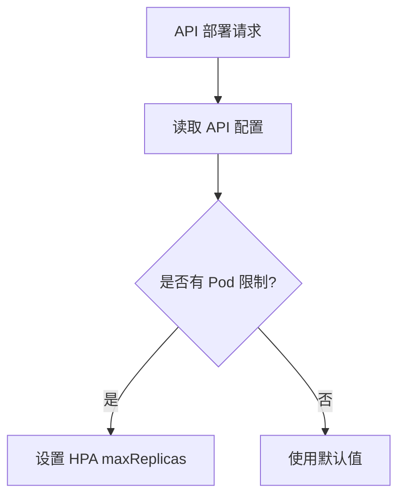

为了更好地处理 Pod 数量的选择及其逻辑，同时简化管理流程，可以参考以下方案，将 Pod 数量的信息与 API 紧密绑定，并存储在一个合适的数据库或配置管理系统中。以下是推荐的解决方案：

存储 Pod 数量信息的位置

Pod 数量信息直接与 API 的具体配置相关，因此可以存储在以下平台组件中：
	1.	数据库（推荐：Firestore 或关系型数据库）
	•	将每个 API 的配置信息存储在数据库中，包含默认设置、环境类型（prod 或 non-prod）、Pod 数量限制等字段。
	•	适合复杂系统，因为数据库易于扩展、查询和管理。
示例数据库结构：
``` 
API_ID	API_NAME	ENV_TYPE	POD_LIMIT	NOTES
api_001	UserService	prod	4	默认生产环境
api_002	DataService	non-prod	2	非生产环境
api_003	ReportAPI	prod	8	特殊生产环境，8 pods
``` 
	•	说明：
	•	POD_LIMIT 字段记录每个 API 的最大 Pod 数量。
	•	ENV_TYPE 用于区分环境。
	•	特殊用户可以通过在 NOTES 中备注说明，或者增加新的标记字段。

	2.	Kubernetes ConfigMap
	•	如果配置是临时的或主要供 Kubernetes 使用，可以将 Pod 数量限制存储在 ConfigMap 中。
	•	每次部署时，Pod 控制器可以动态从 ConfigMap 中获取对应的 Pod 限制值。
ConfigMap 示例：
```yaml
apiVersion: v1
kind: ConfigMap
metadata:
  name: api-pod-config
data:
  UserService: "4"
  DataService: "2"
  ReportAPI: "8"
``` 

	3.	API 配置文件（JSON 或 YAML 格式）
	•	如果 API 信息存储在配置文件中（如 API Gateway 的配置文件或微服务定义），可以直接在配置文件中添加 Pod 数量限制字段。
	•	适合小型系统，但不推荐用于复杂环境。
JSON 配置示例：
```json
{
  "api_id": "api_001",
  "api_name": "UserService",
  "env_type": "prod",
  "pod_limit": 4
}
``` 
处理逻辑建议
	1.	按 API 定义 Pod 数量限制
	•	每个 API 的 Pod 限制直接存储在数据库或配置文件中，允许根据需求进行动态调整。
	•	优势：灵活性高，且 Pod 限制与 API 绑定，逻辑清晰。
	2.	在部署时动态调整 Pod 数量
	•	根据环境（prod/non-prod）和 API 的 Pod 限制，动态设置 HPA 的最大副本数。
	•	逻辑流程：
	•	在 API 部署时，读取数据库或配置文件中的 Pod 限制。
	•	设置 HPA 的 maxReplicas 为 Pod 限制值。
Mermaid 流程图：


	3.	自动化管理特殊情况
	•	针对特殊用户的 API，可以在数据库中添加标记字段，例如 is_special_user，并基于此字段动态调整 Pod 限制。
	•	示例逻辑：
	•	如果 is_special_user = true，Pod 数量限制设为 8。
	•	否则，按照默认环境限制（prod: 4, non-prod: 2）。
	4.	收费逻辑与 Pod 限制关联
	•	在收费计算时，直接从数据库中读取 Pod 限制值，并基于该值进行费用计算。
	•	示例公式：
	•	如果用户申请 Pod 数量 > POD_LIMIT，则产生警告或拒绝申请。
	•	否则，按公式正常收费。

实现效果总结

通过将 Pod 数量与 API 配置绑定，可以实现以下目标：
	1.	动态调整不同环境或特殊用户的 Pod 数量限制。
	2.	统一管理所有 API 的资源配额信息，避免硬编码配置。
	3.	在收费和部署时自动化读取配置，减少人为干预。
	4.	为未来的扩展（如更多环境或定制收费逻辑）打下基础。

推荐选择 Firestore 或关系型数据库 作为存储中心，结合动态部署逻辑，实现高效且灵活的 Pod 限制管理。