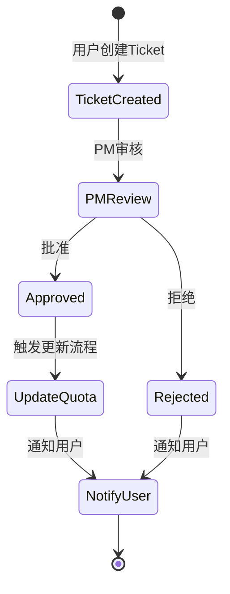
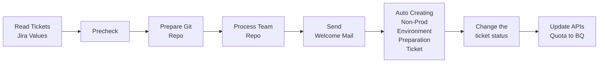
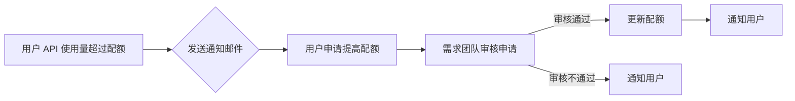
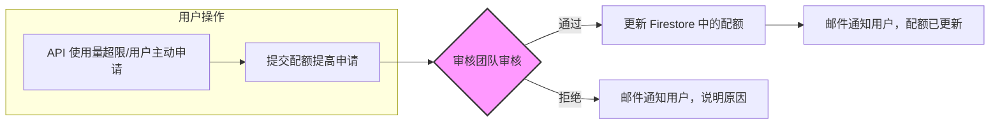
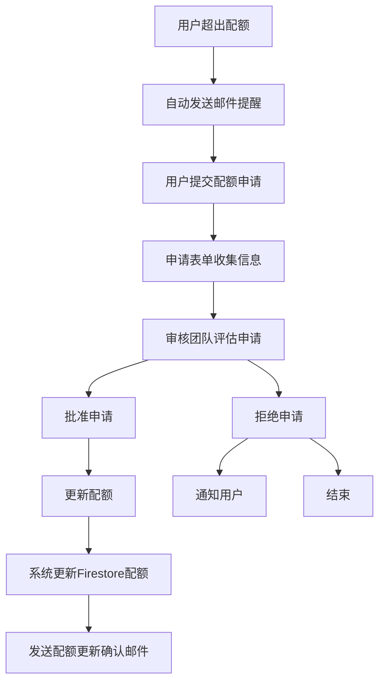

设计一个完整的API Quota管理和申请流程。我的建议流程如下：

### 1. Quota监控和预警机制

#### 监控触发点
- 每月固定时间（如月底）检查Teams的API使用情况
- 当API使用量达到80%时，首次发送预警邮件
- 当API使用量达到100%时，发送配额超限邮件

### 2. 邮件模板设计

#### 预警邮件模板
```
主题：API配额使用预警 - [团队名称]

尊敬的 [团队负责人]，

您好！我们注意到您的团队当前API使用量已达到80%。

- 当前使用量：[X] / [总配额Y]
- 使用百分比：[Z%]

建议：
1. 评估当前API使用情况
2. 优化API调用策略
3. 如需增加配额，请按以下流程申请

[申请链接]
```

#### 配额超限邮件模板
```
主题：API配额已超限 - [团队名称]

尊敬的 [团队负责人]，

您的团队API配额已达到100%，当前服务可能受限。

- 当前使用量：[X] / [总配额Y]
- 使用百分比：100%

紧急行动：
1. 立即申请增加配额
2. 优化API调用策略
3. 暂时控制API调用频率

[申请链接]
```

### 3. 配额申请流程

#### 申请步骤
1. 通过专门的配额申请平台（可以是内部工单系统）
2. 填写申请表单，包含：
   - 团队名称
   - 当前使用情况
   - 申请增加的配额数量
   - 申请原因
3. 上传必要的业务说明文档
4. 提交申请

#### 申请表单建议字段
- 团队名称
- 联系人
- 联系邮箱
- 当前配额
- 已使用配额
- 申请增加配额数量
- 业务使用场景说明
- 预期未来3-6个月的API使用趋势
- 相关支持文档上传

### 4. 审核和更新流程

#### 审核标准
1. 业务合理性评估
2. 历史API使用记录
3. 申请理由充分性
4. 团队过往信誉

#### 审核流程
1. 一线技术支持初步审核
2. 需求团队详细评估
3. 管理层最终批准
4. 配额调整

#### 更新机制
- 通过Firestore直接更新Teams的Quota
- 发送配额调整确认邮件
- 记录变更日志

### 5. 技术实现建议

#### 系统组件
1. Firestore数据存储
2. 定时监控服务
3. 邮件通知系统
4. 工单管理平台

#### 关键流程自动化
- 使用量自动监控
- 邮件模板动态生成
- 工单自动分配
- 审核流程追踪

### 6. 额外建议

1. 建立明确的配额政策文档
2. 提供API使用优化建议
3. 考虑提供配额使用报告
4. 设置配额使用预警机制

### 建议改进点

1. 开发自助服务门户
2. 提供API使用情况实时仪表盘
3. 制定差异化配额策略
4. 建立配额透明度机制

这个流程提供了一个相对全面的解决方案。您可以根据实际情况进行调整和优化。希望对您有帮助！

根据您的描述，我们可以设计一个基于Demand Tickets的Quota审核和更新流程。以下是一个详细的建议方案：

### Quota审核和更新流程

#### 1. 流程概览
1. 用户在Demand Tickets中提交Quota调整申请
2. PM直接在Demand Tickets中审核和确认
3. 确认后自动触发Quota更新流程

#### 2. 详细流程设计

##### 2.1 申请提交
- 用户在Demand Tickets中创建新的Ticket
- Ticket模板包含以下关键字段：
  - 当前Quota
  - 申请调整的Quota数量
  - 申请原因
  - 业务背景说明

##### 2.2 PM审核
- PM收到Ticket通知
- 审核考虑因素：
  1. 业务合理性
  2. 历史API使用情况
  3. 申请理由的充分性
  4. 团队过往信誉

##### 2.3 审核确认机制
- PM在Ticket中添加审核状态：
  - 待审核
  - 已批准
  - 拒绝
- 如果批准，在Ticket中直接更新最新的Quota值

#### 3. 自动触发更新流程

##### 3.1 Trigger机制
- 当Ticket状态变更为"已批准"时
- 系统自动检测到状态变更
- 触发Quota更新Pipeline

##### 3.2 Pipeline更新步骤
1. 从Demand Tickets读取最新Quota值
2. 更新Firestore中对应Teams的Quota
3. 发送确认邮件给用户
4. 记录变更日志

#### 4. 技术实现建议






#### 5. 邮件通知模板

##### 5.1 批准通知
```
主题：Quota申请已批准 - [团队名称]

尊敬的 [团队负责人]，

您的Quota调整申请已获批：
- 原Quota：[X]
- 新Quota：[Y]
- 批准日期：[日期]

感谢您的申请！
```

##### 5.2 拒绝通知
```
主题：Quota申请未通过 - [团队名称]

尊敬的 [团队负责人]，

很抱歉，您的Quota调整申请未通过。
- 原因：[简要说明]

建议：
1. 重新评估申请理由
2. 优化API使用策略
```

#### 6. 额外建议
1. 设置Quota变更的审计日志
2. 提供Quota历史变更追溯
3. 建立申诉机制

#### 7. 风险控制
- 设置Quota调整的上限阈值
- 对频繁申请的团队设置特殊审核流程
- 建立异常检测机制

这个流程充分利用了现有的Demand Tickets系统，实现了低成本、高效率的Quota管理。PM可以便捷地进行审核，系统可以自动完成后续更新工作。


邮件需要更新，以告知用户后续操作。如果在 Firestore 中存储的、通过 Demon Tickets 定义的 API 使用配额需要更新（例如，用户超额使用 API），需求团队应该如何操作？

更具体地说，他们想知道两件事：

1. 邮件内容该如何更新，以指导用户在收到 API 使用量超过配额的通知后应该采取什么行动？ 例如，邮件是否应该引导用户申请提高配额，联系支持人员，或是其他操作？
2. 如果用户需要调整他们的 API 使用配额，需求团队（可能是负责处理配额申请或调整的团队）应该如何执行这个操作？  这部分需要解释具体的流程，例如通过哪个平台或工具提交申请，需要提供哪些信息等等。

为了更好地回复，你需要提供关于这两点的信息。

以下是一个示例回复，你可以根据实际情况进行修改：

	关于邮件内容的更新，我建议在邮件中明确告知用户以下信息：

• 当前的 API 使用量
• 预先设定的配额限制
     • Quota Requirement From where to get quota

如果用户的 API 使用量已经超过配额，可以在邮件中添加以下内容：

• 超过配额后的影响（例如，API 是否会被限流或停用）
• 后续操作指导：
	• 如何申请提高配额（例如，提供申请链接或联系方式）
	• 如何联系支持人员寻求帮助

	如果需求团队需要更新用户的 API 使用配额，可以通过以下步骤操作：

1. 登录 [配额管理平台/工具的名称]。
2. 找到需要调整配额的用户的记录。
3. 输入新的配额值并保存。
4. （如有需要）通知用户配额已更新。

此外，还可以考虑使用 Mermaid 流程图更清晰地展示配额更新流程。


需要提供的是：

1. 邮件模板:  告知用户他们的 API 使用量已超过配额，并指导他们如何申请提高配额。
2. 申请流程:  用户申请提高配额的具体步骤，例如，通过哪个平台或工具提交申请，需要提供哪些信息等等。
3. 审核和更新流程:  你们团队如何审核用户的申请，以及如何更新配额。

以下是一个更具体的示例，包含邮件模板和流程说明：

1. 邮件模板示例:

主题：您的 API 使用量已接近/超过配额

尊敬的 [用户名]，

您好！

我们注意到您的 API 使用量已[接近/超过]您当前的配额限制。

* 当前 API 使用量: [实际使用量]
* 配额限制: [配额值]

[如果已超过配额，添加以下内容]
由于您的 API 使用量已超过配额，您可能会在接下来的使用中遇到 API 限流或服务中断。

为了避免影响您的正常使用，请尽快申请提高配额。

[无论是否超过配额，都添加以下内容]
您可以通过以下链接申请提高配额： [申请链接]

在申请中，请提供以下信息：

* 您预期的 API 使用量
* 提高配额的原因

我们的团队将在收到您的申请后尽快进行审核。

如果您有任何疑问，请联系我们：[联系方式]

谢谢！

[你的团队名称]

2. 申请流程:

用户点击邮件中的申请链接，跳转到配额申请平台/工具，填写申请表单，提供所需信息，并提交申请。

3. 审核和更新流程 (Mermaid 流程图):

补充说明:

• 以上只是一个示例，您可以根据实际情况进行调整。
• 建议在邮件模板中加入更具体的指导，例如申请链接、联系方式、需要提供的具体信息等。
• 在审核和更新流程中，可以根据实际情况添加更多的步骤，例如，如果申请被拒绝，可以提供申诉的途径。

通过提供清晰的邮件模板和流程说明，可以帮助用户更好地理解如何处理 API 配额问题，并提高工作效率。


根据您的需求，我为您设计了一个优化后的流程，涵盖了邮件通知、申请流程和配额更新流程。以下是我的建议：

### 1. 邮件模板

#### 邮件主题：
```
提醒：您的API使用量已超出配额，请提交申请以获取更多配额
```

#### 邮件内容：
```text
亲爱的 [用户/团队名]，

您好！我们注意到您的API使用量已超出当前配额。为了确保您的服务不受影响，您需要提交申请以提高API配额。以下是您可以采取的步骤：

### 申请提高配额的步骤：

1. **提交申请**：请通过[平台名称]提交配额增加申请。
   - 申请入口：[申请入口链接]
   
2. **填写必要信息**：
   - 当前API使用情况（您可以在FireStore中查看）
   - 需要的配额增加量（例如：增加 x% 或 y 次/小时）
   - 预期的使用场景或原因（例如：新功能上线、大流量使用等）

3. **提交申请**：填写完毕后，请点击提交。我们会在收到申请后尽快进行审核。

### 审核与更新：

- 我们会根据您的使用情况和资源可用性进行审核。
- 审核通过后，我们将更新您的配额并通知您。

如有任何问题或疑虑，请随时与我们联系。

感谢您的合作与支持！

祝好，  
[您的团队名]  
[公司名称]
```

### 2. 申请流程

用户需要按照以下步骤提交配额申请：

1. **登录平台**：用户登录到[平台名称]。
2. **申请入口**：在平台中找到“配额申请”入口。
   - 提供申请链接，如`[申请入口链接]`，供用户快速访问。
3. **填写申请表单**：
   - 用户需要提供相关的API使用信息、当前配额、希望增加的配额数量，以及配额增加的理由。
   - 通过表单引导用户填写所有必要的字段（例如：API名、增加的请求量、使用场景描述等）。
4. **提交申请**：用户提交申请后，系统自动记录申请，并通知相关团队审核。

### 3. 审核和更新流程

1. **申请接收**：平台系统接收到配额增加申请后，将其记录为工单（如通过Jira Ticket）。
2. **审核申请**：
   - 审核团队评估用户的配额使用情况，确定是否符合配额增加的条件。
   - 如果需要更多信息，审核团队可以与用户联系，要求提供更多细节。
3. **更新配额**：
   - 审核通过后，系统自动更新Firestore中的配额记录。
   - 通知用户审核结果，并更新配额。
   - 如果申请未通过，则通知用户并提供拒绝原因。
4. **记录更新**：所有审核和更新操作都应在系统中留下日志，以便后续追溯。

### 其他建议

1. **自动化邮件通知**：可以通过自动化工具（例如：Airflow）定期检查FireStore中的配额使用情况，并自动触发邮件发送给超出配额的用户。
2. **申请表单的自动化处理**：使用一个自定义表单工具（例如Google Forms、Jira Service Desk等），可以方便地收集用户申请信息，并将申请内容自动转化为Ticket进行审核。
3. **配额监控和预警系统**：可以在系统中加入配额监控功能，当API使用量接近配额时自动向用户发出预警邮件，提前提醒他们可能需要申请增加配额。

### 流程图



这样，整个流程将从用户超出配额开始，到提交申请、审核、更新配额和通知用户完成，能够确保配额管理高效、清晰。

帮我理解这个内容
We need some updates on mail content for what is the follow up action. 
If DM quota shall be updated. How demand team and do that ?


This message is asking for clarification on the next steps regarding email content and how to handle DM (Direct Message?) quotas.  Let’s break it down:

• “We need some updates on mail content for what is the follow up action.”  This means they need to know what the email should say about what the recipient should do after reading it.  What’s the call to action?
• “If DM quota shall be updated…” This suggests there’s a quota (a limit) on Direct Messages, and they’re questioning whether this limit needs to be changed.
• “How demand team and do that?”  This is the most confusing part, likely due to a typo. It seems to be asking how the “demand team” (presumably the team requesting or needing the quota update) should go about updating the DM quota.  It’s missing a word, perhaps something like: “How can the demand team do that?” or “How should the demand team do that?”

In short, the message sender wants to know two things:

1. What should the follow-up action be in the email (what should the recipient do)?
2. If the DM quota needs adjusting, how can the team responsible make that change?

To help them, you need to provide them with these answers.  If you manage the email content, you can suggest a call to action.  If you are familiar with the DM quota process, you should explain the steps to update it.

这条消息询问有关邮件内容的后续操作以及如何处理 DM（可能是指私信）配额的更新步骤。让我们分解一下：

• “We need some updates on mail content for what is the follow up action.”  这意味着他们需要知道邮件应该如何指示收件人在阅读后采取行动。换句话说，邮件的“行动号召”是什么？
• “If DM quota shall be updated…” 这表明私信数量可能存在配额（限制），他们正在询问是否需要更改此限制。
• “How demand team and do that?” 这是最令人困惑的部分，可能是由于拼写错误。这似乎是在询问“需求团队”（大概是请求或需要更新配额的团队）应该如何更新 DM 配额。它缺少一个词，可能是像这样：“需求团队可以怎么做？” 或“需求团队应该怎么做？”

简而言之，消息发送者想知道两件事：

1. 电子邮件中的后续行动应该是什么（收件人应该做什么）？
2. 如果 DM 配额需要调整，负责的团队该如何进行更改？

为了帮助他们，您需要向他们提供这些答案。如果您管理电子邮件内容，您可以建议一个行动号召。如果您熟悉 DM 配额流程，您应该解释更新它的步骤。