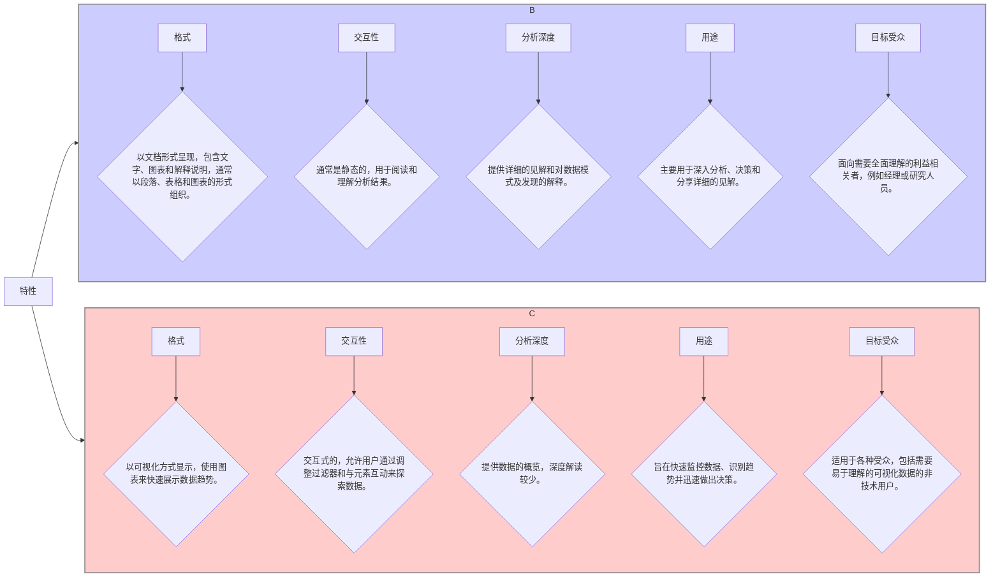

| Feature | Reports | Dashboards |
| ---- | ---- | ---- |
| Format | Documents with text, visuals, explanations, often in paragraphs, tables, and charts. | Visual displays with graphs and charts that show data trends at a glance. |
| Interactivity | Usually static, meant for reading and understanding the analysis. | Interactive, allowing users to explore data by adjusting filters and interacting with elements. |
| Depth of Analysis | Offer detailed insights and explanations behind data patterns and findings. | Provide a high-level overview of data, with less in-depth commentary. |
| Purpose | Primarily used for in-depth analysis, decision-making, and sharing detailed insights. | Aimed at quick data monitoring, identifying trends, and making swift decisions. |
| Target Audience | Targeted at stakeholders who need a comprehensive understanding, like managers or researchers. | Suited for various audiences, including non-technical users who need easy-to-understand visuals. | 


| 特性 | 报告 | 仪表盘 |
| ---- | ---- | ---- |
| 格式 | 带有文本、可视化元素、解释说明的文档，常以段落、表格和图表形式呈现。 | 通过图形和图表进行可视化展示，能让人一眼看清数据趋势。 |
| 交互性 | 通常是静态的，旨在供人阅读并理解分析内容。 | 具有交互性，允许用户通过调整筛选条件以及与各元素互动来探索数据。 |
| 分析深度 | 能提供数据模式及研究结果背后详细的见解和解释。 | 提供数据的高层次概览，深度评论较少。 |
| 目的 | 主要用于深入分析、决策以及分享详细见解。 | 旨在进行快速的数据监测、识别趋势并迅速做出决策。 |
| 目标受众 | 针对那些需要全面理解相关内容的利益相关者，如管理人员或研究人员。 | 适用于各类受众，包括需要易于理解的可视化内容的非技术用户。 |
```
