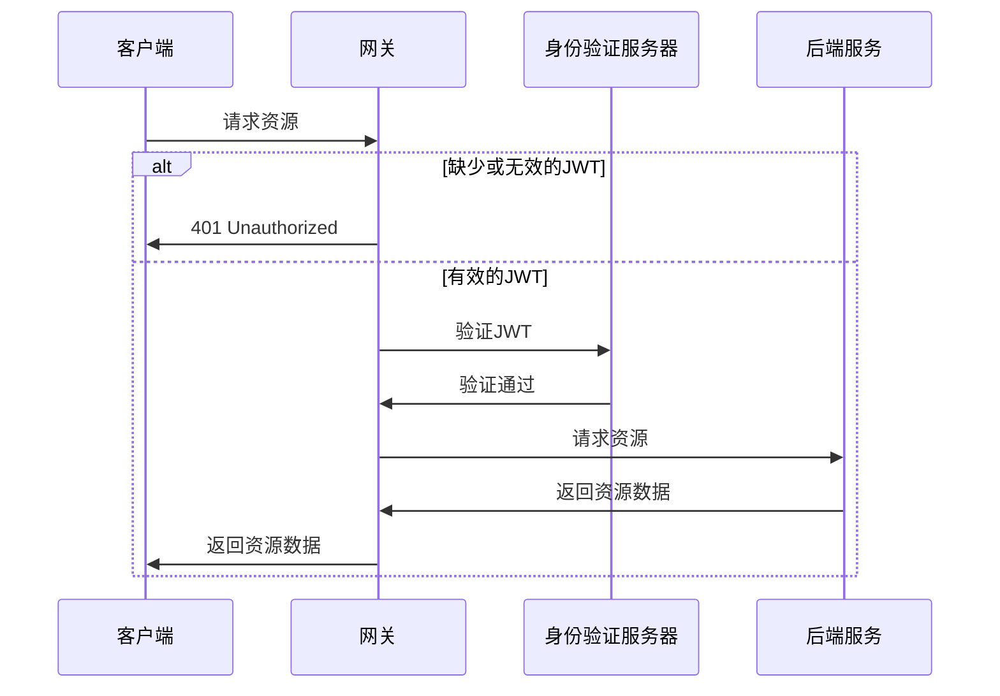
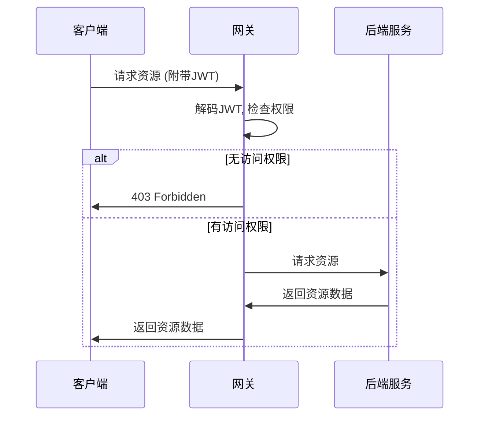
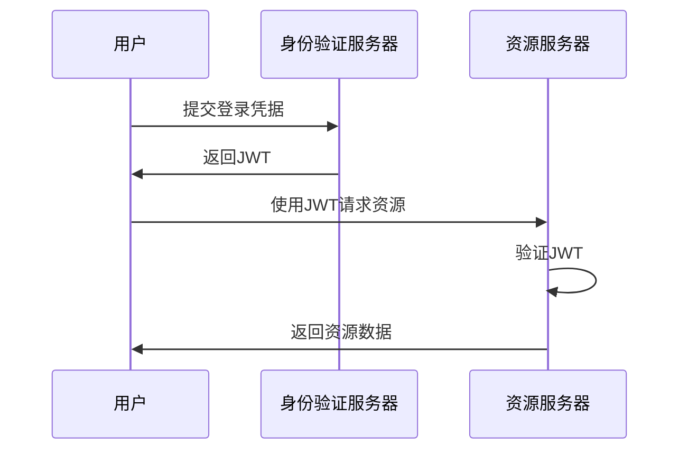

为了详细描述身份验证（authN）和授权（authZ）在系统中的流程，我将分开展示每个过程，包括常见的组件如客户端、网关和后端服务。

### AuthN (身份验证) 详细流程

1. **客户端请求**：用户通过客户端向网关发送请求。
2. **网关验证**：网关检查请求是否包含有效的JWT或其他身份验证信息。
3. **认证失败**：如果缺少或无效，网关返回401 Unauthorized。
4. **认证成功**：如果JWT有效，网关解码JWT并验证其有效性（如签名和过期时间）。
5. **请求后端服务**：验证通过后，网关将请求转发给后端服务。



### AuthZ (授权) 详细流程

1. **客户端请求**：用户通过客户端向网关发送请求，附带JWT。
2. **网关解码JWT**：网关解码JWT以提取用户信息和权限。
3. **权限检查**：网关根据用户角色或权限进行访问控制检查。
4. **授权失败**：如果用户没有访问权限，网关返回403 Forbidden。
5. **授权成功**：如果用户有权限，网关将请求转发给后端服务。



这两个时序图分别展示了身份验证和授权的详细流程，包含可能的错误处理（如返回401和403状态码）。这些流程图可以帮助你理解系统中如何处理用户的身份验证和权限检查。


为了帮助你理解身份验证（authN）、授权（authZ）、和JWT在端到端通信（e2e）中的使用，我将描述这些过程并生成对应的Mermaid时序图。

## 身份验证 (Authentication, AuthN)
身份验证是验证用户身份的过程，通常通过用户名和密码、OTP（一次性密码）、生物识别等方式来完成。

## 授权 (Authorization, AuthZ)
授权是在用户身份验证之后，决定用户是否有权限访问某些资源的过程。授权通常基于用户角色、权限等来执行。

## JWT (JSON Web Token)
JWT是一种紧凑的、URL安全的方式，用于声明在通信双方之间传递信息。它通常用于身份验证和授权。JWT由三部分组成：头部（header）、载荷（payload）和签名（signature）。

### E2E 过程概述
1. **用户登录请求**：用户向身份验证服务器发送登录请求（包含凭据）。
2. **身份验证**：服务器验证用户身份。成功后生成JWT。
3. **JWT 返回**：服务器将JWT返回给用户。
4. **客户端存储JWT**：客户端存储JWT（例如在本地存储或Cookie中）。
5. **资源请求**：用户请求受保护的资源时，将JWT作为身份验证令牌发送。
6. **令牌验证**：服务器验证JWT的有效性和权限。
7. **资源访问**：如果验证通过，用户获得资源访问权限。



这个时序图展示了从用户登录到资源访问的整个流程，包括身份验证和授权的过程。希望这个图能帮助你更好地理解authN、authZ和JWT在e2e通信中的作用。

我很乐意为您详细解释认证(AuthN)、授权(AuthZ)和JWT端到端(JWT-E2E)的完整过程,并为每个过程生成相应的Mermaid序列图。我们将逐一介绍这些概念,并为每个概念创建一个详细的图表。

让我们从认证(AuthN)开始:


```
sequenceDiagram
    participant U as 用户
    participant C as 客户端应用
    participant AS as 认证服务器
    participant DB as 用户数据库

    U->>C: 1. 输入用户名和密码
    C->>AS: 2. 发送认证请求
    AS->>DB: 3. 验证用户凭证
    DB-->>AS: 4. 返回验证结果
    alt 认证成功
        AS-->>C: 5a. 返回访问令牌(如JWT)
        C-->>U: 6a. 显示登录成功
    else 认证失败
        AS-->>C: 5b. 返回错误信息
        C-->>U: 6b. 显示错误消息
    end
```

这个序列图展示了认证(AuthN)的完整过程:

1. 用户在客户端应用中输入用户名和密码。
2. 客户端应用将这些凭证发送到认证服务器。
3. 认证服务器与用户数据库通信,验证提供的凭证。
4. 用户数据库返回验证结果给认证服务器。
5. 根据验证结果:
   a. 如果认证成功,认证服务器返回一个访问令牌(通常是JWT)给客户端。
   b. 如果认证失败,认证服务器返回一个错误信息。
6. 客户端根据结果向用户显示成功或失败的消息。

接下来,让我们看看授权(AuthZ)的过程:


```
sequenceDiagram
    participant U as 用户
    participant C as 客户端应用
    participant API as API服务器
    participant AS as 授权服务器

    U->>C: 1. 请求访问受保护资源
    C->>API: 2. 发送请求(带访问令牌)
    API->>AS: 3. 验证令牌和权限
    AS-->>API: 4. 返回验证结果
    alt 授权成功
        API->>API: 5a. 执行请求的操作
        API-->>C: 6a. 返回操作结果
        C-->>U: 7a. 显示请求结果
    else 授权失败
        API-->>C: 5b. 返回授权错误
        C-->>U: 6b. 显示错误消息
    end
```

这个序列图展示了授权(AuthZ)的完整过程:

1. 用户通过客户端应用请求访问受保护的资源。
2. 客户端应用向API服务器发送请求,包含之前获得的访问令牌。
3. API服务器将令牌发送给授权服务器进行验证,并检查用户权限。
4. 授权服务器返回验证结果给API服务器。
5. 根据验证结果:
   a. 如果授权成功,API服务器执行请求的操作。
   b. 如果授权失败,API服务器准备返回授权错误。
6. API服务器将结果返回给客户端应用。
7. 客户端应用向用户显示操作结果或错误消息。

最后,让我们看看JWT端到端(JWT-E2E)的完整过程:


```
sequenceDiagram
    participant U as 用户
    participant C as 客户端应用
    participant AS as 认证服务器
    participant API as API服务器
    participant DB as 用户数据库

    U->>C: 1. 输入用户名和密码
    C->>AS: 2. 发送认证请求
    AS->>DB: 3. 验证用户凭证
    DB-->>AS: 4. 返回验证结果
    alt 认证成功
        AS->>AS: 5a. 生成JWT
        AS-->>C: 6a. 返回JWT
        C->>C: 7a. 存储JWT
        U->>C: 8a. 请求访问受保护资源
        C->>API: 9a. 发送请求(带JWT)
        API->>API: 10a. 验证JWT签名
        API->>API: 11a. 检查JWT权限声明
        alt JWT有效且有权限
            API->>API: 12aa. 执行请求的操作
            API-->>C: 13aa. 返回操作结果
            C-->>U: 14aa. 显示请求结果
        else JWT无效或无权限
            API-->>C: 12ab. 返回授权错误
            C-->>U: 13ab. 显示错误消息
        end
    else 认证失败
        AS-->>C: 5b. 返回错误信息
        C-->>U: 6b. 显示错误消息
    end
```

这个序列图展示了JWT端到端(JWT-E2E)的完整过程:

1. 用户在客户端应用中输入用户名和密码。
2. 客户端应用将这些凭证发送到认证服务器。
3. 认证服务器与用户数据库通信,验证提供的凭证。
4. 用户数据库返回验证结果给认证服务器。
5-7. 如果认证成功:
   a. 认证服务器生成JWT并返回给
