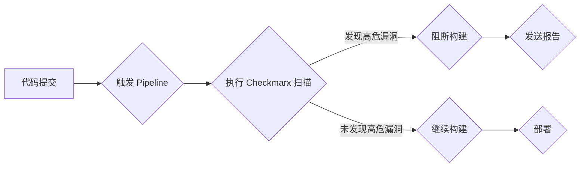

## Checkmarx 扫描报告在 Pipeline 中的含义

在 CI/CD pipeline 中，Checkmarx 扫描报告通常指的是 Checkmarx 静态应用程序安全测试 (SAST) 工具对代码库进行扫描后生成的报告。 该报告包含了对代码中潜在安全漏洞的分析结果。

### 扫描报告的内容

Checkmarx 扫描报告通常包含以下信息:

* **已识别漏洞列表:** 详细列出扫描过程中发现的所有安全漏洞，并对每个漏洞进行分类和评级 (例如，高危、中危、低危)。
* **漏洞详细信息:**  提供每个漏洞的详细信息，包括漏洞类型、代码位置、漏洞描述、修复建议等。
* **代码片段:**  展示包含漏洞的代码片段，方便开发人员定位问题。
* **趋势分析:**  展示项目安全状况的趋势变化，例如新增漏洞数量、已修复漏洞数量等。
* **合规性报告:**  根据预定义的安全标准 (例如，OWASP Top 10、CWE)  评估代码的安全性。

###  Pipeline 中的应用

Checkmarx 扫描通常集成在 CI/CD pipeline 的构建或测试阶段，用于在代码合并到主分支之前尽早发现安全问题。 

* **阻断构建:**  可以配置 pipeline，当 Checkmarx 扫描发现高危漏洞时自动阻断构建，防止不安全的代码被部署到生产环境。
* **生成报告:**  将 Checkmarx 扫描报告发送给相关人员，例如开发团队、安全团队等，以便及时修复漏洞。
* **跟踪漏洞:**  跟踪漏洞的修复进度，确保所有漏洞都得到及时处理。

###  Mermaid 流程图

###  总结

Checkmarx 扫描报告是保障应用程序安全的重要工具，将其集成到 CI/CD pipeline 中可以帮助您在开发过程的早期发现和修复安全漏洞，降低安全风险。 

checkmarx ==> SAAST
