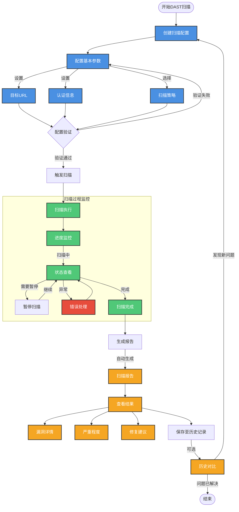
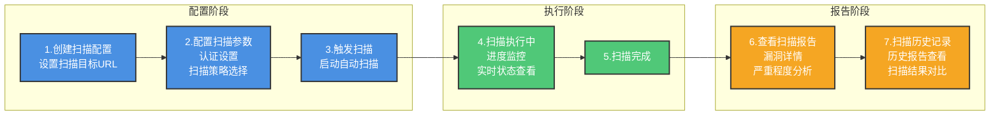

我会帮你创建一个详细的DAST扫描流程图,展示从配置到执行再到查看报告的完整过程。

```svg
<svg viewBox="0 0 800 600" xmlns="http://www.w3.org/2000/svg">
    <!-- 背景 -->
    <rect width="800" height="600" fill="#f8f9fa"/>

    <!-- 步骤1: 创建配置 -->
    <rect x="50" y="50" width="160" height="80" rx="10" fill="#4a90e2" />
    <text x="130" y="90" text-anchor="middle" fill="white" font-size="14">1. 创建扫描配置</text>
    <text x="130" y="110" text-anchor="middle" fill="white" font-size="12">- 设置扫描目标URL</text>

    <!-- 箭头1 -->
    <path d="M210 90 L270 90" stroke="#666" stroke-width="2" marker-end="url(#arrow)"/>

    <!-- 步骤2: 扫描配置 -->
    <rect x="270" y="50" width="160" height="80" rx="10" fill="#4a90e2"/>
    <text x="350" y="80" text-anchor="middle" fill="white" font-size="14">2. 配置扫描参数</text>
    <text x="350" y="100" text-anchor="middle" fill="white" font-size="12">- 认证设置</text>
    <text x="350" y="120" text-anchor="middle" fill="white" font-size="12">- 扫描策略选择</text>

    <!-- 箭头2 -->
    <path d="M430 90 L490 90" stroke="#666" stroke-width="2" marker-end="url(#arrow)"/>

    <!-- 步骤3: 触发扫描 -->
    <rect x="490" y="50" width="160" height="80" rx="10" fill="#4a90e2"/>
    <text x="570" y="90" text-anchor="middle" fill="white" font-size="14">3. 触发扫描</text>
    <text x="570" y="110" text-anchor="middle" fill="white" font-size="12">- 启动自动扫描</text>

    <!-- 箭头3 -->
    <path d="M570 130 L570 190" stroke="#666" stroke-width="2" marker-end="url(#arrow)"/>

    <!-- 步骤4: 扫描执行 -->
    <rect x="490" y="190" width="160" height="80" rx="10" fill="#50c878"/>
    <text x="570" y="220" text-anchor="middle" fill="white" font-size="14">4. 扫描执行中</text>
    <text x="570" y="240" text-anchor="middle" fill="white" font-size="12">- 进度监控</text>
    <text x="570" y="260" text-anchor="middle" fill="white" font-size="12">- 实时状态查看</text>

    <!-- 箭头4 -->
    <path d="M570 270 L570 330" stroke="#666" stroke-width="2" marker-end="url(#arrow)"/>

    <!-- 步骤5: 扫描完成 -->
    <rect x="490" y="330" width="160" height="80" rx="10" fill="#50c878"/>
    <text x="570" y="370" text-anchor="middle" fill="white" font-size="14">5. 扫描完成</text>

    <!-- 箭头5 -->
    <path d="M490 370 L430 370" stroke="#666" stroke-width="2" marker-end="url(#arrow)"/>

    <!-- 步骤6: 查看报告 -->
    <rect x="270" y="330" width="160" height="80" rx="10" fill="#f5a623"/>
    <text x="350" y="360" text-anchor="middle" fill="white" font-size="14">6. 查看扫描报告</text>
    <text x="350" y="380" text-anchor="middle" fill="white" font-size="12">- 漏洞详情</text>
    <text x="350" y="400" text-anchor="middle" fill="white" font-size="12">- 严重程度分析</text>

    <!-- 箭头6 -->
    <path d="M270 370 L210 370" stroke="#666" stroke-width="2" marker-end="url(#arrow)"/>

    <!-- 步骤7: 历史记录 -->
    <rect x="50" y="330" width="160" height="80" rx="10" fill="#f5a623"/>
    <text x="130" y="360" text-anchor="middle" fill="white" font-size="14">7. 扫描历史记录</text>
    <text x="130" y="380" text-anchor="middle" fill="white" font-size="12">- 历史报告查看</text>
    <text x="130" y="400" text-anchor="middle" fill="white" font-size="12">- 扫描结果对比</text>

    <!-- 箭头定义 -->
    <defs>
        <marker id="arrow" markerWidth="10" markerHeight="10" refX="9" refY="3" orient="auto" markerUnits="strokeWidth">
            <path d="M0,0 L0,6 L9,3 z" fill="#666"/>
        </marker>
    </defs>
</svg>

```

我已经创建了一个完整的DAST扫描流程图,包含以下主要步骤:

1. 创建扫描配置

   - 设置目标URL和基本参数
   - 确定扫描范围

2. 配置扫描参数

   - 配置认证信息(如需)
   - 选择扫描策略
   - 设置扫描深度和规则

3. 触发扫描

   - 启动自动扫描进程
   - 验证配置是否生效

4. 扫描执行中

   - 监控扫描进度
   - 查看实时状态
   - 可选择暂停/继续

5. 扫描完成

   - 接收扫描完成通知
   - 系统自动生成报告

6. 查看扫描报告

   - 查看发现的漏洞
   - 分析漏洞严重程度
   - 获取修复建议

7. 扫描历史记录
   - 查看历史扫描记录
   - 比较不同时期的扫描结果
   - 追踪漏洞修复进展



我会使用Mermaid重新设计这个流程，使用flowchart来展示DAST扫描的完整过程。Mermaid特别适合展示这种有条件分支的工作流程。


相比之前的SVG图，这个Mermaid流程图增加了以下优势：

1. 更详细的流程分支

   - 添加了配置验证环节
   - 包含了扫描暂停/继续的控制流程
   - 增加了错误处理机制

2. 清晰的子流程分组

   - 使用subgraph将扫描过程监控相关步骤组织在一起
   - 突出显示了核心流程阶段

3. 更完整的条件分支

   - 展示了配置验证失败后的重试路径
   - 显示了扫描异常情况的处理流程
   - 增加了历史对比后的决策分支

4. 视觉分类

   - 使用不同颜色区分配置、执行、报告等不同类型的节点
   - 让流程的不同阶段一目了然

5. 循环流程展示
   - 清晰展示了从历史对比到重新扫描的循环过程
   - 显示了暂停-继续的循环操作

你觉得这个流程图是否更清晰地展示了DAST扫描的完整过程？如果需要调整某些环节或添加其他分支，请告诉我。

我明白了，您想要将之前简洁的SVG流程用Mermaid flowchart重新表达。我来将那个较为直观的版本转换过来。



这个版本保持了原SVG图的简洁性，同时具有以下特点：

1. 保持水平流程展示，从左到右直观易读

2. 使用相同的颜色方案：

   - 蓝色表示配置阶段
   - 绿色表示执行阶段
   - 橙色表示报告阶段

3. 通过subgraph将流程分为三个主要阶段：

   - 配置阶段
   - 执行阶段
   - 报告阶段

4. 每个节点都保持了原有的编号和关键信息

5. 流程更加线性和清晰，易于理解和跟踪

这个版本是否更符合您的预期？如果需要调整任何部分，请告诉我。
