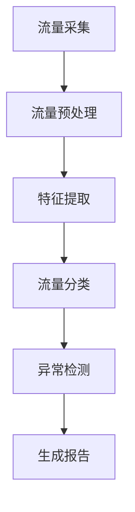
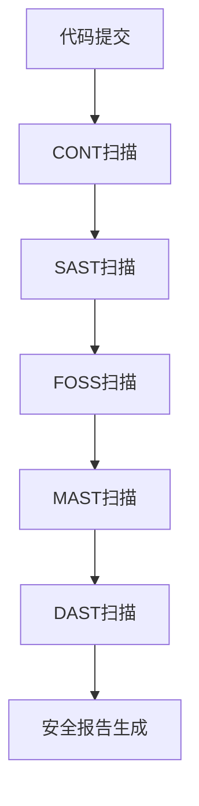

Cyberflows 是一个网络流量监控和分析系统，常用于网络安全领域。它的核心功能是实时检测和分析网络流量中的异常行为，通过定义好的规则或模型来生成对应的安全报告。

以下是一些基本概念，以及如何通过 pipeline 处理相关逻辑并生成报告的流程：

### 基础概念：
1. **网络流量（Network Flows）**：
   网络流量是指一组共享相同属性的网络包集合，例如源IP、目的IP、协议、端口号等。Cyberflows 通过监控这些流量来检测异常行为。

2. **流量采集（Flow Collection）**：
   采集网络中的数据流量是 Cyberflows 的第一步。可以使用网络探针或流量导出器 (NetFlow, IPFIX) 来抓取这些数据。

3. **流量分类（Flow Classification）**：
   在采集到流量后，需要对数据进行分类。这一步会根据流量的元数据（如IP、协议、端口）将流量划分为不同的类别，以便后续分析。

4. **特征提取（Feature Extraction）**：
   从流量中提取关键特征（如流量大小、流量持续时间等），这些特征将用于进一步分析和模型训练。

5. **异常检测（Anomaly Detection）**：
   使用统计学模型或机器学习算法分析流量特征，检测潜在的异常行为。例如，流量突然增大可能意味着 DDoS 攻击。

6. **报告生成（Report Generation）**：
   Cyberflows 会根据分析结果生成报告，报告中会标注网络中的潜在威胁、流量趋势等信息。

### Pipeline 的基本流程：
1. **数据收集**：
   在 pipeline 的第一步，使用流量采集器（如 TShark、Wireshark）获取网络流量数据。采集的数据可以直接传递给 Cyberflows。

2. **数据预处理**：
   在处理数据前，通常需要对数据进行清洗和格式转换。比如，将原始流量数据转换为标准化的 NetFlow 格式。

3. **特征提取和分类**：
   数据进入 pipeline 后，首先会进行特征提取，并根据预定义的规则或机器学习模型对流量进行分类。

4. **异常检测和处理**：
   使用机器学习模型（如 k-means、DBSCAN）或者规则引擎来检测流量中的异常行为。这一步是 pipeline 的核心，能发现潜在的网络攻击或异常流量模式。

5. **生成报告**：
   最后一步是根据分析结果生成报告。报告可以包含流量的统计信息、发现的异常和潜在的威胁。可以使用诸如 Jupyter Notebook 或报表生成工具来完成这一步。

### 示例 Pipeline：

你可以根据需求，调整 pipeline 的具体步骤。例如，是否需要引入复杂的机器学习模型或调整报告生成的模板来更好地符合你的业务需求。

扫描技术在现代软件开发和安全领域中至关重要，它们用于识别、评估和减轻代码、应用程序和依赖项中的安全风险。以下是不同扫描类型的详细介绍：

### 1. **CONT（Continuous Security Scanning）**
   **持续安全扫描**是一种持续集成（CI）和持续交付（CD）流水线中不可或缺的一部分。它自动化了安全扫描的过程，确保每次代码变更或应用程序更新时都进行安全检查。
   
   **特点**：
   - **持续进行**：与代码开发和发布周期同步。
   - **实时监控**：当新的漏洞报告发布时，立即检测现有应用中是否存在相同的漏洞。
   - **集成性高**：与 CI/CD 管道无缝集成。

   **应用场景**：
   - 适用于快速交付的项目，在每次代码提交、构建或部署时自动进行安全检查。

### 2. **SAST（Static Application Security Testing）**
   **静态应用安全测试**是在源代码或二进制文件上执行的静态代码分析。SAST 不运行应用程序，而是通过分析源代码的结构和逻辑来查找潜在的安全漏洞。
   
   **特点**：
   - **提前检测**：在开发阶段早期发现漏洞。
   - **源码分析**：分析代码路径、控制流和数据流，以检测常见的编程错误和安全漏洞，如 SQL 注入、缓冲区溢出等。

   **应用场景**：
   - 适用于开发阶段早期，特别是在代码审核和合并过程中。

### 3. **FOSS（Free and Open-Source Software Scanning）**
   **FOSS 扫描**用于分析项目中所使用的开源组件。它帮助开发团队识别项目中开源软件的版本、许可证合规性以及已知漏洞。

   **特点**：
   - **开源依赖扫描**：检测开源组件中的已知漏洞（如 CVE）。
   - **许可证合规性检查**：确保所使用的开源软件遵循正确的许可证。
   - **更新提醒**：提醒开发者开源库的最新安全更新。

   **应用场景**：
   - 尤其适用于依赖大量开源组件的项目，确保其安全性和许可证合规性。

### 4. **MAST（Mobile Application Security Testing）**
   **移动应用安全测试**专门针对移动应用程序（Android、iOS）进行安全评估。MAST 综合了静态、动态和后期分析，确保移动应用程序在整个生命周期内的安全性。
   
   **特点**：
   - **静态分析**：分析移动应用程序的源代码或 APK/IPA 文件。
   - **动态分析**：在运行时分析应用的行为，发现敏感数据泄露等问题。
   - **逆向分析**：评估应用是否存在逆向工程或篡改风险。

   **应用场景**：
   - 移动应用程序的安全审计，确保代码、通信和数据存储的安全性。

### 5. **DAST（Dynamic Application Security Testing）**
   **动态应用安全测试**是在应用程序运行时进行的测试，主要用于模拟攻击者如何利用已部署应用程序中的漏洞。这种方法不需要源代码，只关注应用程序的运行时行为。

   **特点**：
   - **黑盒测试**：测试人员无需访问源代码，通过模拟攻击对应用程序进行渗透测试。
   - **运行时分析**：捕获应用程序在真实环境中的安全问题，特别是与输入验证、认证和会话管理相关的问题。
   - **针对Web应用程序**：常用于检测Web应用中的漏洞，如XSS（跨站脚本攻击）和SQL注入。

   **应用场景**：
   - 适用于已部署或即将上线的应用程序，确保它们在生产环境下的安全性。

### 6. **其他常见的扫描类型**：

   - **IAST（Interactive Application Security Testing）**：结合了 SAST 和 DAST 的优点，在运行时分析应用的代码和行为。
   - **RASP（Runtime Application Self-Protection）**：集成到应用程序内部，实时监控和防护应用程序的运行时安全。

### 流程图示意：

### 总结：
不同类型的扫描适用于软件开发生命周期的不同阶段。SAST 和 FOSS 更侧重于开发和构建阶段的静态代码安全，而 DAST 和 MAST 更适合在应用程序的测试或运行阶段检测动态行为中的漏洞。CONT 扫描则贯穿整个 CI/CD 流水线，确保持续的安全监控。
