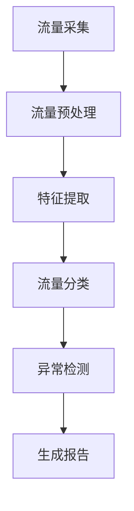

Cyberflows 是一个网络流量监控和分析系统，常用于网络安全领域。它的核心功能是实时检测和分析网络流量中的异常行为，通过定义好的规则或模型来生成对应的安全报告。

以下是一些基本概念，以及如何通过 pipeline 处理相关逻辑并生成报告的流程：

### 基础概念：
1. **网络流量（Network Flows）**：
   网络流量是指一组共享相同属性的网络包集合，例如源IP、目的IP、协议、端口号等。Cyberflows 通过监控这些流量来检测异常行为。

2. **流量采集（Flow Collection）**：
   采集网络中的数据流量是 Cyberflows 的第一步。可以使用网络探针或流量导出器 (NetFlow, IPFIX) 来抓取这些数据。

3. **流量分类（Flow Classification）**：
   在采集到流量后，需要对数据进行分类。这一步会根据流量的元数据（如IP、协议、端口）将流量划分为不同的类别，以便后续分析。

4. **特征提取（Feature Extraction）**：
   从流量中提取关键特征（如流量大小、流量持续时间等），这些特征将用于进一步分析和模型训练。

5. **异常检测（Anomaly Detection）**：
   使用统计学模型或机器学习算法分析流量特征，检测潜在的异常行为。例如，流量突然增大可能意味着 DDoS 攻击。

6. **报告生成（Report Generation）**：
   Cyberflows 会根据分析结果生成报告，报告中会标注网络中的潜在威胁、流量趋势等信息。

### Pipeline 的基本流程：
1. **数据收集**：
   在 pipeline 的第一步，使用流量采集器（如 TShark、Wireshark）获取网络流量数据。采集的数据可以直接传递给 Cyberflows。

2. **数据预处理**：
   在处理数据前，通常需要对数据进行清洗和格式转换。比如，将原始流量数据转换为标准化的 NetFlow 格式。

3. **特征提取和分类**：
   数据进入 pipeline 后，首先会进行特征提取，并根据预定义的规则或机器学习模型对流量进行分类。

4. **异常检测和处理**：
   使用机器学习模型（如 k-means、DBSCAN）或者规则引擎来检测流量中的异常行为。这一步是 pipeline 的核心，能发现潜在的网络攻击或异常流量模式。

5. **生成报告**：
   最后一步是根据分析结果生成报告。报告可以包含流量的统计信息、发现的异常和潜在的威胁。可以使用诸如 Jupyter Notebook 或报表生成工具来完成这一步。

### 示例 Pipeline：

你可以根据需求，调整 pipeline 的具体步骤。例如，是否需要引入复杂的机器学习模型或调整报告生成的模板来更好地符合你的业务需求。
