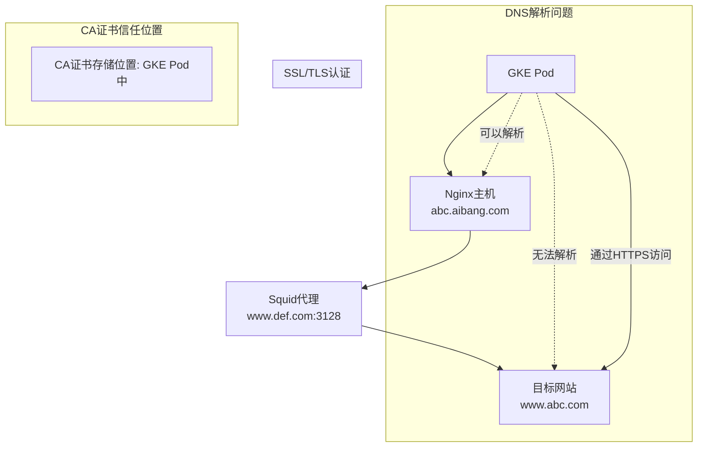

在这个网络架构中，流量流经多个节点：GKE Pod -> Nginx 主机 (abc.aibang.com) -> Squid 代理 (www.def.com:3128) -> 目标网站 (www.abc.com)。为了确保 HTTPS 请求的成功和正确的 SSL/TLS 认证，CA 证书的信任配置至关重要。

### SSL/TLS 认证和CA证书的信任位置

#### 1. **GKE Pod 到 Nginx 主机 (abc.aibang.com)**

- **DNS解析**: 由于 GKE Pod 无法直接解析 `www.abc.com`，它首先连接到可以解析的 `abc.aibang.com`。
- **HTTP/HTTPS 连接**: 如果连接是 HTTP，则没有 SSL/TLS 验证；如果是 HTTPS，则需要确保 GKE Pod 信任 `abc.aibang.com` 的证书。通常，这个证书是由 Nginx 主机提供的自签名证书或由受信任的 CA 签发的证书。
- **CA 证书存储位置**: 
  - 如果 `abc.aibang.com` 使用自签名证书，您需要将该证书添加到 GKE Pod 中的信任存储（例如 `cacerts`）。
  - 如果使用的是由公共 CA 签发的证书，则确保 GKE Pod 的信任存储中包含该 CA 的根证书即可。

#### 2. **Nginx 主机 到 Squid 代理 (www.def.com:3128)**

- **HTTP/HTTPS 连接**: 通常是 HTTP，因为 Squid 代理一般用于处理 HTTP 代理请求而非终止 HTTPS。
- **CA 证书存储位置**: 不需要特别的 CA 证书配置，因为通常代理服务器不涉及 SSL/TLS 的终止或验证。

#### 3. **Squid 代理 到 目标网站 (www.abc.com)**

- **HTTPS 连接**: Squid 代理会将客户端的 HTTPS 请求转发到 `www.abc.com`。此时客户端（GKE Pod）实际上是直接与 `www.abc.com` 建立了 SSL/TLS 连接，Squid 仅作为中间转发流量。
- **CA 证书存储位置**: 
  - GKE Pod 需要信任 `www.abc.com` 的证书。
  - 如果 `www.abc.com` 使用的是受信任的公共 CA 签发的证书，只需确保该 CA 的根证书存在于 GKE Pod 的信任存储中。
  - 如果 `www.abc.com` 使用自签名证书，您需要将该证书添加到 GKE Pod 的信任存储。

### 总结

您的 CA 证书应该主要配置在 GKE Pod 中，因为最终的 SSL/TLS 连接是由客户端（GKE Pod）与目标服务器（www.abc.com）直接建立的。确保 GKE Pod 中的 Java truststore（例如 `cacerts`）包含必要的 CA 证书，以便验证 `abc.aibang.com` 和 `www.abc.com` 的 SSL/TLS 证书。

具体操作步骤：
1. **获取 `www.abc.com` 和 `abc.aibang.com` 的证书**（如果是自签名的）。
2. **将证书导入 GKE Pod 中的 `cacerts` 文件**：
   ```bash
   keytool -import -trustcacerts -keystore /opt/zulu-jre/lib/security/cacerts -storepass changeit -alias youralias -file /path/to/certificate.crt
   ```
3. **验证配置**：通过 `curl` 或其他工具验证连接和证书验证是否成功。

在前面的解释基础上，让我们详细说明如何获取和导入证书，并验证 SSL/TLS 连接。

### 获取证书

#### 1. **获取 `www.abc.com` 的证书**
   - 可以使用 `openssl` 工具来获取目标网站的证书：
   ```bash
   openssl s_client -connect www.abc.com:443 -showcerts
   ```
   - 输出中，`-----BEGIN CERTIFICATE-----` 到 `-----END CERTIFICATE-----` 之间的部分是 PEM 格式的证书。将它们复制并保存为 `.crt` 文件。

#### 2. **获取 `abc.aibang.com` 的证书**
   - 使用相同的 `openssl` 命令来获取 Nginx 主机的证书：
   ```bash
   openssl s_client -connect abc.aibang.com:443 -showcerts
   ```
   - 保存证书内容为 `.crt` 文件。

### 导入证书到 Java Truststore

#### 1. **准备工作**
   - 确保您的 GKE Pod 中的 Java 环境安装了 `keytool` 工具。
   - 找到 `cacerts` 文件的路径。通常在 `/opt/zulu-jre/lib/security/cacerts`，但具体路径可能根据 Java 版本或发行版有所不同。
   - 备份原始的 `cacerts` 文件，以防止意外错误。

#### 2. **导入证书**
   - 使用 `keytool` 命令将证书导入 Java Truststore：
   ```bash
   keytool -import -trustcacerts -keystore /opt/zulu-jre/lib/security/cacerts -storepass changeit -alias abc -file /path/to/abc_aibang_com.crt
   keytool -import -trustcacerts -keystore /opt/zulu-jre/lib/security/cacerts -storepass changeit -alias www -file /path/to/www_abc_com.crt
   ```
   - 其中：
     - `-keystore`: 指定要修改的 Truststore 文件。
     - `-storepass`: Truststore 的密码，默认是 `changeit`。请根据实际情况修改。
     - `-alias`: 为导入的证书指定一个别名。
     - `-file`: 证书文件的路径。

### 验证 SSL/TLS 连接

#### 1. **验证 HTTPS 连接**
   - 使用 `curl` 验证 GKE Pod 是否可以成功地与目标网站建立 HTTPS 连接：
   ```bash
   curl -v https://www.abc.com
   ```
   - 检查输出中是否有证书错误或其他问题。

#### 2. **调试和日志**
   - 如果连接失败，检查 GKE Pod 的日志文件，以及 `curl` 命令的详细输出。可能的错误包括证书不受信任、证书过期或 CN（Common Name）不匹配等。

### 其他考虑

1. **证书更新**:
   - 证书有时会过期或被吊销。定期检查和更新信任存储中的证书非常重要。

2. **安全性**:
   - 确保 `cacerts` 文件和相关的私钥文件仅对授权人员可访问，以避免潜在的安全风险。

3. **自动化**:
   - 对于大型系统或多个服务，可以考虑使用自动化工具来管理和更新证书。例如，Certbot 可以自动获取和更新 Let's Encrypt 的证书，并自动将它们添加到 Java Truststore 中。

通过这些步骤，您可以确保 GKE Pod 能够正确地验证与目标网站的 SSL/TLS 连接，并安全地传输数据。


# calude 

根据您描述的场景,我理解您的问题涉及到一个复杂的网络请求流程。让我们逐步分析这个情况:

1. 请求流程:
   GKE Pod -> Nginx主机(abc.aibang.com) -> Squid代理(www.def.com:3128) -> 目标网站(www.abc.com)

2. DNS解析问题:
   您提到GKE Pod无法直接解析www.abc.com,但可以解析abc.aibang.com(Nginx主机)。

3. SSL/TLS认证:
   最终目标是通过HTTPS访问www.abc.com,这涉及到SSL/TLS证书验证。

针对您的主要问题"我要访问目的地我的CA证书应该在哪里信任?",答案是:

CA证书应该被信任在发起请求的客户端,也就是您的GKE Pod中。

解释如下:

1. 证书验证发生在SSL/TLS握手阶段,这是由客户端(在这个场景中是您的Java应用)执行的。

2. 尽管请求经过了Nginx和Squid代理,但最终与www.abc.com建立加密连接的仍然是您的Java应用。

3. 代理服务器(无论是Nginx还是Squid)在这个过程中通常是透明的,它们只是转发加密的流量,不参与证书验证过程。

4. 因此,您需要确保www.abc.com的CA证书被添加到您的Java应用信任的证书存储中。在Java环境中,这通常是cacerts文件。

具体步骤:

1. 获取www.abc.com的CA证书。
2. 使用keytool将这个CA证书添加到您的Java应用使用的cacerts文件中:

   ```
   keytool -import -alias abccom -file path_to_ca_cert -keystore $JAVA_HOME/lib/security/cacerts -storepass changeit
   ```

3. 确保您的Java应用使用更新后的cacerts文件。

4. 如果您使用的是自定义的TrustManager,确保它被配置为信任正确的CA证书。

额外注意事项:

- 如果Squid代理(www.def.com:3128)使用SSL拦截(SSL interception),那么您可能还需要信任Squid的CA证书。在这种情况下,Squid会终止来自客户端的SSL连接,然后与目标服务器建立新的SSL连接。

- 确保您的Java应用正确配置以使用Squid代理。这可能涉及到设置系统属性如http.proxyHost和http.proxyPort。

- 对于Nginx,除非它也参与SSL终止,否则它在证书验证过程中不起作用。

总之,关键是要在发起HTTPS请求的客户端(您的Java应用)中正确配置证书信任,而不是在中间的代理服务器上。​​​​​​​​​​​​​​​​

下面是基于您提供的描述生成的流程图，使用 Mermaid 格式：



### 描述

1. **请求流程**:
   - 从 GKE Pod 发出的请求首先到达 Nginx 主机 (abc.aibang.com)，然后转发到 Squid 代理 (www.def.com:3128)，最后到达目标网站 (www.abc.com)。

2. **DNS解析问题**:
   - GKE Pod 无法直接解析 `www.abc.com`，但可以解析 `abc.aibang.com`（Nginx 主机）。

3. **SSL/TLS认证**:
   - GKE Pod 发起的最终 HTTPS 连接到 `www.abc.com`，这涉及到 SSL/TLS 证书验证。证书验证在客户端（GKE Pod）进行，代理服务器在此过程中通常是透明的。

4. **CA证书信任位置**:
   - CA证书应该被信任在发起请求的客户端，也就是 GKE Pod 中。代理服务器（Nginx 和 Squid）不会参与最终的证书验证过程，除非有 SSL 拦截机制。

### 操作步骤

1. 获取 `www.abc.com` 的 CA 证书。
2. 使用 `keytool` 将 CA 证书添加到 Java 应用使用的 `cacerts` 文件中：
   ```bash
   keytool -import -alias abccom -file path_to_ca_cert -keystore $JAVA_HOME/lib/security/cacerts -storepass changeit
   ```
3. 确保 Java 应用使用更新后的 `cacerts` 文件。
4. 如果使用自定义的 TrustManager，确保其配置正确以信任相应的 CA 证书。

这个流程图和描述有助于理解在复杂网络架构中如何处理 SSL/TLS 认证和 CA 证书信任问题。
