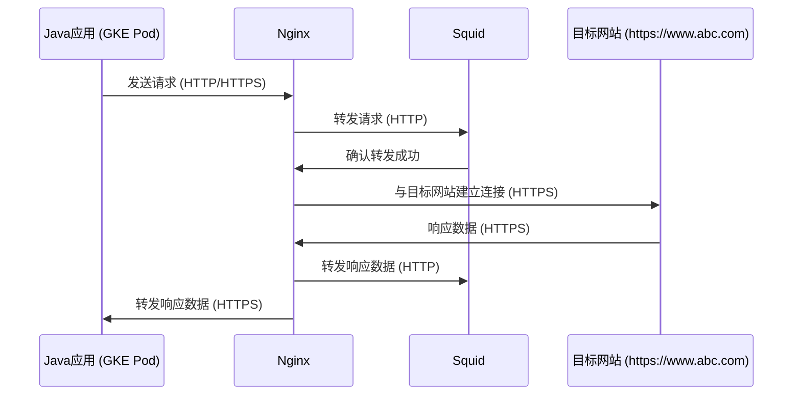

- [网络拓扑是：](#网络拓扑是)
- [Verify SSL Certificate](#verify-ssl-certificate)
    - [输出内容解析](#输出内容解析)
    - [额外注意事项](#额外注意事项)
    - [1. **CA 证书的信任位置**](#1-ca-证书的信任位置)
      - [a. **客户端（GKE Pod）上的 CA 证书**](#a-客户端gke-pod上的-ca-证书)
      - [b. **代理服务器（def.com）上的 CA 证书**](#b-代理服务器defcom上的-ca-证书)
    - [2. **证书验证流程**](#2-证书验证流程)
    - [3. **代理服务器的角色**](#3-代理服务器的角色)
    - [结论](#结论)

# 网络拓扑是：
GKE Pod (Java应用) -> Nginx -> Squid (HTTP代理) -> 目标网站 (https://www.abc.com)

在这种情况下，我们需要仔细考虑每个组件的角色：

1. Java应用（GKE Pod）：
   - 这是最初的请求发起者，但它并不直接与最终的HTTPS目标通信。
   - 它只需要能够与Nginx通信（可能是HTTP或HTTPS）。

2. Nginx：
   - 作为第一跳代理，Nginx接收来自Java应用的请求。
   - Nginx然后通过Squid代理向最终目标发送请求。
   - 在这个设置中，Nginx实际上扮演了"客户端"的角色，因为它是与最终HTTPS目标建立加密连接的组件。

3. Squid：
   - 您提到Squid使用HTTP协议，这意味着Squid可能不参与SSL/TLS处理。
   - Squid在这里可能只是简单地转发Nginx的请求，而不涉及证书验证。

4. 目标网站 (https://www.abc.com)：
   - 最终的HTTPS目标。

基于这个分析，我们可以得出以下结论：

1. CA证书配置位置：
   - 主要的CA证书配置应该在Nginx上进行，因为Nginx是实际与HTTPS目标建立加密连接的组件。
   - Nginx需要信任www.abc.com的CA证书才能成功建立HTTPS连接。

2. Java应用的角色：
   - 如果Java应用到Nginx的连接是HTTP，则Java应用不需要特殊的CA证书配置。
   - 如果Java应用到Nginx的连接是HTTPS，那么Java应用需要信任Nginx的证书，但不需要信任最终目标(www.abc.com)的证书。

3. 正确的"客户端"：
   - 在这个特定的设置中，就SSL/TLS连接而言，Nginx实际上扮演了"客户端"的角色。
   - Java应用是初始请求的发起者，但在SSL/TLS层面，Nginx才是与最终HTTPS目标建立加密连接的组件。

验证和配置步骤：

1. 在Nginx服务器上：
   - 确保Nginx配置了正确的CA证书，以便能够验证www.abc.com的证书。
   - 可以使用如下命令在Nginx服务器上测试连接：
     ```
     curl -v https://www.abc.com -x http://www.def.com:3128
     ```
   - 如果出现证书验证错误，可能需要在Nginx的配置中添加正确的CA证书。

2. Java应用（如果到Nginx的连接是HTTPS）：
   - 确保Java应用信任Nginx的证书。
   - 这可能涉及将Nginx的证书添加到Java的信任库中。

3. Squid配置：
   - 由于Squid使用HTTP协议，通常不需要特殊的SSL/TLS配置。
   - 但要确保Squid正确配置为允许HTTPS流量通过。

总结：
在您的场景中，就SSL/TLS证书验证而言，Nginx才是真正的"客户端"。CA证书的主要配置应该在Nginx上进行，以确保它能够成功连接到https://www.abc.com。Java应用虽然是初始请求的发起者，但在这个特定的SSL/TLS链中，它的角色较为有限。

建议：
1. 首先在Nginx服务器上进行证书验证测试。
2. 确保Nginx有正确的CA证书配置。
3. 检查Java应用到Nginx的连接是否安全，如果是，确保相应的证书配置正确。

如果您需要有关Nginx SSL配置或任何其他方面的具体帮助，请随时告诉我。​​​​​​​​​​​​​​​​


- mermaid



1. Nginx和Squid的角色：
    Nginx：
   - 作为第一跳代理，Nginx接收来自Java应用的请求。
   - Nginx然后通过Squid代理向最终目标发送请求。
   - 在这个设置中，Nginx实际上扮演了"客户端"的角色，因为它是与最终HTTPS目标建立加密连接的组件。
   - Squid使用HTTP协议作为代理，这进一步确认它不参与SSL/TLS的处理。

2. 证书信任位置：
   
   - Nginx需要信任www.abc.com的CA证书才能成功建立HTTPS连接。
   - Java应用（GKE Pod）需要信任Nginx的证书，但不需要信任最终目标(www.abc.com)的证书。

3. 验证步骤：
   - 在Nginx服务器上测试连接：
     ```
     curl -v https://www.abc.com -x http://www.def.com:3128
     ```
   - 如果出现证书验证错误，可能需要在Nginx的配置中添加正确的CA证书。
4. Java应用（如果到Nginx的连接是HTTPS）：
   - 确保Java应用信任Nginx的证书。
   - 这可能涉及将Nginx的证书添加到Java的信任库中。

5. Squid配置：
   - 由于Squid使用HTTP协议，通常不需要特殊的SSL/TLS配置。
   - 但要确保Squid正确配置为允许HTTPS流量通过。

总结：

3. 关于使用keytool导入证书：
   对于您的问题"应该导入几个证书"，这取决于几个因素：

   a) 根证书和中间证书：
      - 通常，您需要导入目标网站（www.abc.com）的证书链中的根证书。
      - 有时还需要导入中间证书，特别是当Java的默认信任库不包含这些中间证书时。

   b) 多个域名：
      - 如果您的应用需要连接到多个使用不同CA签发的证书的域名，您可能需要为每个不同的CA导入一个根证书。

   c) 证书匹配：
      - 您提到"是不是应该有几个匹配的情况出现或者是多个"，这里需要澄清一下：
        * 在SSL/TLS握手过程中，服务器会发送它的证书链。
        * 您的Java应用会尝试使用信任库中的根证书来验证这个链。
        * 只需要有一个匹配就足够了，通常是根证书的匹配。

   具体步骤：

   1. 获取www.abc.com的证书链（可以通过浏览器或使用openssl工具）。
   2. 识别根证书和任何必要的中间证书。
   3. 使用keytool导入这些证书：

      ```
      keytool -import -alias abcroot -file path_to_root_cert -keystore $JAVA_HOME/lib/security/cacerts -storepass changeit
      ```

      如果需要，对中间证书重复此过程，使用不同的别名。

   4. 如果您的应用需要连接到其他使用不同CA的域名，对每个域名重复这个过程。

最后的建议：
1. 首先尝试只导入根证书。在大多数情况下，这就足够了。
2. 如果遇到证书验证问题，再考虑导入中间证书。
3. 使用 `keytool -list -v -keystore $JAVA_HOME/lib/security/cacerts` 来查看已导入的证书，确保所需的证书都已正确导入。

如果您在执行这些步骤时遇到任何具体问题，或者需要更详细的指导，请随时告诉我。​​​​​​​​​​​​​​​​

# Verify SSL Certificate
To ensure that your Java client can successfully access the HTTPS domain, and to verify this, follow these steps:
关于如何确保Java客户端能够成功访问HTTPS域名，以及如何验证这一点。让我们逐步探讨这个问题：


首先，让我解释一下验证过程，然后我会提供一个Java代码示例来帮助您测试和验证HTTPS连接。

1. 确保CA证书正确导入：
   - 使用之前讨论的 keytool 命令导入必要的根证书和中间证书。
   - 确保Java应用使用正确的信任库（通常是 cacerts 文件）。

2. 验证步骤：
   a. 尝试建立HTTPS连接
   b. 如果连接成功，证书验证通过
   c. 如果出现 SSLHandshakeException，通常表示证书验证失败

3. 测试方法：
   - 编写一个简单的Java程序来测试HTTPS连接
   - 使用 javax.net.ssl 包中的类来建立安全连接

下面是一个Java代码示例，用于测试HTTPS连接和证书验证：

```java
import javax.net.ssl.HttpsURLConnection;
import java.io.IOException;
import java.net.URL;
import java.security.cert.Certificate;
import java.security.cert.X509Certificate;

public class HttpsConnectionTest {

    public static void main(String[] args) {
        String urlString = "https://www.abc.com"; // 替换为您需要测试的HTTPS URL
        
        try {
            URL url = new URL(urlString);
            HttpsURLConnection conn = (HttpsURLConnection) url.openConnection();
            
            conn.setConnectTimeout(5000); // 设置连接超时（毫秒）
            conn.setReadTimeout(5000);    // 设置读取超时（毫秒）
            
            // 尝试连接
            conn.connect();
            
            // 如果到达这里，说明连接成功
            System.out.println("Connection successful!");
            
            // 获取服务器证书
            Certificate[] certs = conn.getServerCertificates();
            System.out.println("Server provided " + certs.length + " certificate(s):");
            
            for (Certificate cert : certs) {
                if(cert instanceof X509Certificate) {
                    X509Certificate x509 = (X509Certificate)cert;
                    System.out.println("Subject: " + x509.getSubjectDN());
                    System.out.println("Issuer: " + x509.getIssuerDN());
                    System.out.println("Valid from: " + x509.getNotBefore());
                    System.out.println("Valid until: " + x509.getNotAfter());
                    System.out.println();
                }
            }
            
            // 关闭连接
            conn.disconnect();
            
        } catch (IOException e) {
            System.out.println("Connection failed!");
            e.printStackTrace();
        }
    }
}
```

使用这个程序的步骤：

1. 将 `urlString` 变量替换为您需要测试的HTTPS URL。
2. 编译并运行这个程序。
3. 观察输出：
   - 如果看到 "Connection successful!" 和证书信息，说明证书验证成功。
   - 如果出现异常，特别是 SSLHandshakeException，说明证书验证失败。

如果遇到证书验证失败，您可以：

1. 检查是否正确导入了所有必要的证书。
2. 验证系统时间是否正确（证书有效期检查依赖于系统时间）。
3. 使用 `-Djavax.net.debug=ssl` JVM 参数运行程序，获取更详细的SSL握手信息。

例如：
```
java -Djavax.net.debug=ssl HttpsConnectionTest
```

这将提供SSL/TLS握手的详细日志，有助于诊断问题。

通过这种方法，您可以:
1. 确认Java客户端是否能成功建立HTTPS连接。
2. 验证证书是否被正确信任。
3. 获取服务器证书的详细信息，以便进一步分析。

如果您在运行这个测试或解释结果时需要任何帮助，请随时告诉我。我也可以根据您的具体环境或需求对代码进行调整。​​​​​​​​​​​​​​​​


根据您描述的场景,我理解您的问题涉及到一个复杂的网络请求流程。让我们逐步分析这个情况:

1. 请求流程:
   GKE Pod -> Nginx主机(abc.aibang.com) -> Squid代理(www.def.com:3128) -> 目标网站(www.abc.com)

2. DNS解析问题:
   您提到GKE Pod无法直接解析www.abc.com,但可以解析abc.aibang.com(Nginx主机)。

3. SSL/TLS认证:
   最终目标是通过HTTPS访问www.abc.com,这涉及到SSL/TLS证书验证。

针对您的主要问题"我要访问目的地我的CA证书应该在哪里信任?",答案是:

CA证书应该被信任在发起请求的客户端,也就是您的GKE Pod中。

解释如下:

1. 证书验证发生在SSL/TLS握手阶段,这是由客户端(在这个场景中是您的Java应用)执行的。

2. 尽管请求经过了Nginx和Squid代理,但最终与www.abc.com建立加密连接的仍然是您的Java应用。

3. 代理服务器(无论是Nginx还是Squid)在这个过程中通常是透明的,它们只是转发加密的流量,不参与证书验证过程。

4. 因此,您需要确保www.abc.com的CA证书被添加到您的Java应用信任的证书存储中。在Java环境中,这通常是cacerts文件。

具体步骤:

1. 获取www.abc.com的CA证书。
2. 使用keytool将这个CA证书添加到您的Java应用使用的cacerts文件中:

   ```
   keytool -import -alias abccom -file path_to_ca_cert -keystore $JAVA_HOME/lib/security/cacerts -storepass changeit
   ```

3. 确保您的Java应用使用更新后的cacerts文件。

4. 如果您使用的是自定义的TrustManager,确保它被配置为信任正确的CA证书。

额外注意事项:

- 如果Squid代理(www.def.com:3128)使用SSL拦截(SSL interception),那么您可能还需要信任Squid的CA证书。在这种情况下,Squid会终止来自客户端的SSL连接,然后与目标服务器建立新的SSL连接。

- 确保您的Java应用正确配置以使用Squid代理。这可能涉及到设置系统属性如http.proxyHost和http.proxyPort。

- 对于Nginx,除非它也参与SSL终止,否则它在证书验证过程中不起作用。

总之,关键是要在发起HTTPS请求的客户端(您的Java应用)中正确配置证书信任,而不是在中间的代理服务器上。​​​​​​​​​​​​​​​​

`keytool -list -keystore /opt/zulu-jre/lib/security/cacerts` 命令用于列出 Java 安全库（keystore）中存储的证书条目。以下是该命令可能的详细输出示例和解释：

```shell
Keystore type: JKS
Keystore provider: SUN

Your keystore contains 12 entries

Alias name: verisignclass3g5ca
Creation date: Jan 1, 2015
Entry type: trustedCertEntry

Owner: CN=VeriSign Class 3 Public Primary Certification Authority - G5, OU=(c) 2006 VeriSign, Inc. - For authorized use only, OU=VeriSign Trust Network, O=VeriSign, Inc., C=US
Issuer: CN=VeriSign Class 3 Public Primary Certification Authority - G5, OU=(c) 2006 VeriSign, Inc. - For authorized use only, OU=VeriSign Trust Network, O=VeriSign, Inc., C=US
Serial number: 3b8
Valid from: Fri Nov 07 19:00:00 UTC 2006 until: Mon Jul 16 23:59:59 UTC 2035
Certificate fingerprints:
         SHA1: 36:45:DB:4C:6E:BD:E7:7C:A1:AA:63:56:D4:52:C0:00:5F:C1:59:4C
         SHA256: 4E:7F:7C:0F:A4:7A:48:4A:8D:EB:38:C8:2B:DC:9C:8B:4F:7A:50:89:DC:A7:78:AF:A1:1F:FD:FC:39:4A:51
Signature algorithm name: SHA256withRSA
Version: 3

Alias name: thawtepremiumserverca
Creation date: Jan 1, 2015
Entry type: trustedCertEntry

Owner: CN=Thawte Premium Server CA, OU=Certification Services Division, O=Thawte Consulting, L=Cape Town, ST=Western Cape, C=ZA
Issuer: CN=Thawte Premium Server CA, OU=Certification Services Division, O=Thawte Consulting, L=Cape Town, ST=Western Cape, C=ZA
Serial number: 9
Valid from: Thu Dec 31 19:00:00 UTC 1996 until: Sun Dec 31 19:00:00 UTC 2028
Certificate fingerprints:
         SHA1: 72:75:01:68:C6:2A:7B:AB:C5:BB:85:A3:1E:69:47:1F:47:D6:5C:3C
         SHA256: 4E:9A:29:ED:9C:56:C4:F1:B4:F1:A7:20:0A:34:E7:6C:C5:A1:0B:2A:48:9D:6D:A4:50:4B:7B:95:8B:F2:12
Signature algorithm name: SHA1withRSA
Version: 3

...
```

### 输出内容解析

1. **Keystore type 和 provider**:
   - `Keystore type`: 表示密钥库的类型，这里是 `JKS`，表示 Java KeyStore。
   - `Keystore provider`: 提供该密钥库实现的安全提供者，这里是 `SUN`。

2. **条目数**:
   - `Your keystore contains 12 entries`: 表示密钥库中有12个条目（证书）。

3. **每个条目的详细信息**:
   - **Alias name**: 证书的别名，用于标识密钥库中的唯一证书。
   - **Creation date**: 证书条目创建的日期。
   - **Entry type**: 条目的类型，通常是 `trustedCertEntry`，表示这是一个受信任的证书条目。
   - **Owner**: 证书的所有者信息，包含通用名称（CN）、组织单位（OU）、组织（O）、国家（C）等。
   - **Issuer**: 证书的颁发者信息，通常与所有者信息类似。
   - **Serial number**: 证书的序列号。
   - **Valid from/until**: 证书的有效期起始和结束时间。
   - **Certificate fingerprints**:
     - `SHA1`: 证书的 SHA-1 指纹，用于唯一标识证书。
     - `SHA256`: 证书的 SHA-256 指纹。
   - **Signature algorithm name**: 证书使用的签名算法，例如 `SHA256withRSA`。
   - **Version**: 证书的版本号，通常是 `3`。

### 额外注意事项

- 在生产环境中，确保密钥库的访问受到限制，以防止未授权访问和潜在的安全漏洞。
- 定期更新密钥库中的证书，确保包含最新的受信任的 CA 证书，防止由于证书过期或吊销导致的访问问题。


在您的场景中，您通过 `curl` 命令访问 `www.abc.com`，并通过 `http://www.def.com:3128` 这个 SQUID 代理服务器。关于 CA 证书的信任位置，关键取决于 HTTPS 连接的终点和代理服务器的角色。

### 1. **CA 证书的信任位置**

#### a. **客户端（GKE Pod）上的 CA 证书**
- **主要原因**: 当您使用 `curl` 访问 `https://www.abc.com` 时，客户端（GKE Pod）需要验证 `www.abc.com` 的 SSL/TLS 证书。客户端会使用它的信任存储（keystore）中的根 CA 证书来验证服务器的证书是否可信。
- **操作**: 确保您的 GKE Pod 中的 Java 应用或系统信任存储（例如，`/opt/zulu-jre/lib/security/cacerts`）中包含 `www.abc.com` 所使用的 CA 证书。如果证书不被信任，HTTPS 连接将失败。

#### b. **代理服务器（def.com）上的 CA 证书**
- **主要原因**: 代理服务器通常不会终止 TLS 连接，它只是将请求从客户端转发到目标服务器。客户端与目标服务器之间的 TLS 握手和验证依赖于客户端的信任存储。如果代理服务器配置了 SSL/TLS 中间人（MITM）模式或需要验证客户端证书，才需要在代理服务器上配置 CA 证书。
- **操作**: 如果 `def.com` 仅作为一个透明的代理，不终止 TLS 连接，则不需要特别信任任何 CA 证书。但是，如果它有自己的 SSL/TLS 证书终止或重新加密流量的功能，则需要在代理服务器上信任相应的 CA 证书。

### 2. **证书验证流程**

- **客户端到代理的连接**（HTTP）:
  - 没有 TLS 证书验证，这只是一个简单的 HTTP 连接。

- **代理到目标服务器的连接**（HTTPS）:
  - TLS 连接建立在客户端和目标服务器之间，因此证书的验证主要在客户端进行。

### 3. **代理服务器的角色**

代理服务器（如 `def.com`）在这种情况下，更多的是扮演一个中继的角色，它不会查看或修改客户端与目标服务器之间的 TLS 流量。如果代理服务器配置了 HTTPS 代理或需要解密和重新加密流量（例如进行 SSL/TLS 中间人攻击或检查），则需要在代理服务器上进行相应的证书管理。

### 结论

**主要需要在 GKE Pod（客户端）上信任 `www.abc.com` 的 CA 证书**，以确保能正确地验证目标服务器的证书。如果代理服务器没有终止 TLS 连接或执行其他特殊操作，则不需要在代理服务器上额外配置 CA 证书。
