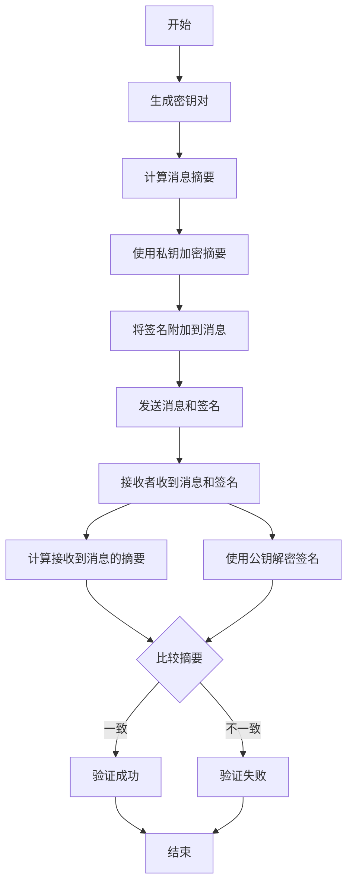
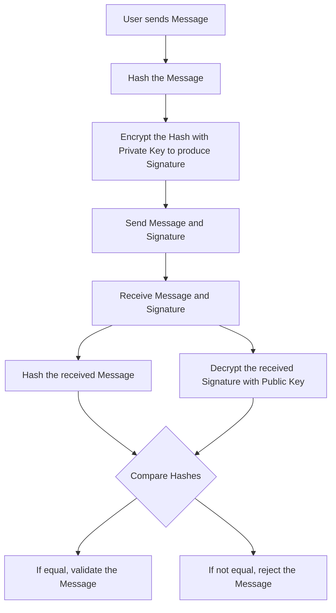

# calude 
当然,我很乐意为您解释数字签名的基本原理和过程,并提供一个流程图来展示这个过程。

数字签名是一种通过加密技术来验证消息完整性和发送者身份的方法。它的基本原理和过程如下:

1. 密钥生成:
   - 发送者生成一对密钥:公钥和私钥。
   - 私钥保密保管,公钥可以公开分享。

2. 签名生成:
   - 发送者用Hash函数计算消息的摘要。
   - 用私钥对摘要进行加密,生成数字签名。

3. 签名附加:
   - 将数字签名附加到原始消息上。

4. 发送:
   - 发送者将带有数字签名的消息发送给接收者。

5. 签名验证:
   - 接收者收到消息后,用同样的Hash函数计算消息摘要。
   - 用发送者的公钥解密数字签名,得到原始摘要。
   - 比较两个摘要是否一致。如果一致,说明消息未被篡改且确实来自预期的发送者。

现在,我将使用Mermaid语法创建一个流程图来可视化这个过程。




这个流程图展示了数字签名的整个过程,从密钥生成到签名验证。它清晰地说明了发送者和接收者的角色,以及在整个过程中执行的各个步骤。

使用数字签名可以确保:
1. 消息完整性:如果消息被篡改,摘要将不匹配。
2. 身份认证:只有拥有私钥的发送者才能创建有效的签名。
3. 不可否认性:发送者无法否认已签名的消息。

在实际应用中,您可能需要选择适当的加密算法(如RSA或ECDSA)和Hash函数(如SHA-256)。此外,确保私钥的安全性是至关重要的,因为私钥泄露将危及整个系统的安全性。

如果您需要更多关于特定编程语言中如何实现数字签名的信息,或者有任何其他问题,请随时告诉我。


要对用户发送的数据进行签名验证，您需要了解数字签名的基本原理和过程。数字签名的主要目的是确保数据的完整性和真
实性，防止伪造和抵赖。以下是如何进行数据签名和验证的详细步骤：

### 数据签名过程

1. **生成哈希值**：首先，对需要签名的原始数据进行哈希运算，生成一个固定长度的摘要（哈希值）。
2. **加密哈希值**：使用签名者的私钥对生成的哈希值进行加密，得到数字签名。
3. **发送数据和签名**：将原始数据和数字签名一起发送给接收方。

示例代码（Java）：
```java
import java.nio.charset.StandardCharsets;
import java.security.*;
import java.util.Base64;

public class DigitalSignatureExample {
    public static void main(String[] args) throws Exception {
        // 生成RSA公钥/私钥对
        KeyPairGenerator keyGen = KeyPairGenerator.getInstance("RSA");
        keyGen.initialize(2048);
        KeyPair keyPair = keyGen.generateKeyPair();

        // 原始数据
        String data = "This is a sample data";
        byte[] dataBytes = data.getBytes(StandardCharsets.UTF_8);

        // 生成数据的哈希值
        MessageDigest digest = MessageDigest.getInstance("SHA-256");
        byte[] hash = digest.digest(dataBytes);

        // 使用私钥对哈希值进行加密，生成数字签名
        Signature signature = Signature.getInstance("SHA256withRSA");
        signature.initSign(keyPair.getPrivate());
        signature.update(hash);
        byte[] digitalSignature = signature.sign();

        // 将数字签名和原始数据一起发送
        System.out.println("Original Data: " + data);
        System.out.println("Digital Signature: " + Base64.getEncoder().encodeToString(digitalSignature));
    }
}
```

### 签名验证过程

1. **接收数据和签名**：接收方接收到包含原始数据和数字签名的消息。
2. **生成哈希值**：接收方对接收到的原始数据进行哈希运算，生成新的哈希值。
3. **解密签名**：使用签名者的公钥对数字签名进行解密，得到解密后的哈希值。
4. **对比哈希值**：将解密后的哈希值与生成的新哈希值进行比较。如果两者一致，则验证通过；否则验证失败。

示例代码（Java）：
```java
import java.nio.charset.StandardCharsets;
import java.security.*;
import java.util.Base64;

public class DigitalSignatureVerification {
    public static void main(String[] args) throws Exception {
        // 假设已经有公钥和数字签名
        PublicKey publicKey = ...; // 从证书或其他来源获取
        String receivedData = "This is a sample data";
        String receivedSignature = ...; // 从发送方接收到的数字签名

        byte[] dataBytes = receivedData.getBytes(StandardCharsets.UTF_8);
        byte[] signatureBytes = Base64.getDecoder().decode(receivedSignature);

        // 生成数据的哈希值
        MessageDigest digest = MessageDigest.getInstance("SHA-256");
        byte[] hash = digest.digest(dataBytes);

        // 使用公钥解密数字签名
        Signature signature = Signature.getInstance("SHA256withRSA");
        signature.initVerify(publicKey);
        signature.update(hash);
        boolean isVerified = signature.verify(signatureBytes);

        if (isVerified) {
            System.out.println("Signature is valid.");
        } else {
            System.out.println("Signature is invalid.");
        }
    }
}
```

### 总结

用户需要使用他们的私钥对数据进行签名，您则需要使用用户提供的公钥来验证签名。签名验证的关键在于确保解密后的哈希值与重新计算的哈希值一致。这样可以确保数据的完整性和真实性[1][2][3][5]。

Citations:
[1] https://www.liaoxuefeng.com/wiki/1252599548343744/1304227943022626
[2] https://patents.google.com/patent/CN104301119A/zh
[3] https://blog.csdn.net/u010312474/article/details/102815899
[4] https://help.fanruan.com/finereport9.0/doc-view-845.html
[5] https://blog.csdn.net/qq_34664239/article/details/131068011


使用私钥签名和公钥验证的主要原因如下:

1. 身份认证：私钥只有所有者知道，因此用私钥进行签名可以证明签名者的身份。任何人都可以使用公开的公钥来验证签名，从而确认签名者的身份[2][3]。

2. 防止伪造：由于私钥是保密的，只有私钥持有者才能生成有效的签名。其他人无法伪造签名，因为他们没有私钥[2]。

3. 不可抵赖性：签名者无法否认自己曾经签过名，因为只有他才拥有可以生成该签名的私钥[2][3]。

4. 完整性验证：签名过程通常包括对消息内容进行哈希，因此可以检测到消息是否被篡改[2][4]。

5. 公开验证：由于公钥是公开的，任何人都可以验证签名，这使得签名可以被广泛认可和使用[1][3]。

6. 安全性：即使公钥被公开，也无法通过公钥推导出私钥，保证了签名系统的安全性[1]。

总之，这种机制利用了非对称加密的特性，既保证了签名的安全性和可靠性，又使得签名可以被公开验证，非常适合在不安全的网络环境中使用[3][4]。这也是为什么数字签名被广泛应用于电子商务、软件分发等需要身份认证和数据完整性保证的场景。

Citations:
[1] https://blog.csdn.net/m0_45406092/article/details/114578536
[2] https://www.liaoxuefeng.com/wiki/1252599548343744/1304227943022626
[3] https://www.cnblogs.com/xujinzhong/p/11161531.html
[4] https://www.zhaohuabing.com/post/2020-03-19-pki/
[5] https://blog.csdn.net/u010312474/article/details/102815899

## 数字签名的基本原理和过程

数字签名是一种用于验证数据真实性和完整性的方法。它主要利用公钥密码学来实现。数字签名的过程分为签名和验证两个阶段。以下是详细解释：

### 1. 签名过程
- **步骤1: 哈希函数**
  1. 用户A（发送方）首先对要发送的数据进行哈希计算，生成固定长度的哈希值。这一步是为了确保数据在传输过程中没有被篡改。
  
  2. 使用的哈希函数可以是SHA-256、SHA-512等。

- **步骤2: 私钥加密**
  1. 用户A使用其私钥对生成的哈希值进行加密，生成数字签名。
  
  2. 这个加密操作确保了只有拥有该私钥的用户A可以生成该数字签名。

- **步骤3: 发送数据和签名**
  1. 用户A将原始数据和数字签名一起发送给用户B（接收方）。

### 2. 验证过程
- **步骤1: 哈希函数**
  1. 用户B接收到数据和数字签名后，首先对接收到的数据进行哈希计算，生成新的哈希值。

- **步骤2: 公钥解密**
  1. 用户B使用用户A的公钥对接收到的数字签名进行解密，得到从签名生成的哈希值。

- **步骤3: 比较哈希值**
  1. 用户B比较新生成的哈希值和从签名中解密得到的哈希值。如果两者一致，则说明数据未被篡改，且确实是由用户A发送的。
  
  2. 如果不一致，则说明数据可能被篡改或签名无效。

### Mermaid 流程图


通过以上过程和图示，可以清晰地理解数字签名的工作原理和操作步骤。使用数字签名可以有效保证数据的完整性和真实性。


# coze 
当然，数字签名是确保数据完整性和真实性的一种常用方法。它主要依赖于公钥加密技术。以下是数字签名的基本原理和过程的详细解释，以及一个对应的 Mermaid 流程图。

### 数字签名的基本原理和过程

数字签名使用非对称加密算法（如 RSA、DSA 以及 Elliptic Curve Cryptography），包括两个密钥：一个私钥和一个公钥。

#### 基本原理

1. **私钥（Private Key）**：保存在签名者安全的地方，用于生成数字签名。
2. **公钥（Public Key）**：公开给接收方，用于验证数字签名的真实性。

数字签名的过程包括以下步骤：

1. **消息哈希（Hashing）**：
    - 签名者首先对要发送的消息（数据）进行哈希处理，生成消息摘要（Message Digest）。常用的哈希算法有 SHA-256 等。
    
2. **生成签名（Signing）**：
    - 使用签名者的私钥对消息摘要进行加密，生成数字签名。
    
3. **发送消息和签名**：
    - 将原始消息和数字签名一起发送给接收方。

4. **消息签名验证（Verification）**：
    - 接收方接收到消息和签名后，首先使用同样的哈希算法对接收到的消息进行哈希处理，生成一个新的消息摘要。
    - 然后，接收方使用签名者的公钥对接收到的数字签名进行解密，得到发送时的消息摘要。
    - 对比两个消息摘要是否相同。如果相同，则说明消息未被篡改且确实是由签名者发送的。

### 示例流程图（Mermaid）



### 详细流程解释

1. **哈希消息 (B)**：
   - 对用户发送的消息进行哈希处理生成消息摘要。
   - 示例： `hash = SHA-256(Message)`

2. **使用私钥加密哈希值生成签名 (C)**：
   - 使用发送者的私钥对哈希值进行加密生成数字签名。
   - 示例： `Signature = Encrypt(PrivateKey, hash)`

3. **发送消息和签名 (D)**：
   - 将原始消息和生成的数字签名一并发送给接收方。

4. **接收消息和签名 (E)**：
   - 接收方接收到消息和数字签名。

5. **哈希接收到的消息 (F)**：
   - 接收方对接收到的消息进行相同的哈希处理生成新的消息摘要。
   - 示例： `newHash = SHA-256(ReceivedMessage)`

6. **使用公钥解密签名 (G)**：
   - 接收方使用发送方的公钥对接收到的签名进行解密以获得原始哈希值。
   - 示例： `originalHash = Decrypt(PublicKey, receivedSignature)`

7. **比较哈希值 (H)**：
   - 比较两个哈希值：`newHash` 和 `originalHash`。
   - 若两者相同，表示消息未被篡改且由签名者发送。

8. **验证结果 (I, J)**：
   - 如果哈希值相同，则验证消息通过，消息合法。
   - 如果哈希值不同，则验证失败，消息可能被篡改。

### 总结

通过理解上述数字签名的原理和过程，您可以确保数据从发送方到接收方过程中未被修改，并且可以认证消息的发起者。这在安全通信、身份验证和数据完整性验证等场景中非常重要。希望这个详细解释及流程图能够帮助您更好地理解数字签名的使用。
