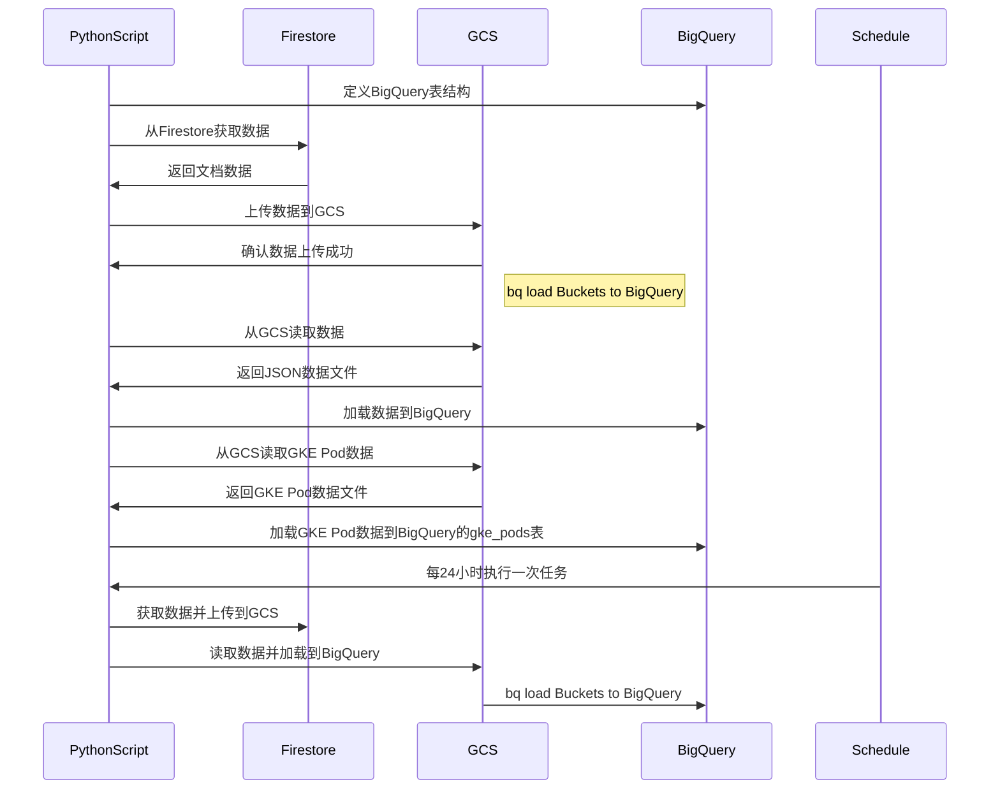
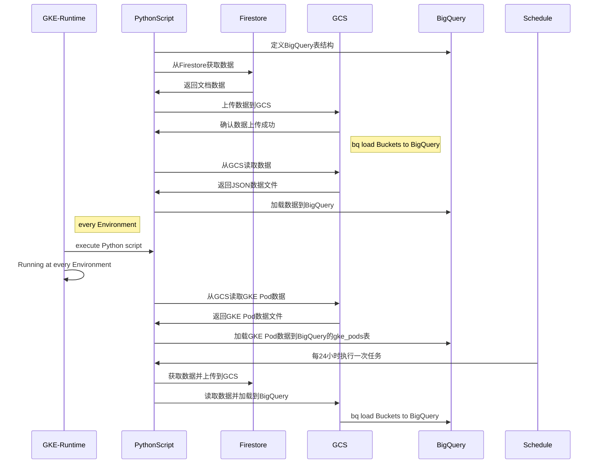
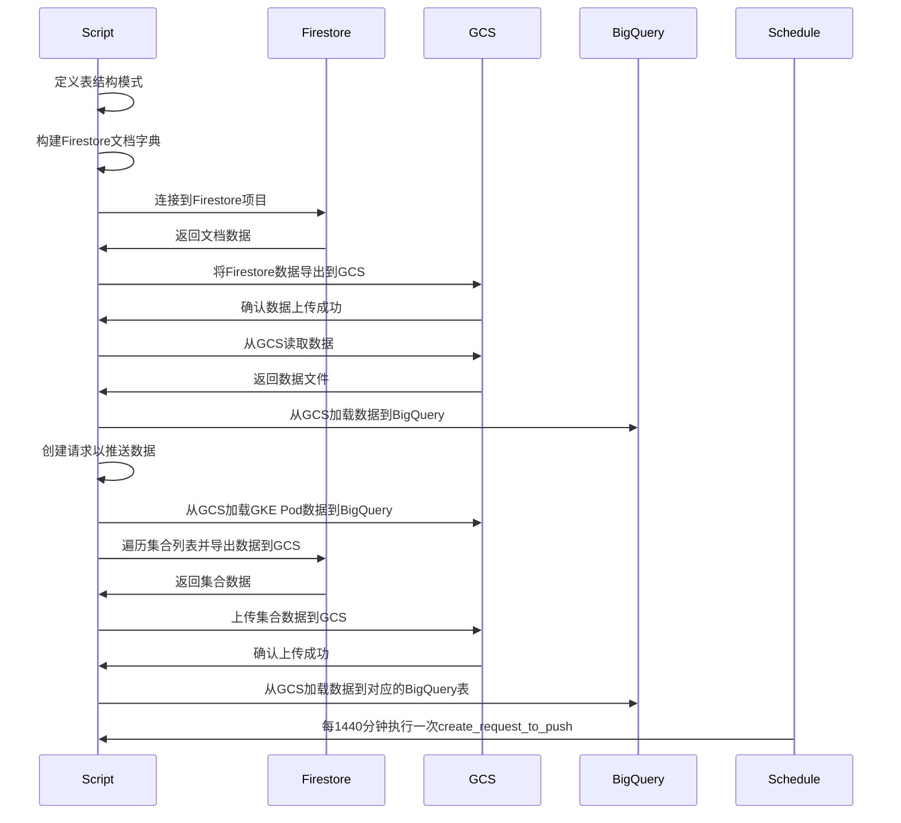
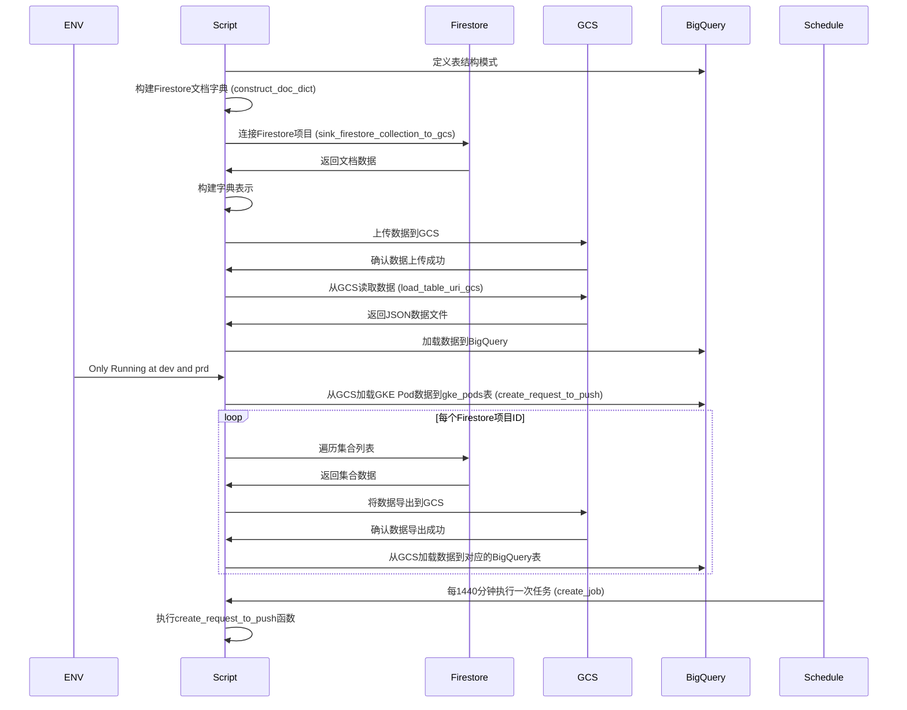
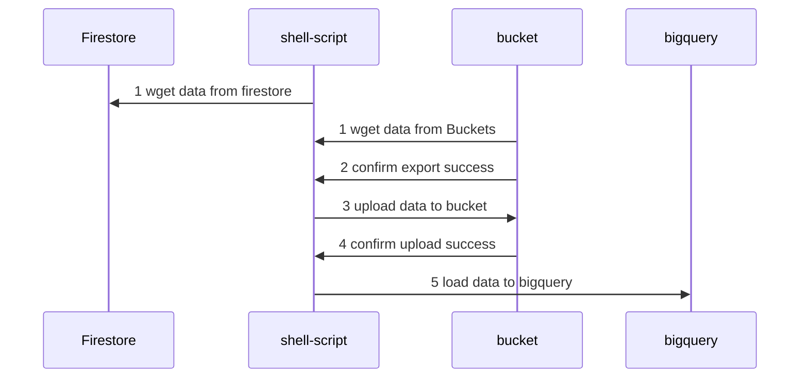
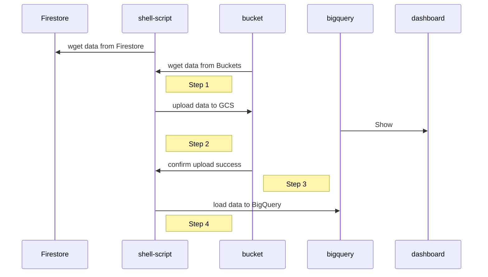

具体来说,它完成以下任务:

1. **定义BigQuery表结构**: 脚本中定义了多个BigQuery表的模式,如`gke_pods_table_schema`、`firestore_apis_table_schema`等,用于在将数据加载到BigQuery时指定表结构。

2. **从Firestore获取数据并上传到GCS**: 脚本会连接到指定的Firestore项目,读取指定集合(`apis`、`apimetadatas`等)中的文档数据,将其格式化为newline-delimited JSON格式,并上传到Google Cloud Storage (GCS)存储桶中。


    根据您提供的代码和分析,想要获取类似 `bigquery.SchemaField("cpu_limit", "STRING", "NULLABLE")` 这样的 GKE Pod 的 CPU 限制信息,您需要查看最终加载到 BigQuery 中的 `gke_pods` 表。

    具体来说:

    1. 在脚本中,有一个名为 `gke_pods_table_schema` 的表结构定义,它包含了 `cpu_limit` 这个字段。

    2. 脚本会从 GCS 存储桶中读取 GKE Pod 数据文件,并将其加载到 BigQuery 的 `abj_api_data.gke_pods` 表中。相关代码如下:

    ```python
    load_table_uri_gcs(table_id=f"{api_data_project_id}.abj_api_data.gke_pods",
                    uri=f"gs://abj-{env}-{region}-api-data/*gke_pods_data.json",
                    schema=table_schema["gke_pods_table_schema"])
    ```

    因此,要查看 GKE Pod 的 CPU 限制等信息,您可以在 BigQuery 中查询 `abj_api_data.gke_pods` 表。例如:

    ```sql
    SELECT pod_name, cpu_limit 
    FROM `your-project-id.abj_api_data.gke_pods`
    ```

    这将返回该表中所有 Pod 的名称和对应的 CPU 限制值。

    您可以根据需要在 BigQuery 中使用 SQL 查询对该表进行过滤、聚合或连接其他表进行更复杂的分析。

    如果您需要查看其他字段的信息,如内存限制、请求值等,也可以在同一张表中查找相应的列名并查询。

    总之,脚本最终将 GKE Pod 的监控数据存储在 BigQuery 的 `abj_api_data.gke_pods` 表中,您可以在该表中查找所需的 CPU、内存等指标信息。

3. **从GCS加载数据到BigQuery**: 脚本会从GCS存储桶中读取前一步上传的JSON数据文件,并根据预先定义的表结构将数据加载到BigQuery中的对应表中。

4. **从GKE获取Pod数据并加载到BigQuery**: 脚本会从GCS存储桶中读取GKE Pod数据文件,并将其加载到BigQuery的`gke_pods`表中。

5. **使用schedule模块定期执行任务**: 脚本使用`schedule`模块设置了一个循环,每24小时(1440分钟)执行一次数据提取和加载任务。

该脚本根据环境变量(`API_PLATFORM_ENV`和`API_PLATFORM_REGION`)确定要处理的Firestore项目和BigQuery数据集。它专门针对`pabj-abc`和`abj-abc`等环境。

总的来说,这个脚本的目的是自动从GKE和Firestore中提取监控和元数据,并将其加载到BigQuery中,以支持进一步的数据分析和可视化工作。


根据你提供的流程，我将生成一个Mermaid的sequenceDiagram来展示整个数据流过程。以下是对应的Mermaid代码：




你可以将此代码粘贴到Mermaid在线工具或支持Mermaid的Markdown编辑器中查看效果。整个流程图将清晰地展示从Firestore获取数据并上传到GCS，再从GCS加载数据到BigQuery，以及从GKE获取Pod数据并加载到BigQuery的过程。









for other api information 



你的sequenceDiagram已经很清晰了。这里有一个优化版本，其中包括了一些细节和额外的注释，以使流程更明确：



在这个优化版本中：
- 重命名了一些参与者，使其更易读。
- 添加了注释来标明每个步骤的顺序，增加了清晰度。

请将此代码粘贴到Mermaid在线工具或支持Mermaid的Markdown编辑器中查看效果。