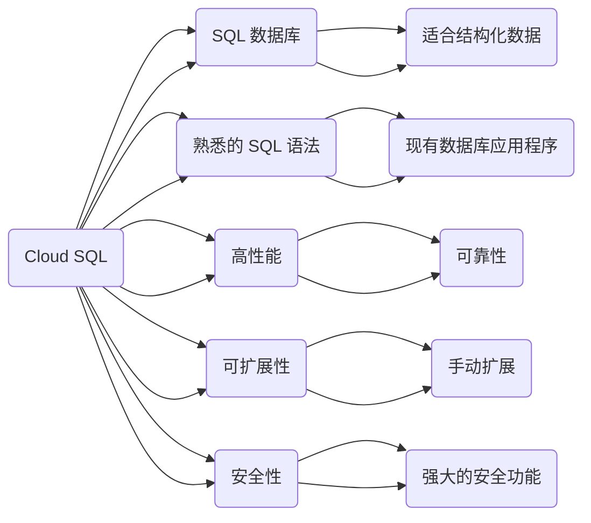

当然，下面是一个对比 Firestore 和 Cloud SQL 的特点和优势的表格：

| 特点和优势      | Firestore                           | Cloud SQL                        |
|----------------|-------------------------------------|----------------------------------|
| 数据库类型        | NoSQL                               | 关系型数据库                      |
| 扩展性和可用性      | 自动扩展性和高可用性                    | 灵活的扩展性                       |
| 数据一致性        | 实时同步和实时查询                      | 强大的事务支持                     |
| 备份与恢复        | 自动数据备份和恢复                      | 支持备份和恢复                       |
| SQL 功能         | N/A                                 | 成熟的 SQL 功能                     |

这个表格可以帮助您更直观地了解 Firestore 和 Cloud SQL 在不同方面的特点和优势。


下面是对比 Firestore 和 Cloud SQL 的特点和优势的 Mermaid 流程图输出：

```mermaid
graph TD;
    Firestore["Firestore"] -- 特点和优势 --> CloudSQL["Cloud SQL"]

    subgraph Firestore
        feature1["NoSQL数据库"] --> Firestore
        feature2["自动扩展性和高可用性"] --> Firestore
        feature3["实时同步和实时查询"] --> Firestore
        feature4["自动数据备份和恢复"] --> Firestore
    end

    subgraph CloudSQL
        feature5["关系型数据库"] --> CloudSQL
        feature6["成熟的SQL功能"] --> CloudSQL
        feature7["强大的事务支持"] --> CloudSQL
        feature8["灵活的扩展性"] --> CloudSQL
    end
```

在这个对比中：

- Firestore 是一种 NoSQL 数据库，适合处理非结构化或半结构化数据，具有自动扩展性和高可用性，能够实现实时同步和实时查询，并且具有自动数据备份和恢复的功能。
- Cloud SQL 是一种关系型数据库，提供了成熟的 SQL 功能，包括强大的事务支持，同时具有灵活的扩展性，可以根据需求调整数据库的规模。

## Firestore 与 Cloud SQL 对比

**Firestore** 和 **Cloud SQL** 都是 Google Cloud Platform (GCP) 提供的数据库服务，但它们具有不同的特点和优势。

**Firestore** 是一个 NoSQL 文档数据库，具有以下特点：

* 易于使用：Firestore 使用 JSON 格式存储数据，易于理解和使用。
* 实时更新：Firestore 支持实时更新，客户端应用程序可以立即看到数据更改。
* 可扩展性：Firestore 可以自动扩展以满足您的需求。
* 安全性：Firestore 提供强大的安全功能，可保护您的数据。

**Cloud SQL** 是一个完全托管的 SQL 数据库服务，具有以下特点：

* 熟悉的 SQL 语法：Cloud SQL 支持标准的 SQL 语法，可让您轻松使用现有数据库应用程序。
* 高性能：Cloud SQL 提供高性能和可靠性。
* 可扩展性：Cloud SQL 可以根据您的需求进行扩展。
* 安全性：Cloud SQL 提供强大的安全功能，可保护您的数据。

**Mermaid 图表**



**总结**

Firestore 和 Cloud SQL 都是功能强大的数据库服务，选择哪个服务取决于您的具体需求。

* 如果您需要一个易于使用、支持实时更新且可扩展的数据库，Firestore 是一个不错的选择。
* 如果您需要一个支持标准 SQL 语法、高性能且可扩展的数据库，Cloud SQL 是一个不错的选择。

**注意：**

* 上面的 Mermaid 图表仅供参考，您可能需要根据您的具体需求进行修改。
* Firestore 和 Cloud SQL 都有免费试用版，您可以试用它们以确定哪个服务最适合您。


以下是 Firestore 和 Cloud SQL 的价格对比：

| 服务         | 定价方式                                                                                                  | 价格                                                                                                                                                                             |
|--------------|----------------------------------------------------------------------------------------------------------|----------------------------------------------------------------------------------------------------------------------------------------------------------------------------------|
| Firestore    | 按照读取、写入和存储的数据量计费。还有其他服务费用，如网络和存储成本。                                    | - 读取：$0.06/100,000 次读取 <br> - 写入：$0.18/100,000 次写入 <br> - 存储：$0.18/GB/月                                                                                                                                                                |
| Cloud SQL    | 根据所选的实例类型、实例大小和使用时间计费。还有其他费用，如网络费用和数据传输费用。                              | - MySQL 和 PostgreSQL：价格根据实例类型和规模不同而变化，但大致从几美元到几百美元不等，具体价格取决于选定的实例类型、大小和使用时间。                                                                                                                                                                       |

请注意，上述价格仅供参考，具体价格可能会因地区、使用情况和其他因素而有所不同。建议查阅 Google Cloud 平台上的最新定价信息以获取准确的价格信息。


## Firestore 和 Cloud SQL 价格对比

**Firestore** 和 **Cloud SQL** 的价格取决于您使用的服务类型和配置。

**Firestore** 的价格如下：

* **免费套餐:** 每月最多 1 GB 的存储空间和 50,000 次读写操作。
* **标准套餐:** 每 GB 存储空间每月 $0.25，每次读写操作 $0.0002。
* **企业套餐:** 提供更高的存储空间和读写操作限额，以及额外的功能和支持。

**Cloud SQL** 的价格如下：

* **MySQL、PostgreSQL 和 SQL Server:** 每 vCPU 每小时 $0.096，每 GB 存储空间每月 $0.25。
* **SQL Server 企业版:** 每 vCPU 每小时 $0.432，每 GB 存储空间每月 $0.25。

**以下是 Firestore 和 Cloud SQL 的一些价格比较：**

| 服务 | 免费套餐 | 标准套餐 | 企业套餐 |
|---|---|---|---|
| Firestore | 1 GB 存储空间, 50,000 次读写操作 | 每 GB 存储空间 $0.25, 每次读写操作 $0.0002 | 更多存储空间和读写操作, 额外功能和支持 |
| Cloud SQL (MySQL, PostgreSQL, SQL Server) | 无 | 每 vCPU 每小时 $0.096, 每 GB 存储空间 $0.25 | 无 |
| Cloud SQL (SQL Server 企业版) | 无 | 每 vCPU 每小时 $0.432, 每 GB 存储空间 $0.25 | 无 |

**一般来说，Firestore 的价格比 Cloud SQL 更低，特别是在您需要存储大量数据或进行大量读写操作的情况下。**

**以下是一些影响 Firestore 和 Cloud SQL 价格的因素：**

* **服务类型:** Firestore 和 Cloud SQL 提供不同的服务类型，例如标准套餐和企业套餐。
* **配置:** 您选择的配置会影响价格，例如 vCPU 数量和存储空间大小。
* **使用量:** 您的使用量会影响价格，例如读写操作的数量。

**建议您使用 Google Cloud Platform 的价格计算器来估算您的成本。**

**价格计算器链接:**

* Firestore: [https://cloud.google.com/firestore/pricing](https://cloud.google.com/firestore/pricing)
* Cloud SQL: [https://cloud.google.com/sql/pricing](https://cloud.google.com/sql/pricing)

**希望这能帮助您！**