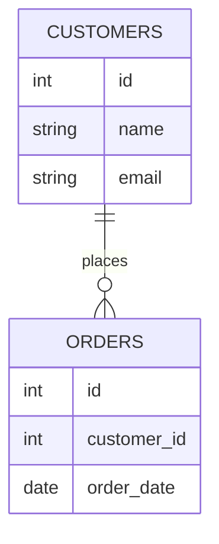

要在Google BigQuery中可视化数据集下所有表格的schema和它们之间的关联关系，你可以使用多种方法和工具。下面是一个详细的方案，包括使用BigQuery的元数据和一些可视化工具来实现这一目标。

### 步骤1：提取Schema信息

首先，你需要提取BigQuery中数据集下所有表的schema信息。你可以通过以下SQL查询来获取这些信息：

```sql
SELECT 
  table_name, 
  column_name, 
  data_type
FROM 
  `project_id.dataset.INFORMATION_SCHEMA.COLUMNS`
ORDER BY 
  table_name, 
  ordinal_position;
```

这个查询会返回数据集中所有表的列信息，包括列名和数据类型。

### 步骤2：提取表之间的关系

BigQuery中没有直接存储外键约束的信息，因此你需要手动或通过其他方式来定义表之间的关系。通常，这些关系可以通过列名的命名约定或文档中的定义来推断。例如，如果表A中的列 `customer_id` 和表B中的列 `customer_id` 是相同的，则可以假设它们之间存在关系。

### 步骤3：生成关系图

你可以使用多种工具来生成关系图，例如：

- **DBML (Database Markup Language)**：可以将表和关系定义成DBML格式，然后使用DBML工具生成关系图。
- **Graphviz**：可以用DOT语言描述表和关系，然后生成关系图。
- **第三方工具**：如DBVisualizer、DBeaver等，也可以用来可视化数据库schema。

#### 示例：使用Graphviz生成关系图

1. 安装Graphviz：

   ```bash
   sudo apt-get install graphviz
   ```

2. 创建一个DOT文件，例如 `schema.dot`：

   ```dot
   digraph G {
     node [shape=record];

     TableA [label="{TableA|<f0> id:int|<f1> customer_id:int|<f2> name:string}"];
     TableB [label="{TableB|<f0> id:int|<f1> customer_id:int|<f2> order_date:date}"];

     TableA:f1 -> TableB:f1;
   }
   ```

3. 生成关系图：

   ```bash
   dot -Tpng schema.dot -o schema.png
   ```

#### 示例：使用DBML生成关系图

1. 创建一个DBML文件，例如 `schema.dbml`：

   ```dbml
   Table users {
     id int [pk]
     name varchar
     email varchar
   }

   Table posts {
     id int [pk]
     user_id int [ref: > users.id]
     title varchar
   }
   ```

2. 使用DBML工具（例如dbdiagram.io）来生成关系图。

### 示例Mermaid图表

你也可以用Mermaid生成简单的ER图。例如：



### 总结

以上方法可以帮助你可视化BigQuery中数据集下所有表格的schema和它们之间的关联关系。你可以选择适合你的工具和方式，根据你的具体需求来实现这一目标。