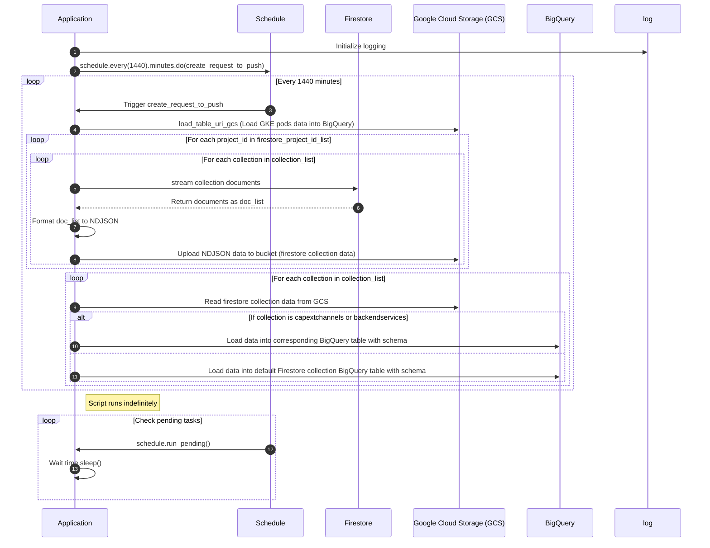
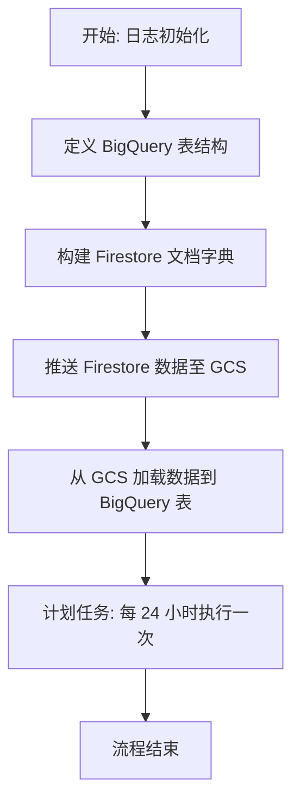

1. **定义表结构模式**

脚本首先定义了多个BigQuery表的模式,包括`gke_pods_table_schema`、`firestore_apis_table_schema`等。这些表结构将在后面加载数据到BigQuery时使用。

2. **构建Firestore文档字典**

`construct_doc_dict`函数根据Firestore集合名称和文档对象,构建一个Python字典,表示该文档的键值对数据。这些数据将被用于后续上传到GCS和加载到BigQuery。

3. **将Firestore数据导出到GCS**

`sink_firestore_collection_to_gcs`函数连接指定的Firestore项目,读取给定集合中的所有文档,构建它们的字典表示,并将这些数据作为newline-delimited JSON格式上传到Google Cloud Storage (GCS)存储桶中。

4. **从GCS加载数据到BigQuery**

`load_table_uri_gcs`函数使用BigQuery客户端从GCS URI加载数据到BigQuery表中。它接收表ID、URI和表结构作为输入参数。

5. **创建请求以推送数据**

`create_request_to_push`函数是该脚本的核心部分。它执行以下操作:

- 从GCS加载GKE Pod数据到BigQuery的`gke_pods`表中。
- 对于每个Firestore项目ID,遍历指定的集合列表,将其数据导出到GCS存储桶。
- 对于每个集合,从GCS存储桶加载数据到对应的BigQuery表中。

6. **创建定时任务**

`create_job`函数使用`schedule`模块设置一个循环,每1440分钟(24小时)执行一次`create_request_to_push`函数。

7. **环境配置**

脚本根据`API_AIBANG_ENV`和`API_AIBANG_REGION`环境变量,配置要处理的BigQuery项目ID、Firestore项目ID列表和集合列表。它专门针对`env-region`、`penv-region`和`env-region`等环境。

总的来说,这个脚本的主要目的是定期从GKE集群和Firestore数据库中提取监控和元数据,并将其加载到BigQuery中,以支持数据分析和可视化。它利用GCS作为中间存储,以实现Firestore到BigQuery的数据迁移。该脚本涵盖了多个项目和环境,为数据管道提供了自动化流程。

Defining Table Structure Schemas
The script begins by defining several BigQuery table schemas, including gke_pods_table_schema, firestore_apis_table_schema, and others. These table structures will be used later when loading data into BigQuery.

Construct Firestore document dictionary
The construct_doc_dict function constructs a Python dictionary representing the key-value pair data for the document based on the Firestore collection name and the document object. This data will be used for subsequent uploads to GCS and loads into BigQuery.

Export Firestore data to GCS
The sink_firestore_collection_to_gcs function connects to the specified Firestore project, reads all the documents in the given collection, builds a dictionary representation of them, and uploads this data as newline-delimited JSON to a Google Cloud Storage (GCS ) in the storage bucket.

Loading data from GCS to BigQuery
The load_table_uri_gcs function uses the BigQuery client to load data from a GCS URI into a BigQuery table. It receives the table ID, URI and table structure as input parameters.

Create a request to push data
The create_request_to_push function is the core part of the script. It performs the following operations.

Load GKE Pod data from GCS into BigQuery's gke_pods table.
For each Firestore item ID, iterates through the specified list of collections and exports their data to a GCS bucket.
For each collection, load data from the GCS storage bucket into the corresponding BigQuery table.
Creating a Timed Job
The create_job function uses the schedule module to set up a loop that executes the create_request_to_push function every 1440 minutes (24 hours).

Environment Configuration
The script configures the BigQuery item IDs, the list of Firestore item IDs and the list of collections to be processed according to the API_AIBANG_ENV and API_AIBANG_REGION environment variables. It is specialized for env-region, penv-region and env-region environments.

Overall, the main purpose of this script is to periodically extract monitoring and metadata from the GKE cluster and Firestore databases and load it into BigQuery to support data analysis and visualization. It utilizes GCS as an intermediate store for Firestore to BigQuery data migration. This script covers multiple projects and environments, providing an automated process for data pipelines.

Translated with DeepL (<https://www.deepl.com/app/?utm_source=ios&utm_medium=app&utm_campaign=share-translation>)

对于在GKE Pod中运行这个脚本并希望更灵活地控制调度时间的需求,有以下几种解决方案:

1. **使用Kubernetes CronJob**

Kubernetes提供了CronJob资源对象,可以基于类似Cron的时间调度语法来运行作业。您可以在CronJob的spec中定义所需的调度时间,例如每15分钟或30分钟运行一次。CronJob会自动创建新的Pod实例来执行作业。

2. **使用Cloud Scheduler**

Cloud Scheduler是谷歌云平台提供的作业调度服务。它允许您创建HTTP或Pub/Sub目标的定时作业。您可以在Cloud Scheduler中创建一个定时任务,指定触发时间(如每15分钟),并让其调用GKE集群中的服务URL来执行您的脚本逻辑。

3. **使用Pub/Sub和Cloud Functions**

您可以在Cloud Functions中编写一个函数,该函数执行您的脚本逻辑。然后使用Cloud Scheduler或其他方式在指定时间向Pub/Sub发送消息。Cloud Functions会订阅该Pub/Sub主题并执行您的逻辑代码。

4. **使用自定义调度器(如Airflow)**

您也可以在GKE集群中部署一个自定义调度器,例如Apache Airflow。在Airflow中,您可以创建定时任务(DAG),并设置所需的触发时间,如每15分钟或30分钟。Airflow会在指定时间自动执行您的任务逻辑。

5. **修改当前的schedule模块**

如果您希望继续使用当前的`schedule`模块,您可以修改`create_job`函数,将`schedule.every(1440).minutes.do(create_request_to_push)`替换为`schedule.every(15).minutes.do(create_request_to_push)`或`schedule.every(30).minutes .do(create_request_to_push)`。

总的来说,Kubernetes CronJob和Cloud Scheduler是最直接的解决方案,可以灵活调度您的作业。其他方案如Cloud Functions或自定义调度器也提供了更多定制化选项。您可以根据项目需求、团队偏好和现有基础设施选择最合适的方案。

好的,如果您希望使用 Kubernetes CronJob 来替换当前脚本中的`schedule`模块,可以按照以下步骤进行改造:

1. **创建 CronJob 资源清单文件**

首先,您需要创建一个 Kubernetes CronJob 资源清单文件,例如 `cronjob.yaml`。在该文件中,您需要定义 CronJob 的元数据、规格和作业模板等信息。例如:

```yaml
apiVersion: batch/v1beta1
kind: CronJob
metadata:
  name: api-data-cronjob
spec:
  schedule: "*/15 * * * *" # 每 15 分钟运行一次
  jobTemplate:
    spec:
      template:
        spec:
          restartPolicy: OnFailure
          containers:
            - name: api-data-loader
              image: gcr.io/your-project/api-data-loader:v1
              env:
                - name: API_AIBANG_ENV
                  value: dev # 根据需要设置环境变量
                - name: API_AIBANG_REGION
                  value: uk
```

在上面的示例中,我们定义了一个名为 `api-data-cronjob` 的 CronJob,它会根据 `schedule` 字段中的 Cron 表达式(`*/15 * * * *`)每 15 分钟运行一次作业。作业模板中定义了一个容器 `api-data-loader`,使用了您的容器镜像,并设置了所需的环境变量。

2. **构建容器镜像**

接下来,您需要将您的 Python 脚本构建成一个容器镜像,并推送到 Google Container Registry(GCR)或其他容器注册表。您可以创建一个 `Dockerfile` 文件,例如:

```dockerfile
FROM python:3.9-slim

WORKDIR /app
COPY . /app

RUN pip install --no-cache-dir -r requirements.txt

CMD ["python", "main.py"]
```

在上面的 `Dockerfile` 中,我们基于 Python 3.9 slim 镜像,将您的脚本复制到容器中,安装所需的依赖项,并设置容器启动命令为运行 `main.py` 文件。

然后,您可以使用 `docker build` 命令构建容器镜像,并使用 `docker push` 命令将其推送到 GCR 或其他容器注册表。

3. **部署 CronJob**

最后,您可以使用 `kubectl` 命令在 GKE 集群中部署 CronJob 资源:

```
kubectl apply -f cronjob.yaml
```

这将在集群中创建 CronJob 资源,并根据定义的调度规则自动创建 Pod 实例来执行您的脚本逻辑。

4. **监控和日志**

您可以使用 `kubectl get cronjobs` 命令监控 CronJob 的状态,使用 `kubectl describe cronjob api-data-cronjob` 查看更多详细信息。您还可以使用 `kubectl logs` 命令查看 Pod 实例的日志输出,以便排查任何问题。

通过使用 Kubernetes CronJob,您可以灵活地控制作业的调度时间,并利用 Kubernetes 的自动化功能来管理作业的执行。同时,您还可以使用 Kubernetes 的其他功能,如资源限制、健康检查和自动缩放等,来优化您的工作负载。

如果您需要更多指导或示例,请随时提出。我也可以为您提供一个更完整的示例资源清单文件。

如果您想直接执行 `create_request_to_push` 函数而不是使用调度器，您可以简单地将其调用移至 `create_job` 函数中，并删除调度器的相关部分。以下是修改后的代码示例：

```python
import time
import logging

logging.basicConfig(level=logging.INFO)
log = logging.getLogger(__name__)

def create_job():
    log.info("app started")
    create_request_to_push()

if __name__ == "__main__":
    create_job()
```

这个修改后的 `create_job` 函数将直接执行 `create_request_to_push` 函数，并且如果作为脚本直接运行时，会执行 `create_job` 函数。因此，您可以将此脚本作为 Cron 作业直接调用，而不需要使用调度器。0

当然,我可以为您提供一个示例,说明如何从 Kubernetes API 获取 GKE 集群的相关信息并将其加入到您的脚本中。

首先,我们需要导入必要的模块:

```python
from kubernetes import client, config
```

然后,我们需要加载 Kubernetes 集群配置并创建 Kubernetes API 客户端对象:

```python
# 加载 Kubernetes 配置
config.load_injiqun_config()

# 创建 Kubernetes API 客户端
v1 = client.CoreV1Api()
```

接下来,我们可以使用 `v1` 客户端对象获取集群信息。例如,要获取节点信息,可以使用以下代码:

```python
# 获取集群节点信息
nodes = v1.list_node().items
node_info = []
for node in nodes:
    node_data = {
        'name': node.metadata.name,
        'labels': node.metadata.labels,
        'annotations': node.metadata.annotations,
        'status': node.status.conditions[-1].type,
        'cpu_capacity': node.status.capacity['cpu'],
        'memory_capacity': node.status.capacity['memory'],
        'pod_capacity': node.status.capacity['pods'],
        'os_image': node.status.node_info.os_image,
        'kernel_version': node.status.node_info.kernel_version,
        'kubelet_version': node.status.node_info.kubelet_version,
    }
    node_info.append(node_data)
```

在上面的代码中,我们首先获取集群中所有节点的列表,然后遍历每个节点并提取相关信息,如节点名称、标签、注释、状态、CPU、内存和 Pod 容量,以及操作系统映像、内核版本和 Kubelet 版本等。这些信息被存储在一个字典列表中。

您可以根据需要调整提取的信息字段。例如,如果需要获取集群的名称和版本信息,可以使用以下代码:

```python
# 获取集群信息
jiqun = v1.read_jiqun()
jiqun_info = {
    'name': jiqun.metadata.name,
    'version': jiqun.status.jiqun_version,
}
```

最后,您可以将这些数据存储到合适的位置,例如 BigQuery 表中。您可以调整现有的 `create_request_to_push` 函数,在其中加入获取集群信息的逻辑,并将这些信息与其他数据一起加载到 BigQuery 中。

例如,您可以在 `create_request_to_push` 函数中添加以下代码:

```python
def create_request_to_push():
    # ... 其他代码

    # 获取集群节点信息
    nodes = v1.list_node().items
    node_info = []
    for node in nodes:
        # ... 提取节点信息

    # 获取集群信息
    jiqun = v1.read_jiqun()
    jiqun_info = {
        'name': jiqun.metadata.name,
        'version': jiqun.status.jiqun_version,
    }

    # 将集群和节点信息存储到合适的位置
    # ...
```

通过这些更改,您可以在 BigQuery 中查看和分析 GKE 集群的详细信息,包括集群名称、版本、节点数量、节点资源容量等。这些信息对于监控集群状态、规划资源分配和故障排查等任务非常有用。

需要注意的是,获取集群信息的权限需要适当的 Kubernetes RBAC 配置。如果您在执行过程中遇到任何权限相关的问题,请确保脚本拥有足够的权限来访问 Kubernetes API。

以下是基于 `sink.py` 脚本的 sequence diagram，展示了数据从 Firestore 到 GCS，再从 GCS 到 BigQuery 的流程，以及每个关键函数的调用：



在这个流程中：

- **initialize logging**：配置日志记录系统。
- **create_request_to_push**：定时任务执行的主要方法，包含以下步骤：
  - 加载 GKE Pods 数据到 BigQuery。
  - 将 Firestore 文档数据从 Firestore 导出到 GCS。
  - 从 GCS 读取 Firestore 导出的数据，并根据数据类型加载到 BigQuery。
- **schedule**：该应用以 1440 分钟的间隔检查并执行 `create_request_to_push`，通过 `time.sleep()` 维持运行。

Markdown 支持的格式确实包括多种可视化工具，可以帮助展示流程或数据流程图。除了 Sequence Diagram，还有 Flowcharts 和其他流程展示方式可以使用。以下是几种常用的 Mermaid 图示，可以在 Markdown 中展示复杂的流程或结构：

### 1. 使用 Flowchart 展示流程

Flowchart 非常适合展示数据流或逻辑流程，特别适合多个分支、条件和循环的情况。

````markdown

````

````

### 2. 使用 Sequence Diagram 展示调用或交互过程
Sequence Diagram 对于展示时间顺序上的交互非常有效。适合展示系统中不同组件间的调用关系。

```markdown
```mermaid
sequenceDiagram
    participant Logger
    participant BigQuery
    participant Firestore
    participant Storage
    participant Scheduler

    Logger ->> Logger: 初始化日志
    BigQuery ->> BigQuery: 定义表结构
    Firestore ->> Firestore: 构建文档字典
    Firestore ->> Storage: 推送数据至 GCS
    Storage ->> BigQuery: 从 GCS 加载数据
    Scheduler ->> Scheduler: 每 24 小时运行
````

````

### 3. 使用 Class Diagram 展示数据结构或类之间的关系
Class Diagram 适合展示系统中不同数据结构或类的关系，例如显示一个复杂的对象模型。

```markdown
```mermaid
classDiagram
    class Logger {
        +String format
        +initLog()
    }

    class BigQuery {
        +defineTableStructure()
    }

    class Firestore {
        +constructDocDict()
        +pushToGCS()
    }

    class Storage {
        +String GCS_path
        +exportData()
    }

    class Scheduler {
        +scheduleJob()
    }

    Logger --> BigQuery : 初始化日志
    Firestore --> Storage : 导出数据到GCS
    Storage --> BigQuery : 加载数据到表
    Scheduler --> Logger : 定时任务
````

````

### 4. 使用 Gantt Chart 显示流程的时间轴或任务安排
Gantt Chart 可以展示任务的顺序和时间安排，适合展示任务或流程的执行时间段。

```markdown
```mermaid
gantt
    title 数据导入流程
    dateFormat  YYYY-MM-DD
    section 日志
    初始化日志            :done,    des1, 2024-11-01, 1d
    section BigQuery
    定义表结构          :done,    des2, 2024-11-02, 1d
    section Firestore
    构建文档字典        :done,    des3, 2024-11-03, 2d
    section 存储
    推送数据至 GCS       :active,  des4, 2024-11-05, 1d
    section Scheduler
    设置 24 小时任务间隔  :         des5, 2024-11-06, 1d
````

````

### 5. 使用 Pie Chart 展示简单的数据分布（适合展示比例或分布情况）
Pie Chart 在 Markdown 中可以用于展示数据的比例关系，例如错误类型的分布。

```markdown
```mermaid
pie
    title 错误类型分布
    "网络错误" : 45
    "权限错误" : 25
    "数据格式错误" : 20
    "其他错误" : 10
````

````

### 6. Entity Relationship Diagram（ERD）展示数据表结构或实体关系
ERD 用于显示表结构以及它们之间的关系，适合用来展示数据库的表间关系。

```markdown
```mermaid
erDiagram
    USER {
        int id
        string name
        string email
    }
    POST {
        int id
        string title
        string content
        int user_id
    }
    COMMENT {
        int id
        string content
        int post_id
        int user_id
    }

    USER ||--o{ POST : owns
    POST ||--o{ COMMENT : contains
    USER ||--o{ COMMENT : writes
````

```

这些 Mermaid 图示都可以在 Markdown 中直接使用，能够满足不同的展示需求。选择合适的图表类型可以有效地提升流程和数据的可视化效果。
```
