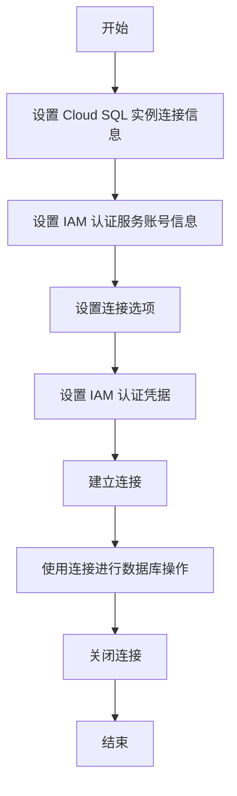

要从另一个 Google GCP 工程中通过 IAM 认证方式访问暴露在 5432 端口的 Cloud SQL，通常需要满足以下条件：

1. **IAM 权限**：确保在源工程中赋予了适当的 IAM 角色或权限，以允许访问目标 Cloud SQL 实例。这可能涉及到授予特定的数据库访问权限或相关的 IAM 角色。
2. **服务账号**：创建一个服务账号，并为其分配适当的权限。服务账号将用于代表源工程进行身份验证和访问 Cloud SQL。
3. **授权关系**：在源工程和目标 Cloud SQL 实例之间建立适当的授权关系。这可以通过 IAM 策略或其他授权机制来实现，确保源工程的服务账号具有访问目标实例的权限。
4. **网络配置**：确保源工程和目标 Cloud SQL 实例在网络上可访问，并且网络配置允许通过 IAM 认证进行访问。这可能涉及到设置适当的防火墙规则或网络配置。
5. **数据库配置**：确保目标 Cloud SQL 实例的数据库配置允许通过 IAM 认证进行访问。这可能涉及到设置适当的用户和权限。

具体的条件和步骤可能会因 GCP 项目的具体配置和需求而有所不同。以下是一般的步骤概述：

1. 在目标 Cloud SQL 实例上创建一个数据库用户，并为其分配适当的权限。
2. 在源工程中创建一个服务账号，并为其授予访问目标 Cloud SQL 实例的 IAM 权限。
3. 在源工程中配置 IAM 策略，以允许服务账号访问目标 Cloud SQL 实例。
4. 在源工程中使用适当的客户端库或工具，通过 IAM 认证方式连接到目标 Cloud SQL 实例。

以下是一个使用 Java 连接到 Cloud SQL 的示例代码，展示了如何使用 IAM 认证方式：

```java
import com.google.cloud.sql.jdbc.ConnectionOptions;
import com.google.cloud.sql.jdbc.SslSocketFactoryProvider;

import java.sql.Connection;
import java.sql.DriverManager;
import java.sql.SQLException;

public class CloudSqlIamAuthExample {
    public static void main(String[] args) {
        // 设置 Cloud SQL 实例的连接信息
        String instanceConnectionName = "your-instance-connection-name";
        String databaseName = "your-database-name";
        String username = "your-username";

        // 设置 IAM 认证的服务账号信息
        String serviceAccountEmail = "your-service-account-email";
        String privateKeyPath = "path-to-your-private-key-file";

        try {
            // 设置连接选项
            ConnectionOptions connectionOptions = ConnectionOptions.builder()
             .instance(instanceConnectionName)
             .database(databaseName)
             .user(username)
             .sslSocketFactoryProvider(SslSocketFactoryProvider.getDefault())
             .build();

            // 设置 IAM 认证的凭据
            connectionOptions.setIamServiceAccountEmail(serviceAccountEmail);
            connectionOptions.setIamPrivateKeyPath(privateKeyPath);

            // 建立连接
            Connection connection = DriverManager.getConnection(connectionOptions.getConnectionUrl());

            // 使用连接进行数据库操作
            //...

            // 关闭连接
            connection.close();
        } catch (SQLException | IOException e) {
            e.printStackTrace();
        }
    }
}
```

在上述示例中，你需要将 `your-instance-connection-name` 替换为你的 Cloud SQL 实例的连接名称，`your-database-name` 替换为你的数据库名称，`your-username` 替换为你的数据库用户，`your-service-account-email` 替换为你的服务账号的电子邮件地址，并将 `path-to-your-private-key-file` 替换为你的私钥文件的路径。

请注意，这只是一个简单的示例，实际的应用可能需要更多的配置和错误处理。此外，确保你已经正确安装和配置了 Google Cloud SQL JDBC 驱动程序。

Mermaid 流程图如下：



要从一个 Google Cloud Project (GCP) 访问另一个项目中的 Cloud SQL (通过暴露的 5432 端口) 并使用 IAM 认证方式，您需要满足以下条件：

1. Cloud SQL 实例设置

• Cloud SQL 实例必须启用 IAM 数据库身份验证。您可以在 Cloud SQL 实例的设置中启用此选项。

2. IAM 权限

• 确保您有适当的 IAM 权限。您需要在担任使用服务帐号或 Google 帐号时，确保其对目标 Cloud SQL 实例具有以下权限：
• roles/cloudsql.client（即 Cloud SQL 客户端角色）。

3. 数据库用户

• 在目标 Cloud SQL 实例中，您需要创建一个 PostgreSQL 用户，并与要使用的 Google 帐号或服务帐号关联。这个用户的访问权限要与 IAM 认证相匹配。

4. 网络设置

• 确保目标 Cloud SQL 实例的网络访问控制允许来自来源项目的请求。这可以通过设置适当的授权网络或使用 私有 IP 配置来实现。

5. 使用服务帐号

• 如果您使用服务帐号进行访问，请确保在调用 Cloud SQL 的服务中使用正确的服务帐号，并且其具有上述角色。

6. 客户端设置

• 在客户端连接时，要使用适当的连接字符串，并确保使用 cloud_sql_connection_string 参数指定 Cloud SQL 实例的权限。

示例连接字符串

以下是一个示例，用于在 GKE 中使用 IAM 认证访问 Cloud SQL 实例的连接示例：

gcloud sql connect [INSTANCE_NAME] --user=[USERNAME]

注意事项

• 在使用 IAM 认证时，确保您的 GKE 环境已配置为能够使用 IAM 令牌进行身份验证。
• 不要忘记在 Terraform 或其他基础设施即代码工具中相应配置IAM角色和权限。

通过满足上述条件，您将能够使用 IAM 认证访问另一个项目中的 Cloud SQL 实例。

```


```
