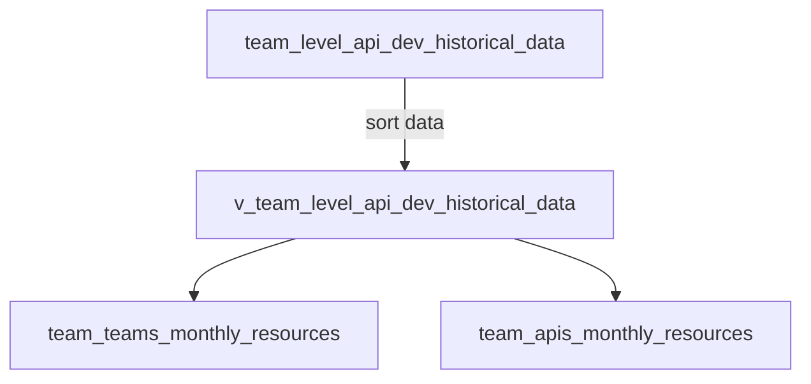

# summary cost 
- 计费原则
  - env,region,api,cpu*$,memory*$
- 首先基于源数据做数据清理,得到一个干净的数据源
  - team_level_api_dev_historical_data
  - 需要考虑采集数据的时间
    - timestamp 可能会存在每天采集多次的情况,所以需要考虑怎么去取值
    - 同一天如果多次采集到数据,按照API的Pod数量最大的那个来进行处理,也就是保留这个API的数据
    - 同时需要注意API多个版本的问题,如果有多个版本，需要保留多个版本,因为环境中运行的可能是不同版本的API，需要保留多个版本的数据,去计费
    - 同时需要注意API多个环境的问题，如果有多个环境，需要保留多个环境，因为环境中运行的可能是不同环境的API，需要保留多个环境的数据，去计费.最终累加在一起
  - team_level_api_dev_historical_data ==> team_api_monthly_resources
  - team_team_monthly_resources 



# team_level_api_dev_historical_data

SQL 和 JSON 提取及解释

SQL 语句 1

SELECT
column_name,
data_type,
is_nullable
FROM
`project.aibang_api_data.INFORMATION_SCHEMA.COLUMNS`
WHERE
table_name = 'team_level_api_dev_historical_data';

解释:

该SQL语句用于查询名为 team_level_api_dev_historical_data 的表的表结构信息。

    • INFORMATION_SCHEMA.COLUMNS:  系统表，存储了数据库中所有表的列信息。
    • project.aibang_api_data: 数据库名。
    • team_level_api_dev_historical_data: 表名。
    • column_name, data_type, is_nullable: 查询的列信息，分别是列名、数据类型、是否可为空。

JSON 输出

```json
[
  {
    "column_name": "backupTime",
    "data_type": "STRING",
    "is_nullable": "YES"
  },
  {
    "column_name": "teamName",
    "data_type": "STRING",
    "is_nullable": "YES"
  },
  {
    "column_name": "aibangOrg",
    "data_type": "STRING",
    "is_nullable": "YES"
  },
  {
    "column_name": "apis",
    "data_type": "ARRAY<STRUCT<memory_request STRING, cpu_limit STRING, env STRING, api_name STRING, region STRING, cpu_request STRING, minor_version STRING, major_version STRING, memory_limit STRING, pod_count INT64>>",
    "is_nullable": "NO"
  }
]
```

解释:

该JSON输出是上面SQL语句的查询结果，展示了 team_level_api_dev_historical_data 表的结构信息:

    • 表格包含四列: backupTime, teamName, aibangOrg, apis。
    • 每列信息包含:
    • column_name: 列名
    • data_type: 数据类型
    • is_nullable: 是否可为空
    • apis 列的数据类型是 ARRAY<STRUCT>，表示它是一个数组，数组中每个元素是一个结构体，结构体中包含 API 的详细信息，例如： memory_request, cpu_limit, api_name 等。

SQL 语句 2

SELECT

- FROM
  `project.aibang_api_data.team_level_api_dev_historical_data`
  UNNEST(apis) AS api
  WHERE api.api_name = 'lex-apiname'

解释:

该SQL语句用于查询 team_level_api_dev_historical_data 表中，apis 数组中 api_name 为 lex-apiname 的所有数据。

    • UNNEST(apis) AS api: 将 apis 数组展开，方便查询数组中的元素。
    • WHERE api.api_name = 'lex-apiname': 过滤条件，只选择 api_name 等于指定值的 API 数据。

由于缺少示例数据，无法提供该SQL语句的输出结果。

结合上面语句如果我想统计月度的每个API的 内存和CPU使用情况 如何处理 写这个SQL 注意 apis 是一个数组 里面有一个api_name

```sql
WITH api_backup_counts AS (
  SELECT
    teamName,
    api.api_name,
    COUNT(DISTINCT DATE(PARSE_TIMESTAMP('%m/%d/%Y, %H:%M:%S', backupTime))) AS backup_count
  FROM
    `project.aibang_api_data.team_level_api_dev_historical_data`
  JOIN UNNEST(apis) AS api
  WHERE
    PARSE_TIMESTAMP('%m/%d/%Y, %H:%M:%S', backupTime) BETWEEN TIMESTAMP('2024-09-01 00:00:00') AND TIMESTAMP('2024-09-30 23:59:59')
  GROUP BY
    teamName,
    api.api_name
)
SELECT
  d.teamName,
  api.api_name,
  t.backup_count,
  SUM(
    CASE
      WHEN REGEXP_CONTAINS(api.memory_limit, r'Gi') THEN CAST(REGEXP_REPLACE(api.memory_limit, r'Gi', '') AS FLOAT64) * 1024
      WHEN REGEXP_CONTAINS(api.memory_limit, r'Mi') THEN CAST(REGEXP_REPLACE(api.memory_limit, r'Mi', '') AS FLOAT64)
      ELSE 0
    END * api.pod_count
  ) AS memory_total_mi,
  SUM(CAST(api.cpu_limit AS FLOAT64) * api.pod_count) AS cpu_total,
  SUM(
    CASE
      WHEN REGEXP_CONTAINS(api.memory_limit, r'Gi') THEN CAST(REGEXP_REPLACE(api.memory_limit, r'Gi', '') AS FLOAT64) * 1024
      WHEN REGEXP_CONTAINS(api.memory_limit, r'Mi') THEN CAST(REGEXP_REPLACE(api.memory_limit, r'Mi', '') AS FLOAT64)
      ELSE 0
    END * api.pod_count
  ) / t.backup_count AS avg_memory_per_day_mi,
  SUM(CAST(api.cpu_limit AS FLOAT64) * api.pod_count) / t.backup_count AS avg_cpu_per_day
FROM
  `project.aibang_api_data.team_level_api_dev_historical_data` AS d
JOIN UNNEST(d.apis) AS api
JOIN api_backup_counts AS t ON d.teamName = t.teamName AND api.api_name = t.api_name
WHERE
  PARSE_TIMESTAMP('%m/%d/%Y, %H:%M:%S', d.backupTime) BETWEEN TIMESTAMP('2024-09-01 00:00:00') AND TIMESTAMP('2024-09-30 23:59:59')
GROUP BY
  d.teamName,
  api.api_name,
  t.backup_count

```

**主要变化:**

1. **CTE (Common Table Expression) - api_backup_counts**:

   - 现在不仅按 `teamName` 分组，还按 `api.api_name` 分组，以便区分不同的 API。
   - 计算每个API在9月份的备份天数 (`backup_count`)。

2. **主查询**:
   - 使用 `JOIN` 连接 `api_backup_counts` CTE 时，添加了 `api.api_name = t.api_name` 的连接条件，确保数据匹配到具体的API。
   - 在 `GROUP BY` 子句中添加了 `api.api_name`，以便对每个API进行聚合。

**输出结果**:

该查询将返回一个包含以下列的表格：

- `teamName`: 团队名称。
- `api_name`: API 名称。
- `backup_count`: 9月份的备份天数。
- `memory_total_mi`: 总内存使用量 (MiB)。
- `cpu_total`: 总CPU使用量。
- `avg_memory_per_day_mi`: 每天的平均内存使用量 (MiB)。
- `avg_cpu_per_day`: 每天的平均CPU使用量。

现在，您可以获得每个API的详细资源使用情况统计信息。
