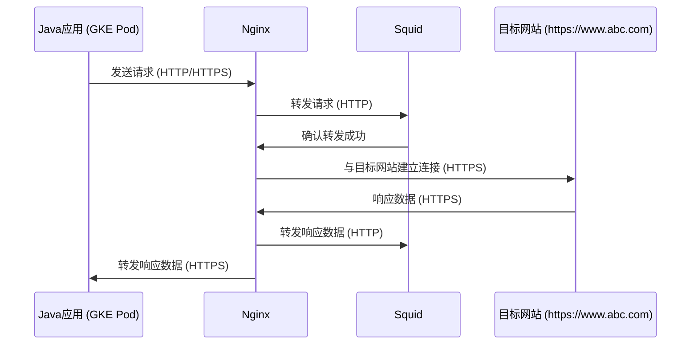
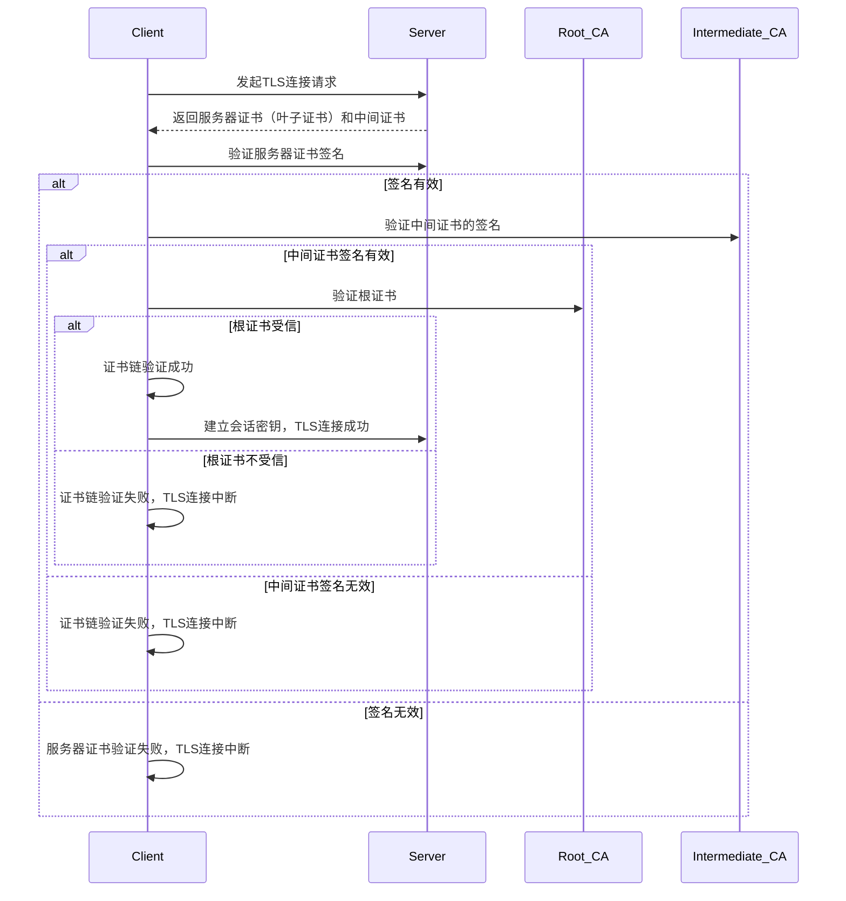
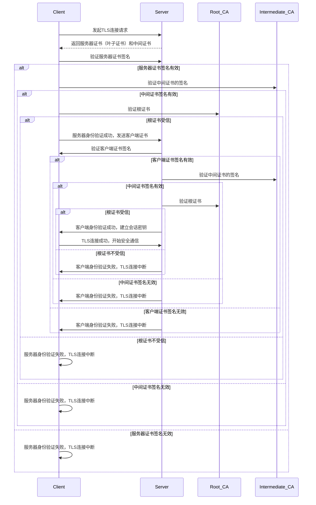
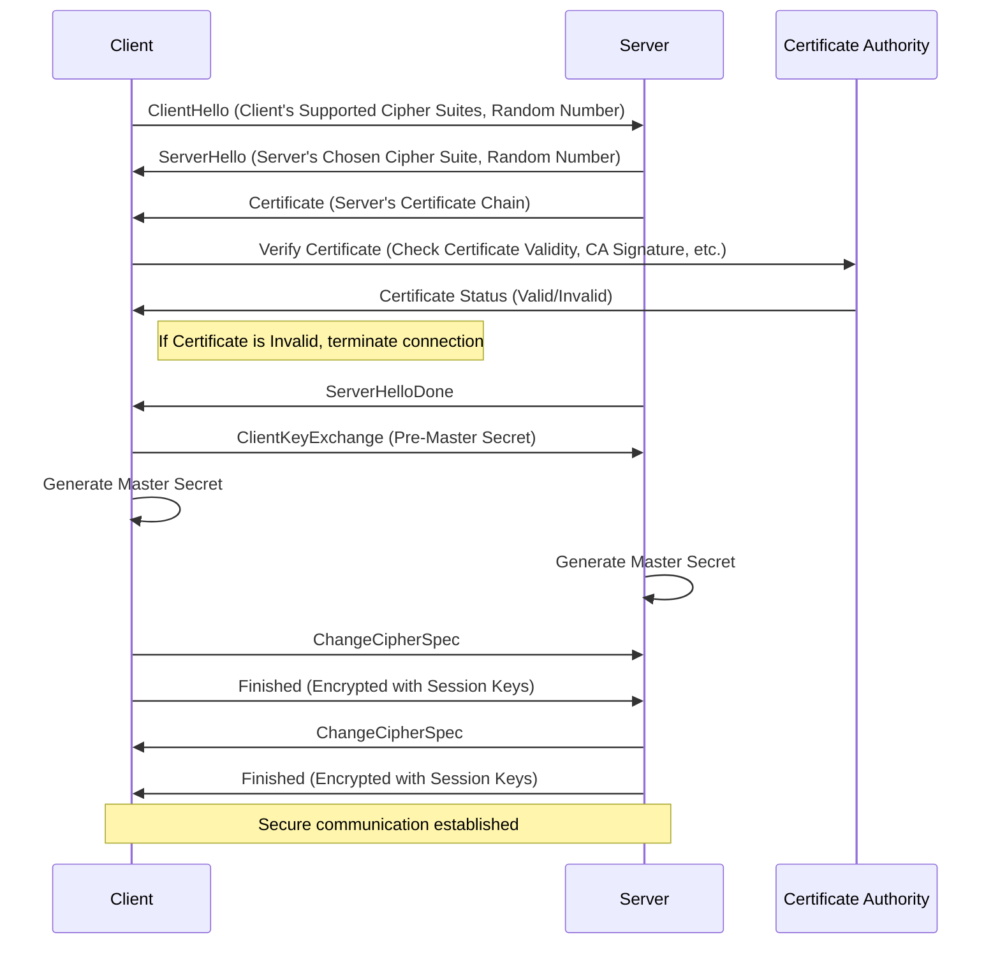
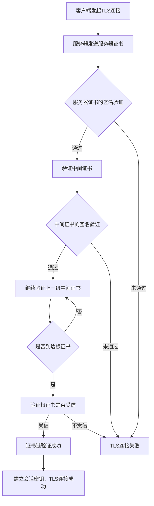
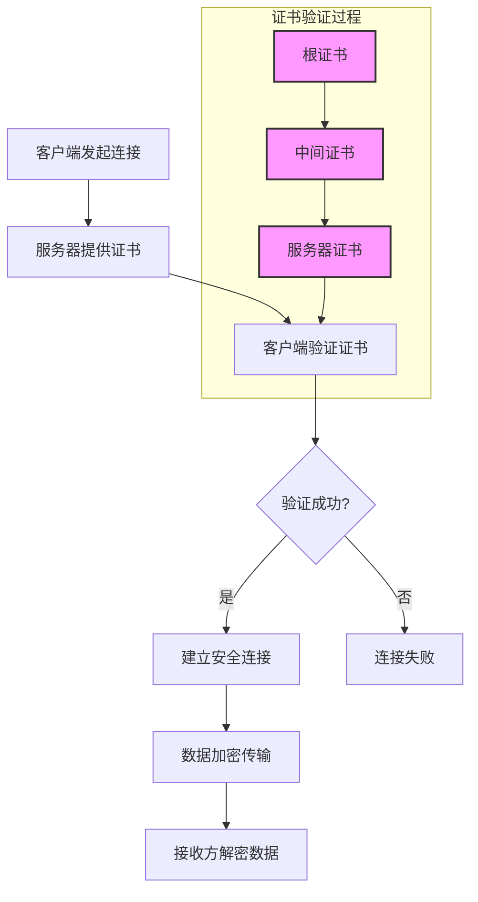
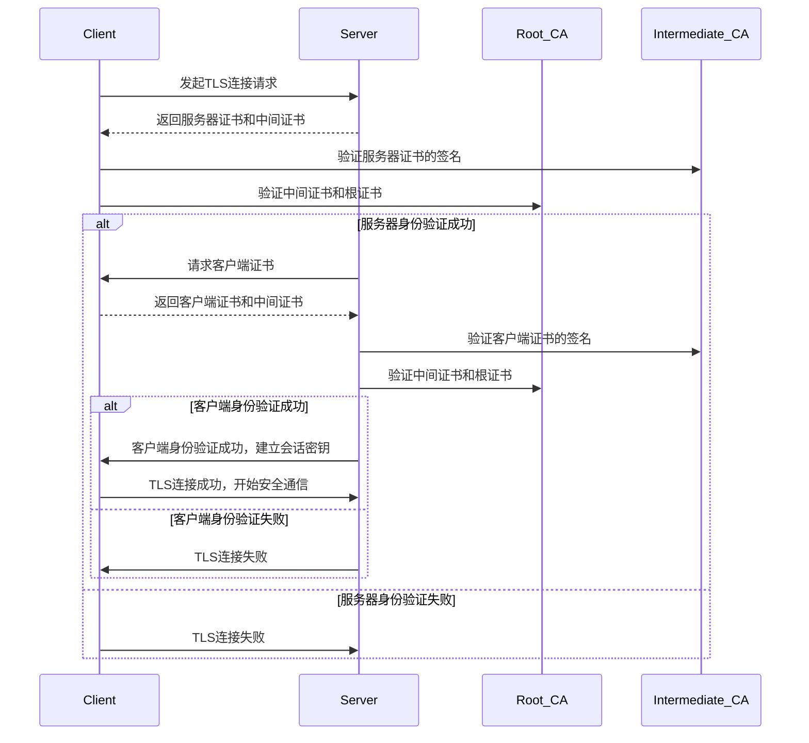
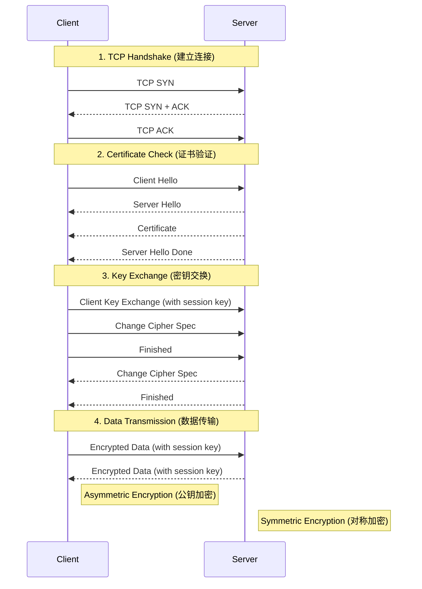

- [A case thinking](#a-case-thinking)
  - [network flow](#network-flow)
  - [The request flow](#the-request-flow)
- [SN with SAN](#sn-with-san)
  - [Subject Name (SN)](#subject-name-sn)
  - [Subject Alternative Name (SAN)](#subject-alternative-name-san)
  - [总结](#总结)
- [TLS with MTLS](#tls-with-mtls)
  - [TLS](#tls)
    - [解释](#解释)
  - [MTLS](#mtls)
    - [解释](#解释-1)
    - [流程解释](#流程解释)
  - [TLS 证书验证过程](#tls-证书验证过程)
    - [1. **服务器证书（叶子证书）发送**](#1-服务器证书叶子证书发送)
    - [2. **中间证书验证**](#2-中间证书验证)
    - [3. **中间证书链验证**](#3-中间证书链验证)
    - [4. **根证书验证**](#4-根证书验证)
    - [5. **证书链的完整性检查**](#5-证书链的完整性检查)
    - [6. **验证成功，建立会话密钥**](#6-验证成功建立会话密钥)
    - [证书验证过程的Flow图](#证书验证过程的flow图)
  - [MTLS 证书验证过程](#mtls-证书验证过程)
    - [mTLS 证书验证过程](#mtls-证书验证过程-1)
      - [1. **客户端发起TLS连接请求**](#1-客户端发起tls连接请求)
      - [2. **服务器发送服务器证书（叶子证书）和中间证书**](#2-服务器发送服务器证书叶子证书和中间证书)
      - [3. **客户端验证服务器证书**](#3-客户端验证服务器证书)
      - [4. **服务器请求客户端证书**](#4-服务器请求客户端证书)
      - [5. **客户端发送客户端证书（叶子证书）和中间证书**](#5-客户端发送客户端证书叶子证书和中间证书)
      - [6. **服务器验证客户端证书**](#6-服务器验证客户端证书)
      - [7. **证书验证成功，建立会话密钥**](#7-证书验证成功建立会话密钥)
    - [mTLS 验证过程的Flow图](#mtls-验证过程的flow图)
    - [解释](#解释-2)
- [How Does the https work](#how-does-the-https-work)
    - [修订后的解释：](#修订后的解释)
- [wget-ssl.md](#wget-sslmd)
  - [要获取一个HTTPS网站的证书链，你可以使用以下几种方法：](#要获取一个https网站的证书链你可以使用以下几种方法)
    - [使用 `openssl` 命令行工具](#使用-openssl-命令行工具)
    - [使用 `curl` 工具](#使用-curl-工具)
    - [使用 Web 浏览器](#使用-web-浏览器)
    - [获取证书链](#获取证书链)
- [Root证书和企业证书](#root证书和企业证书)
- [1. 根证书的定义：](#1-根证书的定义)
  - [企业证书和公共证书的一些辨别](#企业证书和公共证书的一些辨别)
- [什么是中间证书？](#什么是中间证书)
    - [中间证书是否自动信任？](#中间证书是否自动信任)
    - [总结](#总结-1)
- [服务器证书](#服务器证书)
    - [服务器证书验证过程](#服务器证书验证过程)
    - [总结](#总结-2)
- [Tools](#tools)


# A case thinking
## network flow
GKE Pod (Java应用) -> Nginx -> Squid (HTTP代理) -> 目标网站 (https://www.abc.com)

## The request flow 
Client -> Nginx -> Squid -> Target Website


在这种情况下，我们需要仔细考虑每个组件的角色：

1. Java应用（GKE Pod）：
   - 这是最初的请求发起者，但它并不直接与最终的HTTPS目标通信。
   - 它只需要能够与Nginx通信（可能是HTTP或HTTPS）。

2. Nginx：
   - 作为第一跳代理，Nginx接收来自Java应用的请求。
   - Nginx然后通过Squid代理向最终目标发送请求。
   - 在这个设置中，Nginx实际上扮演了"客户端"的角色，因为它是与最终HTTPS目标建立加密连接的组件。

3. Squid：
   - Squid使用HTTP协议，这意味着Squid可能不参与SSL/TLS处理。
   - Squid在这里可能只是简单地转发Nginx的请求，而不涉及证书验证。

4. 目标网站 (https://www.abc.com)：
   - 最终的HTTPS目标。

基于这个分析，我们可以得出以下结论：

1. CA证书配置位置：
   - 主要的CA证书配置应该在Nginx上进行，因为Nginx是实际与HTTPS目标建立加密连接的组件。
   - Nginx需要信任www.abc.com的CA证书才能成功建立HTTPS连接。

2. Java应用的角色：
   - 如果Java应用到Nginx的连接是HTTP，则Java应用不需要特殊的CA证书配置。
   - 如果Java应用到Nginx的连接是HTTPS，那么Java应用需要信任Nginx的证书，但不需要信任最终目标(www.abc.com)的证书。
   - 这里可以通过curl 指定证书来访问测试
     - 获取您要访问的特定 URL 的 CA 证书。假设您要访问的是 example.com，可以使用以下命令
       - `echo | openssl s_client -servername example.com -connect example.com:443 2>/dev/null | openssl x509 > example_com.crt`
     - 可以使用 curl 命令访问目标 URL，并指定使用特定的 CA 证书
       - `curl --cacert /etc/ssl/certs/example_com.crt https://example.com`

3. 正确的"客户端"：
   - 在这个特定的设置中，就SSL/TLS连接而言，Nginx实际上扮演了"客户端"的角色。
   - Java应用是初始请求的发起者，但在SSL/TLS层面，Nginx才是与最终HTTPS目标建立加密连接的组件。

验证和配置步骤.这个其实也是我们 troubleshoot 的思路

1. 在Nginx服务器上：
   - 确保Nginx配置了正确的CA证书，以便能够验证www.abc.com的证书。
   - 可以使用如下命令在Nginx服务器上测试连接：
     ```
     curl -v https://www.abc.com -x http://www.def.com:3128
     ```
   - 如果出现证书验证错误，可能需要在Nginx的配置中添加正确的CA证书。

2. Java应用（如果到Nginx的连接是HTTPS）：
   - 确保Java应用信任Nginx的证书。
   - 这可能涉及将Nginx的证书添加到Java的信任库中。

3. Squid配置：
   - 由于Squid使用HTTP协议，通常不需要特殊的SSL/TLS配置。
   - 但要确保Squid正确配置为允许HTTPS流量通过。

总结：
在我们的场景中，就SSL/TLS证书验证而言，Nginx才是真正的"客户端"。CA证书的主要配置应该在Nginx上进行，
以确保它能够成功连接到https://www.abc.com。Java应用虽然是初始请求的发起者，但在这个特定的SSL/TLS链中，它的角色较为有限。


## The request flow 
- mermaid


1. Nginx和Squid的角色：
    Nginx：
   - 作为第一跳代理，Nginx接收来自Java应用的请求。
   - Nginx然后通过Squid代理向最终目标发送请求。
   - 在这个设置中，Nginx实际上扮演了"客户端"的角色，因为它是与最终HTTPS目标建立加密连接的组件。
   - Squid使用HTTP协议作为代理，这进一步确认它不参与SSL/TLS的处理。

2. 证书信任位置：
   
   - Nginx需要信任www.abc.com的CA证书才能成功建立HTTPS连接。
   - Java应用（GKE Pod）需要信任Nginx的证书，但不需要信任最终目标(www.abc.com)的证书。

3. 验证步骤：
   - 在Nginx服务器上测试连接：
     ```
     curl -v https://www.abc.com -x http://www.def.com:3128
     ```
   - 如果出现证书验证错误，可能需要在Nginx的配置中添加正确的CA证书。
4. Java应用（如果到Nginx的连接是HTTPS）：
   - 确保Java应用信任Nginx的证书。
   - 这可能涉及将Nginx的证书添加到Java的信任库中。

5. Squid配置：
   - 由于Squid使用HTTP协议，通常不需要特殊的SSL/TLS配置。
   - 但要确保Squid正确配置为允许HTTPS流量通过。

# SN with SAN 
Subject Alternative Name (SAN) 和 Subject Name (SN) 是数字证书中的两个重要概念，它们在身份验证和安全性方面扮演着不同的角色。

## Subject Name (SN)

- **定义**：Subject Name 是证书中用于标识持有者的主要名称，**通常是一个单一的域名或主机名**。它在证书的主体字段中定义。
  
- **局限性**：传统的SN只能指定一个名称，这在多域名和子域名的环境中显得不够灵活。根据RFC 2818，使用SN的做法已经被逐渐弃用，因为它无法满足现代网络的需求。

## Subject Alternative Name (SAN)

- **定义**：SAN 是X.509证书标准中的一个扩展字段，**允许在同一证书中指定多个名称,使得一张证书能够支持多个主机名**。这些名称可以是域名、IP地址、电子邮件地址等.这种类型的证书通常被称为通配符证书或多域名证书。

- **优势**：SAN的引入使得一个证书能够支持多个主机名，极大地提高了证书的灵活性和效率。现代浏览器和应用程序主要依赖SAN进行证书验证，甚至在存在SAN的情况下，忽略SN的验证。

- **标准化**：根据RFC 6125，证书验证时应优先检查SAN字段，如果存在SAN，则不再检查SN。这一变化反映了对多域名支持的需求和对安全性的重视。

## 总结

在现代SSL/TLS证书中，SAN被认为是更为重要和灵活的选择，而SN则被视为过时的做法。许多证书颁发机构（CA）现在默认将SN的内容添加到SAN字段中，以确保兼容性和安全性


# TLS with MTLS 

## TLS 
Mermaid的sequenceDiagram来表达TLS证书验证过程的示意图：



### 解释
- **Client**: 客户端发起连接请求并接收服务器的证书。
- **Server**: 服务器响应客户端请求，发送服务器证书和中间证书。
- **Intermediate_CA**: 中间证书颁发机构，用于验证服务器证书。
- **Root_CA**: 根证书颁发机构，用于验证中间证书。

这个流程图以顺序图的形式展现了TLS证书验证过程中的各个关键步骤和验证的顺序。如果在验证过程中任何一步失败，TLS连接将被中断。


## MTLS 
以下是使用Mermaid的sequenceDiagram来表达mTLS（双向TLS）证书验证过程的示意图：



### 解释
mTLS（Mutual TLS）是TLS的扩展形式，其中不仅客户端验证服务器的身份，服务器也会验证客户端的身份。这个过程确保了双向身份验证，提升了通信的安全性。

1. **客户端（Client）发起TLS连接请求**: 
   - 客户端请求与服务器建立安全连接。

2. **服务器（Server）发送服务器证书和中间证书**:
   - 服务器返回自己的证书和中间证书，供客户端进行验证。

3. **客户端验证服务器证书**:
   - 客户端使用中间证书和根证书验证服务器证书的签名，以确保服务器身份的真实性。

4. **服务器身份验证成功后，客户端发送客户端证书**:
   - 如果客户端成功验证了服务器证书，它会将自己的证书发送给服务器进行身份验证。

5. **服务器验证客户端证书**:
   - 服务器使用中间证书和根证书验证客户端证书的签名，以确保客户端身份的真实性。

6. **验证成功，建立会话密钥**:
   - 如果双方的证书都通过验证，客户端和服务器将协商一个会话密钥，用于加密接下来的数据传输，TLS连接成功建立。

7. **如果任何一步验证失败，TLS连接将被中断**:
   - 若在任何步骤中证书验证失败，TLS连接将立即终止，确保未认证的一方无法继续通信。

这个mTLS流程图展示了双向身份验证过程，确保双方身份的真实性和通信的安全性。


下面是完整的TLS（传输层安全）握手过程的描述，特别是围绕证书验证的部分。我将以Mermaid流程图的形式展示这一过程。


### 流程解释

1. **ClientHello**: 客户端发送一个ClientHello消息，其中包括支持的加密套件列表和一个随机数。

2. **ServerHello**: 服务器响应一个ServerHello消息，选择一个加密套件，并发送一个随机数。

3. **Certificate**: 服务器发送其证书链给客户端。证书链包括服务器证书和中间CA证书，最后连接到一个受信任的根CA。

4. **证书验证**: 
   - 客户端验证证书的有效性，包括证书的签名、有效期等。它会使用内置或从网络获取的受信任CA列表来验证证书。
   - 证书验证成功后，客户端继续握手流程；如果验证失败，握手终止。

5. **ServerHelloDone**: 服务器通知客户端其握手消息已完成。

6. **ClientKeyExchange**: 客户端发送ClientKeyExchange消息，其中包括一个使用服务器公钥加密的预主密钥。

7. **生成主密钥**: 
   - 客户端和服务器都使用共享的预主密钥和之前交换的随机数生成主密钥（Master Secret）。

8. **ChangeCipherSpec**: 客户端发送ChangeCipherSpec消息，通知服务器后续消息将使用协商的加密套件和主密钥加密。

9. **Finished**: 客户端发送Finished消息，这是用新协商的密钥加密的，确保前面的握手消息未被篡改。

10. **服务器的ChangeCipherSpec和Finished消息**: 服务器也会发送相应的ChangeCipherSpec和Finished消息。

11. **建立安全通信**: 双方都验证成功后，建立了一个安全的加密通道，可以进行安全的数据传输。

这个过程确保了通信双方能够安全地交换信息，并且只有验证通过的参与者能够成功建立连接。


## TLS 证书验证过程
TLS（传输层安全协议）的证书验证过程是确保通信双方身份真实性和数据传输安全性的关键部分。这个过程涉及多个证书的验证，包括根证书、中间证书和服务器证书（也称为叶子证书）。以下是证书验证过程中这些证书的调用顺序和Flow过程的详细描述：

### 1. **服务器证书（叶子证书）发送**
   - 当客户端（如浏览器）发起与服务器的TLS连接时，服务器会首先将其自己的证书（服务器证书/叶子证书）发送给客户端。
   - 这个证书包含了服务器的公钥，以及由服务器的私钥加密后的证书签名信息。

### 2. **中间证书验证**
   - 服务器通常不会直接使用根证书进行签名，而是使用由根证书签发的中间证书来签署服务器证书。
   - 服务器证书会包含一个指向中间证书的链接或直接包含中间证书，以帮助客户端进行验证。
   - 客户端会使用中间证书的公钥来验证服务器证书的签名是否有效。
   - 如果服务器证书是由中间证书签发的，则客户端会继续验证中间证书。

### 3. **中间证书链验证**
   - 通过验证服务器证书的签名后，客户端会检查中间证书本身是否由受信任的上一级中间证书或根证书签署。
   - 这一过程会递归地进行，直到客户端到达一个受信任的根证书。

### 4. **根证书验证**
   - 根证书是由CA（证书颁发机构）签署的，它们是自签名的，并已预安装在客户端的操作系统或浏览器中。
   - 如果中间证书链最终能追溯到客户端本地存储的受信任根证书，客户端就可以确认服务器的身份是有效的。

### 5. **证书链的完整性检查**
   - 客户端会检查从服务器证书到根证书的整个证书链的完整性，确保没有证书被篡改，且每个证书都是由上一级证书合法签署的。
   - 如果证书链的验证成功，TLS握手过程就可以继续，建立加密通信通道。

### 6. **验证成功，建立会话密钥**
   - 如果证书链验证成功，客户端和服务器之间将通过加密算法协商一个会话密钥，用于加密接下来的数据传输。
   - 这时，TLS连接已成功建立，客户端和服务器可以开始安全通信。

### 证书验证过程的Flow图



这个过程确保了客户端能够信任服务器的身份，并且所有传输的数据都通过加密通道进行安全传输。如果任何一步验证失败，TLS连接将被中断。


## MTLS 证书验证过程

mTLS（Mutual TLS，双向TLS）证书验证过程中，客户端和服务器双方都需要验证对方的身份，因此证书的验证顺序和流程尤为重要。这个流程涉及根证书、中间证书和服务器/客户端证书（叶子证书）。以下是mTLS证书验证过程中的调用顺序和Flow过程：

### mTLS 证书验证过程

#### 1. **客户端发起TLS连接请求**
   - 客户端发起与服务器的TLS连接请求。

#### 2. **服务器发送服务器证书（叶子证书）和中间证书**
   - 服务器响应请求，发送其服务器证书（包括中间证书，通常称为证书链）给客户端。
   - 服务器证书包含服务器的公钥和由中间证书颁发机构签署的数字签名。

#### 3. **客户端验证服务器证书**
   - **验证服务器证书的签名**:
     - 客户端使用服务器证书中提供的中间证书验证服务器证书的签名。
   - **验证中间证书**:
     - 如果服务器证书的签名有效，客户端会继续验证中间证书，确认它是由一个受信任的上级证书（可能是另一个中间证书或根证书）签署的。
   - **验证根证书**:
     - 客户端会检查证书链的根证书是否在其受信任的根证书列表中。

#### 4. **服务器请求客户端证书**
   - 在服务器身份验证成功后，服务器要求客户端发送其证书以验证客户端身份。

#### 5. **客户端发送客户端证书（叶子证书）和中间证书**
   - 客户端将其客户端证书（以及相关的中间证书）发送给服务器。

#### 6. **服务器验证客户端证书**
   - **验证客户端证书的签名**:
     - 服务器使用客户端证书中提供的中间证书验证客户端证书的签名。
   - **验证中间证书**:
     - 如果客户端证书的签名有效，服务器会继续验证中间证书，确认它是由一个受信任的上级证书（可能是另一个中间证书或根证书）签署的。
     - **中间证书**（Intermediate CA）：`Issuer` 和 `Subject` 字段不同。这表示该证书由另一个 CA 签发，而非自签名
   - **验证根证书**:
     - 服务器会检查证书链的根证书是否在其受信任的根证书列表中。
     - **根证书**（Root CA）： `Issuer` 和 `Subject` 字段相同。这表示证书是自签名的，即由自己签发给自己

#### 7. **证书验证成功，建立会话密钥**
   - 如果双方的证书都通过了验证，客户端和服务器将协商一个会话密钥，用于加密后续的通信。

### mTLS 验证过程的Flow图



### 解释

- **服务器证书验证**: 客户端验证服务器证书的过程确保服务器的身份是可信的。
- **客户端证书验证**: 服务器验证客户端证书的过程确保客户端的身份是可信的。
- **中间证书和根证书**: 在mTLS中，中间证书链和根证书用于建立信任路径，确保所有证书都是由受信任的CA签发的。
- **双向身份验证**: mTLS要求双方都验证对方的身份，只有在双方验证成功后才会建立安全的通信通道。

### TLS和mTLS的主要区别是:

TLS (Transport Layer Security) 只验证服务器身份,而 mTLS (Mutual TLS) 同时验证服务器和客户端双方的身份。

更详细的解释:

TLS:
客户端验证服务器的身份
服务器提供证书给客户端验证
主要用于保护客户端到服务器的通信
mTLS:
客户端和服务器互相验证对方的身份
双方都需要提供证书
通常用于服务间通信,提供更高级别的安全性
mTLS在微服务架构和零信任网络中特别有用,因为它能确保通信双方的身份,防止未授权的访问。

# How Does the https work 

- 



### 修订后的解释：

1. **TCP Handshake**:
   - 这个部分描述的是客户端和服务器之间的三次握手流程，确保了TCP连接的建立。

2. **Certificate Check**:
   - 这一阶段涉及客户端和服务器的“Hello”消息交换，服务器同时发送其证书以供客户端验证。

3. **Key Exchange**:
   - 客户端生成会话密钥并通过服务器的公钥加密后发送给服务器。双方随后交换消息，确认切换到加密的会话。

4. **Data Transmission**:
   - 最后阶段是使用对称加密算法进行的数据传输。

通过将这些说明与各步骤紧密结合，你的Mermaid图将更准确地反映SSL/TLS通信过程中的每个关键阶段。


# wget-ssl.md

## 要获取一个HTTPS网站的证书链，你可以使用以下几种方法：

### 使用 `openssl` 命令行工具
`openssl` 是一个强大的工具，可以用于处理SSL/TLS和其他加密任务。以下命令可以获取一个网站的证书链：

```bash
openssl s_client -showcerts -connect public-stg.api.gov.sg:443
```

在这个命令中：
- `-showcerts` 参数会显示服务器提供的所有证书（包括中间证书和根证书）。
- `-connect` 参数后跟上服务器地址和端口（HTTPS默认端口是443）。

### 使用 `curl` 工具
`curl` 是一个常用的命令行工具，用于传输数据。你可以使用它来查看证书链信息：

```bash
curl -v --insecure https://public-stg.api.gov.sg/apex/jwt_test/users
 ✔  8940  08:58:30
* Uses proxy env variable https_proxy == 'http://127.0.0.1:59772'
*   Trying 127.0.0.1:59772...
* Connected to 127.0.0.1 (127.0.0.1) port 59772
* CONNECT tunnel: HTTP/1.1 negotiated
* allocate connect buffer
* Establish HTTP proxy tunnel to public-stg.api.gov.sg:443
> CONNECT public-stg.api.gov.sg:443 HTTP/1.1
> Host: public-stg.api.gov.sg:443
> User-Agent: curl/8.7.1
> Proxy-Connection: Keep-Alive
>
< HTTP/1.1 200 Connection established
<
* CONNECT phase completed
* CONNECT tunnel established, response 200
* ALPN: curl offers h2,http/1.1
* TLSv1.3 (OUT), TLS handshake, Client hello (1):
* TLSv1.3 (IN), TLS handshake, Server hello (2):
* TLSv1.2 (IN), TLS handshake, Certificate (11):
* TLSv1.2 (IN), TLS handshake, Server key exchange (12):
* TLSv1.2 (IN), TLS handshake, Server finished (14):
* TLSv1.2 (OUT), TLS handshake, Client key exchange (16):
* TLSv1.2 (OUT), TLS change cipher, Change cipher spec (1):
* TLSv1.2 (OUT), TLS handshake, Finished (20):
* TLSv1.2 (IN), TLS handshake, Finished (20):
* SSL connection using TLSv1.2 / ECDHE-ECDSA-AES128-GCM-SHA256 / secp256r1 / id-ecPublicKey
* ALPN: server accepted h2
* Server certificate:
*  subject: CN=*.api.gov.sg
*  start date: Jul 22 00:00:00 2024 GMT
*  expire date: Aug 20 23:59:59 2025 GMT
*  issuer: C=US; O=Amazon; CN=Amazon ECDSA 256 M02
*  SSL certificate verify result: unable to get local issuer certificate (20), continuing anyway.
*   Certificate level 0: Public key type EC/prime256v1 (256/128 Bits/secBits), signed using ecdsa-with-SHA256
*   Certificate level 1: Public key type EC/prime256v1 (256/128 Bits/secBits), signed using ecdsa-with-SHA256
*   Certificate level 2: Public key type EC/prime256v1 (256/128 Bits/secBits), signed using sha256WithRSAEncryption
*   Certificate level 3: Public key type RSA (2048/112 Bits/secBits), signed using sha256WithRSAEncryption
* using HTTP/2
* [HTTP/2] [1] OPENED stream for https://public-stg.api.gov.sg/apex/jwt_test/users
* [HTTP/2] [1] [:method: GET]
* [HTTP/2] [1] [:scheme: https]
* [HTTP/2] [1] [:authority: public-stg.api.gov.sg]
* [HTTP/2] [1] [:path: /apex/jwt_test/users]
* [HTTP/2] [1] [user-agent: curl/8.7.1]
* [HTTP/2] [1] [accept: */*]
> GET /apex/jwt_test/users HTTP/2
> Host: public-stg.api.gov.sg
> User-Agent: curl/8.7.1
> Accept: */*
>
* Request completely sent off
< HTTP/2 434
< date: Fri, 26 Jul 2024 00:58:43 GMT
< content-type: application/json
< server:
< x-correlationid: Id-c3f4a26640d65d57c99b7ae5 0
< accept: */*
< host: public-stg.api.gov.sg
< user-agent: curl/8.7.1
< x-amzn-trace-id: Root=1-66a2f4c3-684ce6b00e38c0003083f245
<
{
"code":434,
"transactionID":"Id-c3f4a26640d65d57c99b7ae5"
* Connection #0 to host 127.0.0.1 left intact
}%                                                                          
```

在这个命令中：
- `-v` 或 `--verbose` 会显示详细的操作，包括证书信息。
- `--insecure` 选项会忽略SSL/TLS证书验证错误（只在需要时使用）。

### 使用 Web 浏览器
大多数现代Web浏览器都允许你查看网站的证书信息，包括证书链：
1. 打开浏览器，访问 `https://public-stg.api.gov.sg/apex/jwt_test/users`。
2. 点击地址栏左侧的锁图标。
3. 查看证书详细信息。通常可以找到服务器证书和中间证书的信息。

### 获取证书链
使用以下命令获取证书链：

```bash
openssl s_client -showcerts -connect public-stg.api.gov.sg:443 </dev/null 2>/dev/null | openssl x509 -outform PEM > chain.pem

openssl s_client -showcerts -connect public-stg.api.gov.sg:443 </dev/null 2>/dev/null | openssl x509 -outform PEM
 ✔  8941  08:58:43
-----BEGIN CERTIFICATE-----
MIIENzCCA96gAwIBAgIQAxyz8yVw+9NLqzle/DvZ6zAKBggqhkjOPQQDAjA9MQsw
CQYDVQQGEwJVUzEPMA0GA1UEChMGQW1hem9uMR0wGwYDVQQDExRBbWF6b24gRUNE
U0EgMjU2IE0wMjAeFw0yNDA3MjIwMDAwMDBaFw0yNTA4MjAyMzU5NTlaMBcxFTAT
BgNVBAMMDCouYXBpLmdvdi5zZzBZMBMGByqGSM49AgEGCCqGSM49AwEHA0IABCsI
fZZvAcfTiHjbjK9aWhGDOPljbmnKPzpCA1oc2n9MlI+VSQ6/hl2od1HgMTjHCeQi
wthoifnb95YjLmb3CpKjggLkMIIC4DAfBgNVHSMEGDAWgBS7eJrXaDMynRq7bP2x
NEwB3svQdTAdBgNVHQ4EFgQUk3U3eOmO0uwZkMGdO6dufgErCjowFwYDVR0RBBAw
DoIMKi5hcGkuZ292LnNnMBMGA1UdIAQMMAowCAYGZ4EMAQIBMA4GA1UdDwEB/wQE
AwIDiDAdBgNVHSUEFjAUBggrBgEFBQcDAQYIKwYBBQUHAwIwOwYDVR0fBDQwMjAw
oC6gLIYqaHR0cDovL2NybC5lMm0wMi5hbWF6b250cnVzdC5jb20vZTJtMDIuY3Js
MHUGCCsGAQUFBwEBBGkwZzAtBggrBgEFBQcwAYYhaHR0cDovL29jc3AuZTJtMDIu
YW1hem9udHJ1c3QuY29tMDYGCCsGAQUFBzAChipodHRwOi8vY3J0LmUybTAyLmFt
YXpvbnRydXN0LmNvbS9lMm0wMi5jZXIwDAYDVR0TAQH/BAIwADCCAX0GCisGAQQB
1nkCBAIEggFtBIIBaQFnAHcA3dzKNJXX4RYF55Uy+sef+D0cUN/bADoUEnYKLKy7
yCoAAAGQ2kTuvAAABAMASDBGAiEA7vHX0WYwSev/KCzGeSGmNaMqM4eODowRvvse
h1hxgXwCIQC8NbXKMyWXdSLNo5qvQAXnh2c3PcOJljY0MOgs8t3xcQB1AObSMWNA
d4zBEEEG13G5zsHSQPaWhIb7uocyHf0eN45QAAABkNpE7ogAAAQDAEYwRAIgO1f7
aIremU2ZBzBHPR8rD9u8wToxS4DJSI1zDWOtgVUCIHGoXfxyZ96RKQoM7tUz7h+t
nwHy4C8CEKcp8G73afXRAHUAzPsPaoVxCWX+lZtTzumyfCLphVwNl422qX5UwP5M
DbAAAAGQ2kTvNQAABAMARjBEAiA6tMcxoTD7S6hOqo65N33HJTzlNTolmrqzOLRt
qUlo8AIgA1QDSVV4DDp4oceMn6qdojraHgF8Pbc2qa+ar1N8WqcwCgYIKoZIzj0E
AwIDRwAwRAIgROhiuKXSYr5wv36KqZI7cnWNp2XHZDwAr57D+PMte28CIC1HSiNU
OHOBMHhLAy1qOkuHj1HzO0oQVQMpgapvBuep
-----END CERTIFICATE-----
```

这将会把服务器提供的证书链保存到 `chain.pem` 文件中。

这些方法可以帮助你获取目标网站的证书链。使用命令行工具如`openssl`通常是最直接的方法，因为它可以显示完整的证书链和详细的证书信息。


# Root证书和企业证书
# 1. 根证书的定义：
根证书（Root Certificate）是公钥基础设施（PKI）中最顶层的证书。它是自签名的，也就是说，它由自己签发和认证。根证书是信任链的起点，最上层的证书,用于签发其他证书。

2. 根证书的作用：
- 作为信任的锚点（Trust Anchor）
- 用于签发中间证书或直接签发终端实体证书
- 验证其他证书的有效性

3. 公共根证书：
通常，我们的设备和操作系统预装了一些知名的、被广泛信任的根证书，如 DigiCert、Verisign 等机构的根证书。这些根证书被用来验证我们日常访问的大多数网站的证书。

4. 企业自定义根证书：
确实，安全性要求较高的公司常常会选择维护自己的根证书。这种做法被称为建立私有 PKI（Private Public Key Infrastructure）。

5. 为什么公司要维护自己的根证书：
   a. 增强安全控制：公司可以完全控制证书的签发和撤销过程。
   b. 成本效益：对于大型组织，长期来看可能比购买商业证书更经济。
   c. 自定义策略：可以根据公司特定需求制定证书策略。
   d. 隐私保护：避免依赖外部机构，减少信息泄露风险。
   e. 内部系统专用：特别适用于不需要被公众访问的内部系统。

6. 实施自定义根证书的注意事项：
   a. 需要高度的安全措施来保护根证书私钥。
   b. 要在所有需要使用的设备和系统中安装根证书。
   c. 需要建立完整的证书管理流程，包括签发、更新、撤销等。
   d. 可能需要专门的人员和资源来管理 PKI 系统。

7. 自定义根证书的应用场景：
   - 企业内部网络和应用
   - VPN 和远程访问系统
   - 内部邮件服务器
   - 代码签名
   - 物联网设备管理

8. 潜在的挑战：
   - 在外部系统或公共网络中使用自定义根证书可能会导致信任问题。
   - 需要确保根证书不被滥用，避免成为安全隐患。

总结：
维护自己的根证书确实是一种提高安全性和控制力的方法，特别适合对安全性要求较高的组织。但这也需要大量的专业知识和资源投入。对于大多数公共服务，仍然建议使用受信任的公共证书颁发机构（CA）的证书，因为这些证书在各种客户端设备上都能得到广泛认可。

如果您考虑为您的组织实施自定义根证书，我建议您仔细评估需求和风险，可能还需要咨询安全专家的意见。如果您想了解更多关于如何实施或管理自定义根证书的具体步骤，我很乐意提供更多信息。​​​​​​​​​​​​​​​​
## 企业证书和公共证书的一些辨别 

确实，企业证书和公共根证书可能会有一些重叠，尤其是在大型组织中。分析和比较这些证书是一个重要的安全实践。

首先，让我解释一下证书的结构和比较的关键点：

1. 证书结构：
   - 版本号
   - 序列号
   - 签名算法
   - 颁发者
   - 有效期
   - 主题
   - 公钥信息
   - 扩展信息

2. 比较的关键点：
   - 颁发者（Issuer）
   - 主题（Subject）
   - 公钥
   - 有效期
   - 扩展信息


# 什么是中间证书？
中间证书（Intermediate Certificate）是由根证书颁发机构（Root Certificate Authority, Root CA）签发的，用于签署和颁发服务器证书（即叶子证书）或其他中间证书。中间证书创建了一个信任链（certificate chain），使得根证书不必直接签发最终用户的服务器证书。

通过中间证书的层次结构，证书颁发机构可以增强安全性并分散风险。如果根证书直接签发所有证书，那么一旦根证书私钥泄露，所有基于该根证书的证书都会受到威胁。通过使用中间证书，即使某个中间证书遭到破坏，也可以撤销该中间证书而不影响根证书的安全性。

### 中间证书是否自动信任？
**中间证书不是自动信任的**。

中间证书的信任是基于根证书的。如果根证书是受信任的，并且中间证书是由受信任的根证书签发的，那么客户端会信任该中间证书。

- **中间证书的获取**:
  - 中间证书通常由服务器在SSL/TLS握手过程中提供。服务器会在握手时提供其服务器证书及其对应的中间证书。
  - 另外，如果中间证书不在服务器的证书链中，客户端也可以通过其他方式（如从中间CA下载）获取。

- **中间证书的信任**:
  - "只要根证书是受信任的，客户端就会信任由其签发的中间证书。" 
  - 客户端信任中间证书是因为信任链的存在。如果中间证书是由一个受信任的根证书签发的，且签名有效，那么客户端就会信任该中间证书。

### 总结
- 中间证书在SSL/TLS握手过程中通常由服务器提供，或在需要时可以从中间CA下载。
- 中间证书的信任是基于根证书的信任，如果根证书受信任，且中间证书是由根证书签发的，那么客户端会信任该中间证书，但并非自动信任。


# 服务器证书
服务器证书验证是SSL/TLS握手过程中的一个关键步骤，它确保客户端与服务器之间的通信是安全的，并且服务器的身份是可信的。服务器证书通常由一个中间证书或根证书签发，并包含服务器的公钥和一些标识信息。以下是服务器证书验证的详细步骤：

### 服务器证书验证过程

1. **服务器发送证书链**:
   - 当客户端发起SSL/TLS连接请求时，服务器会返回一个证书链，其中包含服务器证书（叶子证书）和可能的中间证书。这个证书链的目的是建立从服务器证书到受信任的根证书的信任路径。

2. **验证服务器证书的签名**:
   - 客户端使用中间证书中的公钥来验证服务器证书的签名。这个签名是由上级CA（通常是中间证书）使用其私钥生成的。
   - 如果签名验证成功，说明服务器证书确实是由中间CA签发的，并且证书没有被篡改。

3. **验证中间证书的签名**:
   - 如果服务器证书的签名验证成功，客户端会继续验证中间证书的签名。这通常是通过使用根证书的公钥来完成的。
   - 客户端会检查证书链中的每个中间证书，直到达到根证书。

4. **检查证书链的根证书是否受信**:
   - 客户端会检查证书链的根证书是否在其本地的受信任根证书存储中。如果根证书在受信列表中，并且所有签名都有效，那么整个证书链就被信任。
   - 根证书通常由操作系统或浏览器预装，或者由系统管理员手动配置。

5. **检查证书的有效性**:
   - 客户端会检查服务器证书的有效期，确保证书在当前时间内有效。
   - 同时，客户端还会检查证书是否被吊销。可以通过在线证书状态协议（OCSP）或证书吊销列表（CRL）来完成。

6. **验证服务器的身份**:
   - 客户端会检查服务器证书中的“Common Name”或“Subject Alternative Name”字段，确保其与客户端请求的服务器域名匹配。
   - 如果域名匹配，说明服务器证书是为当前连接的服务器颁发的，验证过程继续。

7. **完成握手，建立加密会话**:
   - 如果所有验证步骤都通过，客户端会信任服务器证书，并完成SSL/TLS握手过程。此时，客户端和服务器会协商生成一个对称密钥，用于加密接下来的通信。

### 总结
- **服务器证书** 由中间证书或根证书签发，通过验证签名、检查证书链和根证书的信任来确保其真实性。
- **验证过程** 旨在确保服务器的身份是可信的，并且通信是安全的。
- **信任链** 通过中间证书建立，客户端会逐层验证直到根证书，以确保整个证书链是可信的。


# Tools
- openssl
  - 用以下命令来查看证书内容
  - `openssl x509 -in <certificate-file> -noout -text`
- curl 
- `kubectl get secret <secret-name> -o jsonpath='{.data.tls\.crt}' | base64 --decode > tls.crt`
- `kubectl get secret tls-secret -n namespace  -o jsonpath="{.data['tls\.crt']}" | base64 --decode | openssl x509 -noout -subject | sed -n '/^subject/s/^.*CN=//p'`


- [ ] 证书的那些事
前几年 有当年明月写了一本很火的小说 叫明朝的那些事情,我今天说说 证书的那些事

今天我们客串借名 讲下 各个AI的谁谁谁的证书的那些事
当然 我不确保我说的都是对的 但是肯定是严整验证了的 也希望大家给出宝贵意见 一起参谋 


- [ ] 什么是证书
- [ ] 什么是根证书？
- [ ] 什么是tls mtls 
- [ ] 大型企业如何做自己的Ca 根证书 和外部又如何区别和 
- [ ] 技术细节 比如如何获取转换之类

关于curl 命令 和 openssl 多年互联我下来 好像加上瑞士军刀二字 会有些感染力 我估计给他们也带上


文章中关于SSL/TLS相关的内容和观点大部分是正确的，以下是一些具体分析：
1. **网络流部分**：
    - 对各组件在SSL/TLS连接中的角色分析准确，明确了CA证书主要在Nginx上配置，Java应用与Nginx之间的证书信任关系，以及Squid在SSL/TLS处理中的角色。
    - 验证和配置步骤清晰合理，包括在Nginx服务器上的测试连接以及Java应用对Nginx证书的信任配置。
2. **SN与SAN部分**：
    - 对Subject Name (SN)和Subject Alternative Name (SAN)的定义、局限性和优势的解释准确。
    - 指出SAN在现代SSL/TLS证书中更为重要和灵活，且许多证书颁发机构将SN的内容添加到SAN字段中以确保兼容性和安全性，这一观点是正确的。
3. **TLS与mTLS部分**：
    - TLS证书验证过程的解释和流程图清晰地展示了客户端与服务器之间的证书验证步骤，包括服务器证书发送、中间证书验证、根证书验证等，逻辑正确。
    - mTLS证书验证过程的描述准确，强调了双向身份验证的重要性，以及客户端和服务器双方证书验证的顺序和流程。
    - 完整的TLS握手过程的描述详细，包括ClientHello、ServerHello、Certificate等步骤，以及证书验证在其中的关键作用。
4. **How Does the https work部分**：
    - 通过Mermaid图和修订后的解释，准确地描述了https工作的流程，包括TCP握手、证书检查、密钥交换和数据传输等阶段。
5. **wget - ssl.md部分**：
    - 提供了使用`openssl`、`curl`和Web浏览器获取HTTPS网站证书链的方法，具体步骤和命令示例准确可行。
    - 获取证书链的命令能够将服务器提供的证书链保存到文件中。
6. **Root证书和企业证书部分**：
    - 对根证书的定义、作用、公共根证书以及企业自定义根证书的原因、注意事项、应用场景和潜在挑战的描述全面且准确。
    - 关于企业证书和公共证书辨别的部分，指出了比较的关键点包括颁发者、主题、公钥、有效期和扩展信息等，是合理的。
7. **什么是中间证书部分**：
    - 对中间证书的定义和作用解释清晰，说明了中间证书在证书信任链中的重要性。
    - 指出中间证书不是自动信任的，其信任基于根证书，并且中间证书通常由服务器在SSL/TLS握手过程中提供或可以从中间CA下载，这是正确的。
8. **服务器证书部分**：
    - 服务器证书验证过程的步骤详细且逻辑正确，包括服务器发送证书链、验证签名、检查证书链和根证书的信任、检查证书有效性和验证服务器身份等。
9. **Tools部分**：
    - 提供了一些相关工具的使用示例，如openssl查看证书内容的命令、curl的相关用法以及kubectl获取证书的命令，具有一定的实用性。

总体而言，文章内容丰富，对SSL/TLS相关概念和流程的解释准确，能够为读者提供较好的理解和参考。
